```r
library(haven)
library(labelled) # for general functions to work with labelled data
library(tidyverse) # general wrangling
library(dplyr)
library(Hmisc)
library(gtsummary) # to demonstrate automatic use of variable labels in summary tables
library(readxl)
library(foreign)
library(sjPlot)
library(sjmisc)
library(sjlabelled) # for example efc data set with variable labels
library(stringr)
library(forcats)
```


```r
rm(list = ls())
```


```r
chemin = setwd(getwd())
dir_input_data = paste0(chemin,"/output_data/Mauritania")
dir_output_data = paste0(chemin,"/output_data/Common labels data/Mauritania")
```


```r
Mauritania_Harmonization_variables <- read_excel(paste0(dir_input_data,"/MRT_Harmonization.xlsx"), 
    sheet = "variables_harmonization")
#View(Mauritania_Harmonization_variables)

Mauritania_Harmonization_description <- read_excel(paste0(dir_input_data,"/MRT_Harmonization.xlsx"), 
    sheet = "description")
#View(Mauritania_Harmonization_description)
```


```r
lst_test = Mauritania_Harmonization_description$Name

for(i in 1:length(lst_test)) {                              # Head of for-loop
  assign(lst_test[i],                                   # Read and store data frames
         read_sav(paste0(dir_input_data,"/",lst_test[i],".sav")))
  
}
```


# Data consistency  Check

## Drop duplicated observations


```r
Mauritania_baseline_2018 <- Mauritania_baseline_2018 %>% dplyr::distinct() %>% dplyr::filter(!is.na(ADMIN1Name))
Mauritania_ea_2019 <- Mauritania_ea_2019 %>% dplyr::distinct() %>% dplyr::filter(!is.na(ADMIN1Name))
Mauritania_ea_2020 <- Mauritania_ea_2020 %>% dplyr::distinct() %>% dplyr::filter(!is.na(ADMIN1Name))
Mauritania_ea_2021 <- Mauritania_ea_2021 %>% dplyr::distinct() %>% dplyr::filter(!is.na(ADMIN1Name))
Mauritania_ea_2022 <- Mauritania_ea_2022 %>% dplyr::distinct() %>% dplyr::filter(!is.na(ADMIN1Name))
Mauritania_pdm_2020 <- Mauritania_pdm_2020 %>% dplyr::distinct() %>% dplyr::filter(!is.na(ADMIN1Name))
Mauritania_pdm_2021 <- Mauritania_pdm_2021 %>% dplyr::distinct() %>% dplyr::filter(!is.na(ADMIN1Name))
```

## Consent check


```r
#Mauritania_baseline_2018 <- Mauritania_baseline_2018  %>% filter(RESPConsent == 1)
#Mauritania_ea_2019 <- Mauritania_ea_2019  %>% filter(RESPConsent == "Oui")
#Mauritania_ea_2020 <- Mauritania_ea_2020  %>% filter(RESPConsent == 1)
#Mauritania_ea_2021 <- Mauritania_ea_2021  %>% filter(RESPConsent ==1)
#Mauritania_pdm_2020 <- Mauritania_pdm_2020  %>% filter(RESPConsent =="")
#Mauritania_pdm_2021 <- Mauritania_pdm_2021  %>% filter(RESPConsent == 1)
#Mauritania_ea_2022 <- Mauritania_ea_2022 %>% filter(RESPConsent == 2)
```

## ID Check 


```r
Mauritania_baseline_2018 <- Mauritania_baseline_2018 %>% dplyr::distinct(ID,.keep_all = TRUE) %>% dplyr::filter(!is.na(ID))
Mauritania_ea_2019 <- Mauritania_ea_2019 %>% dplyr::distinct(ID,.keep_all = TRUE) %>% dplyr::filter(!is.na(ID))
Mauritania_ea_2020 <- Mauritania_ea_2020 %>% dplyr::distinct(ID,.keep_all = TRUE) %>% dplyr::filter(!is.na(ID))
Mauritania_ea_2021 <- Mauritania_ea_2021 %>% dplyr::distinct(ID,.keep_all = TRUE) %>% dplyr::filter(!is.na(ID))
Mauritania_ea_2022 <- Mauritania_ea_2022 %>% dplyr::distinct(ID,.keep_all = TRUE) %>% dplyr::filter(!is.na(ID)) 
Mauritania_pdm_2020 <- Mauritania_pdm_2020 %>% dplyr::distinct(ID,.keep_all = TRUE) %>% dplyr::filter(!is.na(ID)) 
Mauritania_pdm_2021 <- Mauritania_pdm_2021 %>% dplyr::distinct(ID,.keep_all = TRUE) %>% dplyr::filter(!is.na(ID)) 

Mauritania_ea_2019 <- Mauritania_ea_2019 %>% dplyr::distinct(ID,.keep_all = TRUE) %>% dplyr::filter(!is.na(ID))
```

# Administrative check


```r
Mauritania_ea_2022 = Mauritania_ea_2022 %>%
  dplyr::mutate(YEAR= "2022" %>% 
                  structure(label = "Annee"))

Mauritania_ea_2022 = Mauritania_ea_2022 %>%
  dplyr::mutate(SURVEY= "Enquête annuelle" %>% 
                  structure(label = "Type d'enquête"))
Mauritania_ea_2022 = Mauritania_ea_2022 %>%
  dplyr::mutate(ADMIN0Name= "Mauritania" %>% 
    structure(label = "Nom du pays"))
Mauritania_ea_2022 = Mauritania_ea_2022 %>%
  dplyr::mutate(adm0_ocha= "MR" %>% 
                  structure(label = "Admin 0 ID"))

Mauritania_ea_2022 = Mauritania_ea_2022 %>%
  dplyr::mutate(ADMIN1Name = case_when(
    ADMIN1Name == "Assaba" ~  "Assaba",
    ADMIN1Name == "Guidimakha" ~  "Guidimakha",
    ADMIN1Name == "Hodecharghui" ~  "Hodh El Chargi",
    .default = as.character(ADMIN1Name)
  )%>%
  structure(label = label(Mauritania_ea_2022$ADMIN1Name)))

Mauritania_ea_2022 = Mauritania_ea_2022 %>%
  dplyr::mutate(adm1_ocha=case_when(
    ADMIN1Name == "Assaba" ~ "MR02",
    ADMIN1Name == "Guidimakha" ~ "MR06",
    ADMIN1Name == "Hodh El Chargi" ~ "MR07",
    TRUE ~ as.character(ADMIN1Name)
  )%>% 
    structure(label = "Admin 1 ID"))

Mauritania_ea_2022$ADMIN2Name<-as.character(Mauritania_ea_2022$ADMIN2Name)
Mauritania_ea_2022 = Mauritania_ea_2022 %>%
  dplyr::mutate(ADMIN2Name=case_when(
  ADMIN2Name  ==  "Barkeol"  ~  "Barkeol",
  ADMIN2Name  ==  "Boumdeid"  ~  "Boumdeid",
  ADMIN2Name  ==  "Khabou"  ~  "Ghabou",
  ADMIN2Name  ==  "Djigueni"  ~  "Djigueni",
  ADMIN2Name  ==  "Kankossa"  ~  "Kankossa",
  ADMIN2Name  ==  "Kiffa"  ~  "Kiffa",
  ADMIN2Name  ==  "Ould_Yenge"  ~  "Ould Yenge",
  TRUE ~ as.character(ADMIN2Name)
)%>%
  structure(label = label(Mauritania_ea_2022$ADMIN2Name)))

Mauritania_ea_2022 = Mauritania_ea_2022 %>%
  dplyr::mutate(adm2_ocha=case_when(
    ADMIN2Name == "Barkeol" ~ "MR0201",
    ADMIN2Name == "Boumdeid" ~ "MR0202",
    ADMIN2Name == "Djigueni" ~ "MR0703",
    ADMIN2Name == "Kankossa" ~ "MR0204",
    ADMIN2Name == "Ghabou" ~ "MR0601",
    ADMIN2Name == "Kiffa" ~ "MR0205",
    ADMIN2Name == "Ould Yenge" ~ "MR0602",
    
    TRUE ~ as.character(ADMIN2Name)
  )%>% 
    structure(label = "Admin 2 ID"))
```

# La base Mauritania_pdm_2022 n'existe pas


```r
Mauritania_pdm_2021 = Mauritania_pdm_2021 %>%
  dplyr::mutate(YEAR= "2021" %>% 
                  structure(label = "Annee"))

Mauritania_pdm_2021 = Mauritania_pdm_2021 %>%
  dplyr::mutate(SURVEY= "PDM" %>% 
                  structure(label = "Type d'enquête"))
Mauritania_pdm_2021 = Mauritania_pdm_2021 %>%
  dplyr::mutate(ADMIN0Name= "Mauritania" %>% 
    structure(label = "Nom du pays"))
Mauritania_pdm_2021 = Mauritania_pdm_2021 %>%
  dplyr::mutate(adm0_ocha= "MR" %>% 
                  structure(label = "Admin 0 ID"))


################# admin1 codification
Mauritania_pdm_2021$ADMIN1Name<-as.character(Mauritania_pdm_2021$ADMIN1Name)
Mauritania_pdm_2021 = Mauritania_pdm_2021 %>%
  dplyr::mutate(ADMIN1Name=case_when(
    ADMIN1Name == "Assaba" ~  "Assaba",
    ADMIN1Name == "Guidimagha" ~  "Guidimakha",
    ADMIN1Name == "Hodh_Chargui" ~  "Hodh El Chargi",
  TRUE ~ as.character(ADMIN1Name)
)%>%
  structure(label = label(Mauritania_pdm_2021$ADMIN1Name)))

Mauritania_pdm_2021 = Mauritania_pdm_2021 %>%
  dplyr::mutate(adm1_ocha=case_when(
    ADMIN1Name == "Assaba" ~ "MR02",
    ADMIN1Name == "Guidimakha" ~ "MR06",
    ADMIN1Name == "Hodh El Chargi" ~ "MR07",
    TRUE ~ as.character(ADMIN1Name)
  )%>% 
    structure(label = "Admin 1 ID"))


##
Mauritania_pdm_2021$ADMIN2Name<-as.character(Mauritania_pdm_2021$ADMIN2Name)
Mauritania_pdm_2021 = Mauritania_pdm_2021 %>%
  dplyr::mutate(ADMIN2Name=case_when(
  ADMIN2Name  ==  "Barkeiwel"  ~  "Barkeol",
  ADMIN2Name  ==  "Amourj"  ~  "Amourj",
  ADMIN2Name  ==  "Khabou"  ~  "Ghabou",
  ADMIN2Name  ==  "Djiguenni"  ~  "Djigueni",
  ADMIN2Name  ==  "Néma"  ~  "Moughataa d'Enneama",
  ADMIN2Name  ==  "Kiffa"  ~  "Kiffa",
  ADMIN2Name  ==  "Ould_Yenge"  ~  "Ould Yenge",
  ADMIN2Name  ==  "Oualata"  ~  "Oualata",
  ADMIN2Name  ==  "Sélibaby"  ~  "Selibabi",
  ADMIN2Name  ==  "Tembedra"  ~  "Timbedgha",
  TRUE ~ as.character(ADMIN2Name)
)%>%
  structure(label = label(Mauritania_pdm_2021$ADMIN2Name)))


Mauritania_pdm_2021 = Mauritania_pdm_2021 %>%
  dplyr::mutate(adm2_ocha=case_when(
    ADMIN2Name == "Barkeol" ~ "MR0201",
    ADMIN2Name == "Amourj" ~ "MR0701",
    ADMIN2Name == "Djigueni" ~ "MR0703",
    ADMIN2Name == "Moughataa d'Enneama" ~ "MR0704",
    ADMIN2Name == "Ghabou" ~ "MR0601",
    ADMIN2Name == "Kiffa" ~ "MR0205",
    ADMIN2Name == "Ould Yenge" ~ "MR0602",
    ADMIN2Name == "Oualata" ~ "MR0706",
    ADMIN2Name == "Selibabi" ~ "MR0603",
    ADMIN2Name == "Timbedgha" ~ "MR0707",
    TRUE ~ as.character(ADMIN2Name)
  )%>% 
    structure(label = "Admin 2 ID"))
```

#Les labels sont dejà des codes adminstratives dans la base Mauritania_ea_2021


```r
Mauritania_ea_2021 = Mauritania_ea_2021 %>%
  dplyr::mutate(YEAR= "2021" %>%
                  structure(label = "Annee"))

Mauritania_ea_2021 = Mauritania_ea_2021 %>%
  dplyr::mutate(SURVEY= "Enquête annuelle" %>%
                  structure(label = "Type d'enquête"))
Mauritania_ea_2021 = Mauritania_ea_2021 %>%
  dplyr::mutate(ADMIN0Name= "Mauritania" %>%
    structure(label = "Nom du pays"))
Mauritania_ea_2021 = Mauritania_ea_2021 %>%
  dplyr::mutate(adm0_ocha= "MR" %>%
                  structure(label = "Admin 0 ID"))


################# admin1 codification
Mauritania_ea_2021$ADMIN1Name<-as.character(Mauritania_ea_2021$ADMIN1Name)
Mauritania_ea_2021 = Mauritania_ea_2021 %>%
  dplyr::mutate(ADMIN1Name=case_when(
    ADMIN1Name == "MR02" ~  "Assaba",
    ADMIN1Name == "MR06" ~  "Guidimakha",
    ADMIN1Name == "MR07" ~  "Hodh El Chargi",
    TRUE ~ as.character(ADMIN1Name)
  )%>%
    structure(label = label(Mauritania_ea_2021$ADMIN1Name)))

Mauritania_ea_2021 = Mauritania_ea_2021 %>%
  dplyr::mutate(adm1_ocha=case_when(
    ADMIN1Name == "Assaba" ~ "MR02",
    ADMIN1Name == "Guidimakha" ~ "MR06",
    ADMIN1Name == "Hodh El Chargi" ~ "MR07",

    TRUE ~ as.character(ADMIN1Name)
  )%>% 
    structure(label = "Admin 1 ID"))
##Admin 2

Mauritania_ea_2021$ADMIN2Name<-as.character(Mauritania_ea_2021$ADMIN2Name)
Mauritania_ea_2021 = Mauritania_ea_2021 %>%
  dplyr::mutate(ADMIN2Name=case_when(
  ADMIN2Name  ==  "MR0201"  ~  "Barkeol",
  ADMIN2Name  ==  "MR0701"  ~  "Amourj",
  ADMIN2Name  ==  "MR0601"  ~  "Ghabou",
  ADMIN2Name  ==  "MR0703"  ~  "Djigueni",
  ADMIN2Name  ==  "MR0205"  ~  "Kiffa",
  ADMIN2Name  ==  "MR0602"  ~  "Ould Yenge",
  ADMIN2Name  ==  "MR0603"  ~  "Selibabi",
    TRUE ~ as.character(ADMIN2Name)
  )%>%
    structure(label = label(Mauritania_ea_2021$ADMIN2Name)))
Mauritania_ea_2021 = Mauritania_ea_2021 %>%
  dplyr::mutate(adm2_ocha=case_when(
    ADMIN2Name == "Barkeol" ~ "MR0201",
    ADMIN2Name == "Amourj" ~ "MR0701",
    ADMIN2Name == "Djigueni" ~ "MR0703",
    ADMIN2Name == "Ghabou" ~ "MR0601",
    ADMIN2Name == "Kiffa" ~ "MR0205",
    ADMIN2Name == "Ould Yenge" ~ "MR0602",
    ADMIN2Name == "Selibabi" ~ "MR0603",

    TRUE ~ as.character(ADMIN2Name)
  )%>% 
    structure(label = "Admin 2 ID"))
```


```r
Mauritania_pdm_2020 = Mauritania_pdm_2020 %>%
  dplyr::mutate(YEAR= "2020" %>% 
                  structure(label = "Annee"))

Mauritania_pdm_2020 = Mauritania_pdm_2020 %>%
  dplyr::mutate(SURVEY= "Enquête annuelle" %>% 
                  structure(label = "Type d'enquête"))
Mauritania_pdm_2020 = Mauritania_pdm_2020 %>%
  dplyr::mutate(ADMIN0Name= "Mauritania" %>% 
                  structure(label = "Nom du pays"))
Mauritania_pdm_2020 = Mauritania_pdm_2020 %>%
  dplyr::mutate(adm0_ocha= "MR" %>% 
                  structure(label = "Admin 0 ID"))


################# admin1 codification
Mauritania_pdm_2020$ADMIN1Name<-as.character(Mauritania_pdm_2020$ADMIN1Name)
Mauritania_pdm_2020 = Mauritania_pdm_2020 %>%
  dplyr::mutate(ADMIN1Name=case_when(
    ADMIN1Name == "Assaba" ~  "Assaba",
    ADMIN1Name == "Guidimakha" ~  "Guidimakha",
    ADMIN1Name == "Hod_Echargui" ~  "Hodh El Chargi",
    TRUE ~ as.character(ADMIN1Name)
  )%>%
    structure(label = label(Mauritania_pdm_2020$ADMIN1Name)))


Mauritania_pdm_2020 = Mauritania_pdm_2020 %>%
  dplyr::mutate(adm1_ocha=case_when(
    ADMIN1Name == "Assaba" ~ "MR02",
    ADMIN1Name == "Guidimakha" ~ "MR06",
    ADMIN1Name == "Hodh El Chargi" ~ "MR07",

    TRUE ~ as.character(ADMIN1Name)
  )%>% 
    structure(label = "Admin 1 ID"))


##
Mauritania_pdm_2020$ADMIN2Name<-as.character(Mauritania_pdm_2020$ADMIN2Name)
Mauritania_pdm_2020 = Mauritania_pdm_2020 %>%
  dplyr::mutate(ADMIN2Name=case_when(
  ADMIN2Name  ==  "Barkeol"  ~  "Barkeol",
  ADMIN2Name  ==  "Amourj"  ~  "Amourj",
  ADMIN2Name  ==  "Ghabou"  ~  "Ghabou",
  ADMIN2Name  ==  "Djigueni"  ~  "Djigueni",
  ADMIN2Name  ==  "Néma"  ~  "Moughataa d'Enneama",
  ADMIN2Name  ==  "Kiffa"  ~  "Kiffa",
  ADMIN2Name  ==  "Ould_Yengé"  ~  "Ould Yenge",
  ADMIN2Name  ==  "Kankossa"  ~  "Kankossa",
  ADMIN2Name  ==  "Sélibaby"  ~  "Selibabi",
  ADMIN2Name  ==  "Bassiknou"  ~  "Basseknou",
    TRUE ~ as.character(ADMIN2Name)
  )%>%
    structure(label = label(Mauritania_pdm_2020$ADMIN2Name)))
Mauritania_pdm_2020 = Mauritania_pdm_2020 %>%
  dplyr::mutate(adm2_ocha=case_when(
    ADMIN2Name == "Barkeol" ~ "MR0201",
    ADMIN2Name == "Amourj" ~ "MR0701",
    ADMIN2Name == "Basseknou" ~ "MR0702",
    ADMIN2Name == "Djigueni" ~ "MR0703",
    ADMIN2Name == "Moughataa d'Enneama" ~ "MR0704",
    ADMIN2Name == "Ghabou" ~ "MR0601",
    ADMIN2Name == "Kiffa" ~ "MR0205",
    ADMIN2Name == "Ould Yenge" ~ "MR0602",
    ADMIN2Name == "Kankossa" ~ "MR0204",
    ADMIN2Name == "Selibabi" ~ "MR0603",

    TRUE ~ as.character(ADMIN2Name)
  )%>% 
    structure(label = "Admin 2 ID"))
```


```r
Mauritania_ea_2020 = Mauritania_ea_2020 %>%
  dplyr::mutate(YEAR= "2020" %>% 
                  structure(label = "Annee"))

Mauritania_ea_2020 = Mauritania_ea_2020 %>%
  dplyr::mutate(SURVEY= "Enquête annuelle" %>% 
                  structure(label = "Type d'enquête"))
Mauritania_ea_2020 = Mauritania_ea_2020 %>%
  dplyr::mutate(ADMIN0Name= "Mauritania" %>% 
                  structure(label = "Nom du pays"))
Mauritania_ea_2020 = Mauritania_ea_2020 %>%
  dplyr::mutate(adm0_ocha= "MR" %>% 
                  structure(label = "Admin 0 ID"))


################# admin1 codification
Mauritania_ea_2020$ADMIN1Name<-as.character(Mauritania_ea_2020$ADMIN1Name)

Mauritania_ea_2020 = Mauritania_ea_2020 %>%
  dplyr::mutate(ADMIN1Name=case_when(
    ADMIN1Name == "Assaba" ~  "Assaba",
    ADMIN1Name == "Guidimakha" ~  "Guidimakha",
    ADMIN1Name == "Hod_Echargui" ~  "Hodh El Chargi",
    TRUE ~ as.character(ADMIN1Name)
  )%>%
    structure(label = label(Mauritania_ea_2020$ADMIN1Name)))


Mauritania_ea_2020 = Mauritania_ea_2020 %>%
  dplyr::mutate(adm1_ocha=case_when(
    ADMIN1Name == "Assaba" ~ "MR02",
    ADMIN1Name == "Guidimakha" ~ "MR06",
    ADMIN1Name == "Hodh El Chargi" ~ "MR07",

    TRUE ~ as.character(ADMIN1Name)
  )%>% 
    structure(label = "Admin 1 ID"))
##
Mauritania_ea_2020$ADMIN2Name<-as.character(Mauritania_ea_2020$ADMIN2Name)
Mauritania_ea_2020 = Mauritania_ea_2020 %>%
  dplyr::mutate(ADMIN2Name=case_when(
  ADMIN2Name  ==  "Barkeol"  ~  "Barkeol",
  ADMIN2Name  ==  "Amourj"  ~  "Amourj",
  ADMIN2Name  ==  "Ghabou"  ~  "Ghabou",
  ADMIN2Name  ==  "Néma"  ~  "Moughataa d'Enneama",
  ADMIN2Name  ==  "Kiffa"  ~  "Kiffa",
  ADMIN2Name  ==  "Ould_Yengé"  ~  "Ould Yenge",
  ADMIN2Name  ==  "Sélibaby"  ~  "Selibabi",
    TRUE ~ as.character(ADMIN2Name)
  )%>%
    structure(label = label(Mauritania_ea_2020$ADMIN2Name)))
##
Mauritania_ea_2020 = Mauritania_ea_2020 %>%
  dplyr::mutate(adm2_ocha=case_when(
    ADMIN2Name == "Barkeol" ~ "MR0201",
    ADMIN2Name == "Amourj" ~ "MR0701",
    ADMIN2Name == "Moughataa d'Enneama" ~ "MR0704",
    ADMIN2Name == "Ghabou" ~ "MR0601",
    ADMIN2Name == "Kiffa" ~ "MR0205",
    ADMIN2Name == "Ould Yenge" ~ "MR0602",
    ADMIN2Name == "Selibabi" ~ "MR0603",

    TRUE ~ as.character(ADMIN2Name)
  )%>% 
    structure(label = "Admin 2 ID"))
```


```r
Mauritania_ea_2019 = Mauritania_ea_2019 %>%
  dplyr::mutate(YEAR= "2019" %>% 
                  structure(label = "Annee"))

Mauritania_ea_2019 = Mauritania_ea_2019 %>%
  dplyr::mutate(SURVEY= "Enquête annuelle" %>% 
                  structure(label = "Type d'enquête"))

Mauritania_ea_2019 = Mauritania_ea_2019 %>%
  dplyr::mutate(ADMIN0Name= "Mauritania" %>% 
                  structure(label = "Nom du pays"))
Mauritania_ea_2019 = Mauritania_ea_2019 %>%
  dplyr::mutate(adm0_ocha= "MR" %>% 
                  structure(label = "Admin 0 ID"))


Mauritania_ea_2019 = Mauritania_ea_2019 %>%
  dplyr::mutate(ADMIN1Name=case_when(
    ADMIN1Name == "Assaba" ~  "Assaba",
    ADMIN1Name == "Guidimakha" ~  "Guidimakha",
    ADMIN1Name == "Hod_Echargui" ~  "Hodh El Chargi",
    
    TRUE ~ as.character(ADMIN1Name)
  )%>% 
    structure(label = label(Mauritania_ea_2019$ADMIN1Name)))


Mauritania_ea_2019 = Mauritania_ea_2019 %>%
  dplyr::mutate(adm1_ocha=case_when(
    ADMIN1Name == "Assaba" ~ "MR02",
    ADMIN1Name == "Guidimakha" ~ "MR06",
    ADMIN1Name == "Hodh El Chargi" ~ "MR07",
   
    TRUE ~ as.character(ADMIN1Name)
  )%>% 
    structure(label = "Admin 1 ID"))


Mauritania_ea_2019 = Mauritania_ea_2019 %>%
  dplyr::mutate(ADMIN2Name=case_when(
  ADMIN2Name  ==  "Barkeol"  ~  "Barkeol",
  ADMIN2Name  ==  "Amourj"  ~  "Amourj",
  ADMIN2Name  ==  "Ghabou"  ~  "Ghabou",
  ADMIN2Name  ==  "Djigueni"  ~  "Djigueni",
  ADMIN2Name  ==  "Néma"  ~  "Moughataa d'Enneama",
  ADMIN2Name  ==  "Kiffa"  ~  "Kiffa",
  ADMIN2Name  ==  "Ould_Yengé"  ~  "Ould Yenge",
  ADMIN2Name  ==  "Kankossa"  ~  "Kankossa",
  ADMIN2Name  ==  "Sélibaby"  ~  "Selibabi",
    TRUE ~ as.character(ADMIN2Name)
  )%>% 
    structure(label = label(Mauritania_ea_2019$ADMIN2Name)))


Mauritania_ea_2019 = Mauritania_ea_2019 %>%
  dplyr::mutate(adm2_ocha=case_when(
    ADMIN2Name == "Barkeol" ~ "MR0201",
    ADMIN2Name == "Amourj" ~ "MR0701",
    ADMIN2Name == "Djigueni" ~ "MR0703",
    ADMIN2Name == "Moughataa d'Enneama" ~ "MR0704",
    ADMIN2Name == "Ghabou" ~ "MR0601",
    ADMIN2Name == "Kiffa" ~ "MR0205",
    ADMIN2Name == "Ould Yenge" ~ "MR0602",
    ADMIN2Name == "Kankossa" ~ "MR0204",
    ADMIN2Name == "Selibabi" ~ "MR0603",
    TRUE ~ as.character(ADMIN2Name)
  )%>% 
    structure(label = "Admin 2 ID"))
```


```r
Mauritania_baseline_2018 = Mauritania_baseline_2018 %>%
  dplyr::mutate(YEAR= "2018" %>% 
                  structure(label = "Annee"))

Mauritania_baseline_2018 = Mauritania_baseline_2018 %>%
  dplyr::mutate(SURVEY= "Baseline" %>% 
                  structure(label = "Type d'enquête"))

Mauritania_baseline_2018 = Mauritania_baseline_2018 %>%
  dplyr::mutate(ADMIN0Name= "Mauritania" %>% 
                  structure(label = "Nom du pays"))
Mauritania_baseline_2018 = Mauritania_baseline_2018 %>%
  dplyr::mutate(adm0_ocha= "MR" %>% 
                  structure(label = "Admin 0 ID"))


Mauritania_baseline_2018 = Mauritania_baseline_2018 %>%
  dplyr::mutate(ADMIN1Name=case_when(
    ADMIN1Name == "Assaba" ~  "Assaba",
    ADMIN1Name == "Guidimagha" ~  "Guidimakha",
    ADMIN1Name == "Hodh_Chargui" ~  "Hodh El Chargi",
    
    TRUE ~ as.character(ADMIN1Name)
  )%>% 
    structure(label = label(Mauritania_baseline_2018$ADMIN1Name)))


Mauritania_baseline_2018 = Mauritania_baseline_2018 %>%
  dplyr::mutate(adm1_ocha=case_when(
    ADMIN1Name == "Assaba" ~ "MR02",
    ADMIN1Name == "Guidimakha" ~ "MR06",
    ADMIN1Name == "Hodh El Chargi" ~ "MR07",
    
    TRUE ~ as.character(ADMIN1Name)
  )%>% 
    structure(label = "Admin 1 ID"))


Mauritania_baseline_2018$ADMIN2Name<-as.character(Mauritania_baseline_2018$ADMIN2Name)
Mauritania_baseline_2018 = Mauritania_baseline_2018 %>%
  dplyr::mutate(ADMIN2Name=case_when(
  ADMIN2Name  ==  "Barkeiwel"  ~  "Barkeol",
  ADMIN2Name  ==  "Amourj"  ~  "Amourj",
  ADMIN2Name  ==  "Khabou"  ~  "Ghabou",
  ADMIN2Name  ==  "Djiguenni"  ~  "Djigueni",
  ADMIN2Name  ==  "Néma"  ~  "Moughataa d'Enneama",
  ADMIN2Name  ==  "Kiffa"  ~  "Kiffa",
  ADMIN2Name  ==  "Ould_Yenge"  ~  "Ould Yenge",
  ADMIN2Name  ==  "Oualata"  ~  "Oualata",
  ADMIN2Name  ==  "Sélibaby"  ~  "Selibabi",
  ADMIN2Name  ==  "Tembedra"  ~  "Timbedgha",

    TRUE ~ as.character(ADMIN2Name)
  )%>% 
    structure(label = label(Mauritania_baseline_2018$ADMIN2Name)))


Mauritania_baseline_2018 = Mauritania_baseline_2018 %>%
  dplyr::mutate(adm2_ocha=case_when(
    ADMIN2Name == "Barkeol" ~ "MR0201",
    ADMIN2Name == "Amourj" ~ "MR0701",
    ADMIN2Name == "Djigueni" ~ "MR0703",
    ADMIN2Name == "Moughataa d'Enneama" ~ "MR0704",
    ADMIN2Name == "Ghabou" ~ "MR0601",
    ADMIN2Name == "Kiffa" ~ "MR0205",
    ADMIN2Name == "Ould Yenge" ~ "MR0602",
    ADMIN2Name == "Oualata" ~ "MR0706",
    ADMIN2Name == "Selibabi" ~ "MR0603",
    ADMIN2Name == "Timbedgha" ~ "MR0707",

     TRUE ~ as.character(ADMIN2Name)
  )%>% 
    structure(label = "Admin 2 ID"))
```


# Indicator checks

## Food consumption score

The Food consumption Score (FCS) is an index that aggregates household-level data on the diversity and frequency of food groups consumed over the last 7 days. It is then weighted according to the relative nutritional value of the consumed food groups. Food groups containing nutritionally dense foods (e.g. animal based products) are given greater weight than those containing less nutritional value (e.g. tubers) as follows: (main staples:2, pulses:3, vegetables:1, fruit:1, meat or fish:4, milk:4, sugar:0.5, oil:0.5).

### FCS : Céréales et tubercules


```r
expss::val_lab(Mauritania_baseline_2018$FCSStap)
Mauritania_baseline_2018$FCSStap <- as.numeric(Mauritania_baseline_2018$FCSStap)
Mauritania_baseline_2018 %>% 
  sjPlot::plot_frq(coord.flip =T,FCSStap,show.na = T)
```

<!-- -->

```r
Mauritania_ea_2019$FCSStap <- as.numeric(Mauritania_ea_2019$FCSStap)
Mauritania_ea_2019%>% 
  sjPlot::plot_frq(coord.flip =T,FCSStap,show.na = T)
```

<!-- -->

```r
Mauritania_ea_2020%>% 
  sjPlot::plot_frq(coord.flip =T,FCSStap,show.na = T)
```

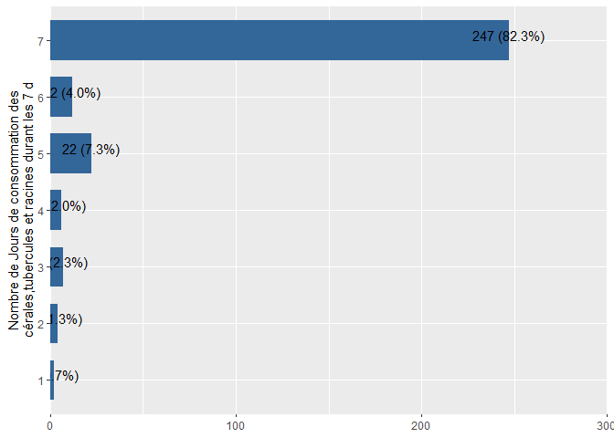<!-- -->

```r
Mauritania_ea_2020$FCSStap <- as.numeric(Mauritania_ea_2020$FCSStap)
Mauritania_ea_2021%>% 
  sjPlot::plot_frq(coord.flip =T,FCSStap,show.na = T)
```

<!-- -->

```r
Mauritania_ea_2021$FCSStap <- as.numeric(Mauritania_ea_2021$FCSStap)
Mauritania_ea_2022%>% 
  sjPlot::plot_frq(coord.flip =T,FCSStap,show.na = T)
```

<!-- -->

```r
Mauritania_ea_2022$FCSStap <- as.numeric(Mauritania_ea_2022$FCSStap)
Mauritania_pdm_2020%>% 
  sjPlot::plot_frq(coord.flip =T,FCSStap,show.na = T)
```

<!-- -->

```r
Mauritania_pdm_2020$FCSStap <- as.numeric(Mauritania_pdm_2020$FCSStap)
Mauritania_pdm_2021%>% 
  sjPlot::plot_frq(coord.flip =T,FCSStap,show.na = T)
```

<!-- -->

```r
Mauritania_pdm_2021$FCSStap <- as.numeric(Mauritania_pdm_2021$FCSStap)
```

### FCS : Céréales et tubercules - Sources


```r
# Codes d’acquisition des aliments 
# 1 = Production propre (récoltes, élevage) ; 2 = Pêche / Chasse ; 3 = Cueillette ; 4 = Prêts ; 5 = Marché (achat avec des espèces) ; 6 = Marché (achat à crédit) ;
# 7 = Mendicité ; 8 = Troc travail ou biens contre des aliments ; 9 = Dons (aliments) de membres de la famille ou d’amis ; 10 = Aide alimentaire de la société civile, ONG, gouvernement, PAM, etc.
```


```r
#2018

expss::val_lab(Mauritania_baseline_2018$FCSStapSRf)
Mauritania_baseline_2018 <- 
Mauritania_baseline_2018 %>% dplyr::mutate_at(c("FCSStapSRf"),recode,"1"=1,"2"=5,"3"=6,"5"=4)
Mauritania_baseline_2018$FCSStapSRf <- labelled::labelled( Mauritania_baseline_2018$FCSStapSRf, c(`Production propre (récoltes, élevage)` = 1, `Pêche / Chasse` = 2, Cueillette= 3,`Prêts`=4,`Marché (achat avec des espèces)`=5,`Marché (achat à crédit)`=6,`Mendicité`=7,`Troc travail ou biens contre des aliments`=8,`Dons (aliments) de membres de la famille ou d’amis`=9,`Aide alimentaire de la société civile, ONG, gouvernement, PAM, etc`=10))
#check labels
expss::val_lab(Mauritania_baseline_2018$FCSStapSRf)
Mauritania_baseline_2018 %>% 
  plot_frq(coord.flip =T,FCSStapSRf,show.na = T)
```

<!-- -->

```r
##2019

Mauritania_ea_2019 <- 
Mauritania_ea_2019 %>% dplyr::mutate_at(c("FCSStapSRf"),recode,"1"=1,"2"=5,"3"=6,"4"=8,"5"=4)
Mauritania_ea_2019$FCSStapSRf <- labelled::labelled( Mauritania_ea_2019$FCSStapSRf, c(`Production propre (récoltes, élevage)` = 1, `Pêche / Chasse` = 2, Cueillette= 3,`Prêts`=4,`Marché (achat avec des espèces)`=5,`Marché (achat à crédit)`=6,`Mendicité`=7,`Troc travail ou biens contre des aliments`=8,`Dons (aliments) de membres de la famille ou d’amis`=9,`Aide alimentaire de la société civile, ONG, gouvernement, PAM, etc`=10))
#check labels
expss::val_lab(Mauritania_ea_2019$FCSStapSRf)
Mauritania_ea_2019 %>% 
  plot_frq(coord.flip =T,FCSStapSRf,show.na = T)
```

<!-- -->

```r
#2020
Mauritania_ea_2020 <- 
Mauritania_ea_2020 %>% dplyr::mutate_at(c("FCSStapSRf"),recode,"1"=1,"2"=5,"3"=6,"5"=4)
Mauritania_ea_2020$FCSStapSRf <- labelled::labelled( Mauritania_ea_2020$FCSStapSRf, c(`Production propre (récoltes, élevage)` = 1, `Pêche / Chasse` = 2, Cueillette= 3,`Prêts`=4,`Marché (achat avec des espèces)`=5,`Marché (achat à crédit)`=6,`Mendicité`=7,`Troc travail ou biens contre des aliments`=8,`Dons (aliments) de membres de la famille ou d’amis`=9,`Aide alimentaire de la société civile, ONG, gouvernement, PAM, etc`=10))
#check labels
expss::val_lab(Mauritania_ea_2020$FCSStapSRf)
Mauritania_ea_2020%>% 
  sjPlot::plot_frq(coord.flip =T,FCSStapSRf,show.na = T)
```

<!-- -->

```r
#pdm2020
Mauritania_pdm_2020 <- 
Mauritania_pdm_2020 %>% dplyr::mutate_at(c("FCSStapSRf"),recode,"1"=1,"2"=5,"3"=6,"5"=4)
Mauritania_pdm_2020$FCSStapSRf <- labelled::labelled( Mauritania_pdm_2020$FCSStapSRf, c(`Production propre (récoltes, élevage)` = 1, `Pêche / Chasse` = 2, Cueillette= 3,`Prêts`=4,`Marché (achat avec des espèces)`=5,`Marché (achat à crédit)`=6,`Mendicité`=7,`Troc travail ou biens contre des aliments`=8,`Dons (aliments) de membres de la famille ou d’amis`=9,`Aide alimentaire de la société civile, ONG, gouvernement, PAM, etc`=10))
Mauritania_pdm_2020%>% 
  sjPlot::plot_frq(coord.flip =T,FCSStapSRf,show.na=T) 
```

<!-- -->

```r
#2021
expss::val_lab(Mauritania_ea_2021$FCSStapSRf)
Mauritania_ea_2021 <- 
Mauritania_ea_2021 %>% dplyr::mutate_at(c("FCSStapSRf"),recode,"1"=1,"2"=5,"3"=6,"7"=9)
Mauritania_ea_2021$FCSStapSRf <- labelled::labelled( Mauritania_ea_2021$FCSStapSRf, c(`Production propre (récoltes, élevage)` = 1, `Pêche / Chasse` = 2, Cueillette= 3,`Prêts`=4,`Marché (achat avec des espèces)`=5,`Marché (achat à crédit)`=6,`Mendicité`=7,`Troc travail ou biens contre des aliments`=8,`Dons (aliments) de membres de la famille ou d’amis`=9,`Aide alimentaire de la société civile, ONG, gouvernement, PAM, etc`=10))
Mauritania_ea_2021%>% 
  sjPlot::plot_frq(coord.flip =T,FCSStapSRf,show.na = T)
```

<!-- -->

```r
#pdm_2021
Mauritania_pdm_2021 <- 
Mauritania_pdm_2021 %>% dplyr::mutate_at(c("FCSStapSRf"),recode,"1"=1,"2"=5,"3"=6,"5"=4,"7"=9,.default = NA_real_)
Mauritania_pdm_2021$FCSStapSRf <- labelled::labelled( Mauritania_pdm_2021$FCSStapSRf, c(`Production propre (récoltes, élevage)` = 1, `Pêche / Chasse` = 2, Cueillette= 3,`Prêts`=4,`Marché (achat avec des espèces)`=5,`Marché (achat à crédit)`=6,`Mendicité`=7,`Troc travail ou biens contre des aliments`=8,`Dons (aliments) de membres de la famille ou d’amis`=9,`Aide alimentaire de la société civile, ONG, gouvernement, PAM, etc`=10))
Mauritania_pdm_2021%>% 
  sjPlot::plot_frq(coord.flip =T,FCSStapSRf,show.na=T)
```

<!-- -->

```r
#ea_2022
Mauritania_ea_2022 <- 
Mauritania_ea_2022 %>% dplyr::mutate_at(c("FCSStapSRf"),recode,"1"=1,"2"=10,"9"=8,"6"=5,"7"=9)
Mauritania_ea_2022$FCSStapSRf <- labelled::labelled( Mauritania_ea_2022$FCSStapSRf, c(`Production propre (récoltes, élevage)` = 1, `Pêche / Chasse` = 2, Cueillette= 3,`Prêts`=4,`Marché (achat avec des espèces)`=5,`Marché (achat à crédit)`=6,`Mendicité`=7,`Troc travail ou biens contre des aliments`=8,`Dons (aliments) de membres de la famille ou d’amis`=9,`Aide alimentaire de la société civile, ONG, gouvernement, PAM, etc`=10))

expss::val_lab(Mauritania_ea_2022$FCSStapSRf)
Mauritania_ea_2022%>% 
  sjPlot::plot_frq(coord.flip =T,FCSStapSRf,show.na = T)
```

<!-- -->


### FCS : Légumineuses

```r
Mauritania_baseline_2018$FCSPulse <- as.numeric(Mauritania_baseline_2018$FCSPulse)
Mauritania_ea_2019$FCSPulse <- as.numeric(Mauritania_ea_2019$FCSPulse)
Mauritania_ea_2020$FCSPulse <- as.numeric(Mauritania_ea_2020$FCSPulse)
Mauritania_ea_2021$FCSPulse <- as.numeric(Mauritania_ea_2021$FCSPulse)
Mauritania_ea_2022$FCSPulse <- as.numeric(Mauritania_ea_2022$FCSPulse)
Mauritania_pdm_2020$FCSPulse <- as.numeric(Mauritania_pdm_2020$FCSPulse)
Mauritania_pdm_2021$FCSPulse <- as.numeric(Mauritania_pdm_2021$FCSPulse)
```


```r
Mauritania_baseline_2018 %>%
  sjPlot::plot_frq(coord.flip =T,FCSPulse,show.na = T)
```

<!-- -->

```r
Mauritania_ea_2019%>% 
  sjPlot::plot_frq(coord.flip =T,FCSPulse,show.na = T)
```

<!-- -->

```r
Mauritania_ea_2020%>% 
  sjPlot::plot_frq(coord.flip =T,FCSPulse,show.na = T)
```

<!-- -->

```r
Mauritania_ea_2021%>% 
  sjPlot::plot_frq(coord.flip =T,FCSPulse,show.na = T)
```

<!-- -->

```r
Mauritania_ea_2022%>% 
  sjPlot::plot_frq(coord.flip =T,FCSPulse,show.na = T)
```

<!-- -->

```r
Mauritania_pdm_2020%>% 
  sjPlot::plot_frq(coord.flip =T,FCSPulse,show.na = T)
```

<!-- -->

```r
Mauritania_pdm_2021%>% 
  sjPlot::plot_frq(coord.flip =T,FCSPulse,show.na = T)
```

<!-- -->

```r
# Mauritania_pdm_2022%>% 
#   sjPlot::plot_frq(coord.flip =T,FCSPulse,show.na = T)
```
### FCS : Légumineuses - Sources


```r
#2018
expss::val_lab(Mauritania_baseline_2018$FCSPulseSRf)
Mauritania_baseline_2018 <- 
Mauritania_baseline_2018 %>% dplyr::mutate_at(c("FCSPulseSRf"),recode,"1"=1,"2"=5,"3"=6,.default = NA_real_)
Mauritania_baseline_2018$FCSPulseSRf <- labelled::labelled( Mauritania_baseline_2018$FCSPulseSRf, c(`Production propre (récoltes, élevage)` = 1, `Pêche / Chasse` = 2, Cueillette= 3,`Prêts`=4,`Marché (achat avec des espèces)`=5,`Marché (achat à crédit)`=6,`Mendicité`=7,`Troc travail ou biens contre des aliments`=8,`Dons (aliments) de membres de la famille ou d’amis`=9,`Aide alimentaire de la société civile, ONG, gouvernement, PAM, etc`=10))
#check labels
expss::val_lab(Mauritania_baseline_2018$FCSPulseSRf)
Mauritania_baseline_2018 %>% 
  plot_frq(coord.flip =T,FCSPulseSRf,show.na = T)
```

<!-- -->

```r
##2019

Mauritania_ea_2019 <- 
Mauritania_ea_2019 %>% dplyr::mutate_at(c("FCSPulseSRf"),recode,"1"=1,"2"=5,"3"=6,"4"=8,"5"=4,"6"=8,"7"=9,.default=NA_real_)
 Mauritania_ea_2019$FCSPulseSRf <- labelled::labelled( Mauritania_ea_2019$FCSPulseSRf, c(`Production propre (récoltes, élevage)` = 1, `Pêche / Chasse` = 2, Cueillette= 3,`Prêts`=4,`Marché (achat avec des espèces)`=5,`Marché (achat à crédit)`=6,`Mendicité`=7,`Troc travail ou biens contre des aliments`=8,`Dons (aliments) de membres de la famille ou d’amis`=9,`Aide alimentaire de la société civile, ONG, gouvernement, PAM, etc`=10))
#check labels
expss::val_lab(Mauritania_ea_2019$FCSPulseSRf)
Mauritania_ea_2019 %>% 
  plot_frq(coord.flip =T,FCSPulseSRf,show.na = T)
```

<!-- -->

```r
# #2020
Mauritania_ea_2020 <- 
Mauritania_ea_2020 %>% dplyr::mutate_at(c("FCSPulseSRf"),recode,"1"=1,"2"=5,"3"=6,"5"=4,.default=NA_real_)
Mauritania_ea_2020$FCSPulseSRf <- labelled::labelled( Mauritania_ea_2020$FCSPulseSRf, c(`Production propre (récoltes, élevage)` = 1, `Pêche / Chasse` = 2, Cueillette= 3,`Prêts`=4,`Marché (achat avec des espèces)`=5,`Marché (achat à crédit)`=6,`Mendicité`=7,`Troc travail ou biens contre des aliments`=8,`Dons (aliments) de membres de la famille ou d’amis`=9,`Aide alimentaire de la société civile, ONG, gouvernement, PAM, etc`=10))
Mauritania_ea_2020%>% 
  sjPlot::plot_frq(coord.flip =T,FCSPulseSRf,show.na=T) 
```

<!-- -->

```r
#pdm2020
Mauritania_pdm_2020 <- 
Mauritania_pdm_2020 %>% dplyr::mutate_at(c("FCSPulseSRf"),recode,"1"=1,"2"=5,"3"=6,"5"=4,"6"=8,.defaut=NA_real_)
Mauritania_pdm_2020$FCSPulseSRf <- labelled::labelled( Mauritania_pdm_2020$FCSPulseSRf, c(`Production propre (récoltes, élevage)` = 1, `Pêche / Chasse` = 2, Cueillette= 3,`Prêts`=4,`Marché (achat avec des espèces)`=5,`Marché (achat à crédit)`=6,`Mendicité`=7,`Troc travail ou biens contre des aliments`=8,`Dons (aliments) de membres de la famille ou d’amis`=9,`Aide alimentaire de la société civile, ONG, gouvernement, PAM, etc`=10))
Mauritania_pdm_2020%>% 
  sjPlot::plot_frq(coord.flip =T,FCSPulseSRf,show.na=T) 
```

<!-- -->

```r
#2021
expss::val_lab(Mauritania_ea_2021$FCSPulseSRf)
Mauritania_ea_2021 <- 
Mauritania_ea_2021 %>% dplyr::mutate_at(c("FCSPulseSRf"),recode,"1"=1,"2"=5,"3"=6,"7"=9,"8"=3,.defaut=NA_real_)
Mauritania_ea_2021$FCSPulseSRf <- labelled::labelled( Mauritania_ea_2021$FCSPulseSRf, c(`Production propre (récoltes, élevage)` = 1, `Pêche / Chasse` = 2, Cueillette= 3,`Prêts`=4,`Marché (achat avec des espèces)`=5,`Marché (achat à crédit)`=6,`Mendicité`=7,`Troc travail ou biens contre des aliments`=8,`Dons (aliments) de membres de la famille ou d’amis`=9,`Aide alimentaire de la société civile, ONG, gouvernement, PAM, etc`=10))
Mauritania_ea_2021%>% 
  sjPlot::plot_frq(coord.flip =T,FCSPulseSRf,show.na = T)
```

<!-- -->

```r
#pdm_2021

Mauritania_pdm_2021 <- 
Mauritania_pdm_2021 %>% dplyr::mutate_at(c("FCSPulseSRf"),recode,"1"=1,"2"=5,"3"=6,"5"=4,.defaut=NA_real_)
Mauritania_pdm_2021$FCSPulseSRf <- labelled::labelled( Mauritania_pdm_2021$FCSPulseSRf, c(`Production propre (récoltes, élevage)` = 1, `Pêche / Chasse` = 2, Cueillette= 3,`Prêts`=4,`Marché (achat avec des espèces)`=5,`Marché (achat à crédit)`=6,`Mendicité`=7,`Troc travail ou biens contre des aliments`=8,`Dons (aliments) de membres de la famille ou d’amis`=9,`Aide alimentaire de la société civile, ONG, gouvernement, PAM, etc`=10))
Mauritania_pdm_2021%>% 
  sjPlot::plot_frq(coord.flip =T,FCSPulseSRf,show.na=T)
```

<!-- -->

```r
#ea_2022
Mauritania_ea_2022 <- 
Mauritania_ea_2022 %>% dplyr::mutate_at(c("FCSPulseSRf"),recode,"1"=1,"2"=10,"6"=5,"7"=6,"8"=7,"10"=9,"other"=10)
Mauritania_ea_2022$FCSPulseSRf <- labelled::labelled( Mauritania_ea_2022$FCSPulseSRf, c(`Production propre (récoltes, élevage)` = 1, `Pêche / Chasse` = 2, Cueillette= 3,`Prêts`=4,`Marché (achat avec des espèces)`=5,`Marché (achat à crédit)`=6,`Mendicité`=7,`Troc travail ou biens contre des aliments`=8,`Dons (aliments) de membres de la famille ou d’amis`=9,`Aide alimentaire de la société civile, ONG, gouvernement, PAM, etc`=10))

expss::val_lab(Mauritania_ea_2022$FCSPulseSRf)
Mauritania_ea_2022%>% 
  sjPlot::plot_frq(coord.flip =T,FCSPulseSRf,show.na = T)
```

<!-- -->


### FCS : Lait et produits laitiers

```r
Mauritania_ea_2021$FCSDairy<- ifelse(Mauritania_ea_2021$FCSDairy==11,1,Mauritania_ea_2021$FCSDairy)
```


```r
Mauritania_baseline_2018$FCSDairy <- as.numeric(Mauritania_baseline_2018$FCSDairy)
Mauritania_ea_2019$FCSDairy <- as.numeric(Mauritania_ea_2019$FCSDairy)
Mauritania_ea_2020$FCSDairy <- as.numeric(Mauritania_ea_2020$FCSDairy)
Mauritania_ea_2021$FCSDairy <- as.numeric(Mauritania_ea_2021$FCSDairy)
Mauritania_ea_2022$FCSDairy <- as.numeric(Mauritania_ea_2022$FCSDairy)
Mauritania_pdm_2020$FCSDairy <- as.numeric(Mauritania_pdm_2020$FCSDairy)
Mauritania_pdm_2021$FCSDairy <- as.numeric(Mauritania_pdm_2021$FCSDairy)
```


```r
Mauritania_baseline_2018 %>%
  sjPlot::plot_frq(coord.flip =T,FCSDairy,show.na = T)
```

<!-- -->

```r
Mauritania_ea_2019%>% 
  sjPlot::plot_frq(coord.flip =T,FCSDairy,show.na = T)
```

<!-- -->

```r
Mauritania_ea_2020%>% 
  sjPlot::plot_frq(coord.flip =T,FCSDairy,show.na = T)
```

<!-- -->

```r
Mauritania_ea_2021%>% 
  sjPlot::plot_frq(coord.flip =T,FCSDairy,show.na = T)
```

<!-- -->

```r
Mauritania_ea_2022%>% 
  sjPlot::plot_frq(coord.flip =T,FCSDairy,show.na = T)
```

<!-- -->

```r
Mauritania_pdm_2020%>% 
  sjPlot::plot_frq(coord.flip =T,FCSDairy,show.na = T)
```

<!-- -->

```r
Mauritania_pdm_2021%>% 
  sjPlot::plot_frq(coord.flip =T,FCSDairy,show.na = T)
```

<!-- -->

```r
# Mauritania_pdm_2022%>% 
#   sjPlot::plot_frq(coord.flip =T,FCSDairy,show.na = T)
```


### FCS : Lait et produits laitiers - Sources


```r
#2018
expss::val_lab(Mauritania_baseline_2018$FCSDairySRf)
Mauritania_baseline_2018 <- 
Mauritania_baseline_2018 %>% dplyr::mutate_at(c("FCSDairySRf"),recode,"1"=1,"2"=5,"3"=6,"6"=8,"7"=9,.default = NA_real_)
Mauritania_baseline_2018$FCSDairySRf <- labelled::labelled( Mauritania_baseline_2018$FCSDairySRf, c(`Production propre (récoltes, élevage)` = 1, `Pêche / Chasse` = 2, Cueillette= 3,`Prêts`=4,`Marché (achat avec des espèces)`=5,`Marché (achat à crédit)`=6,`Mendicité`=7,`Troc travail ou biens contre des aliments`=8,`Dons (aliments) de membres de la famille ou d’amis`=9,`Aide alimentaire de la société civile, ONG, gouvernement, PAM, etc`=10))
#check labels
expss::val_lab(Mauritania_baseline_2018$FCSDairySRf)
Mauritania_baseline_2018 %>% 
  plot_frq(coord.flip =T,FCSDairySRf,show.na = T)
```

<!-- -->

```r
##2019

Mauritania_ea_2019 <- 
Mauritania_ea_2019 %>% dplyr::mutate_at(c("FCSDairySRf"),recode,"1"=1,"2"=5,"3"=6,"5"=4,.defaut=NA_real_)
 Mauritania_ea_2019$FCSDairySRf <- labelled::labelled( Mauritania_ea_2019$FCSDairySRf, c(`Production propre (récoltes, élevage)` = 1, `Pêche / Chasse` = 2, Cueillette= 3,`Prêts`=4,`Marché (achat avec des espèces)`=5,`Marché (achat à crédit)`=6,`Mendicité`=7,`Troc travail ou biens contre des aliments`=8,`Dons (aliments) de membres de la famille ou d’amis`=9,`Aide alimentaire de la société civile, ONG, gouvernement, PAM, etc`=10))
#check labels
expss::val_lab(Mauritania_ea_2019$FCSDairySRf)
Mauritania_ea_2019 %>% 
  plot_frq(coord.flip =T,FCSDairySRf,show.na = T)
```

<!-- -->

```r
# #2020
Mauritania_ea_2020 <- 
Mauritania_ea_2020 %>% dplyr::mutate_at(c("FCSDairySRf"),recode,"1"=1,"2"=5,"3"=6,.defaut=NA_real_)
Mauritania_ea_2020$FCSDairySRf <- labelled::labelled( Mauritania_ea_2020$FCSDairySRf, c(`Production propre (récoltes, élevage)` = 1, `Pêche / Chasse` = 2, Cueillette= 3,`Prêts`=4,`Marché (achat avec des espèces)`=5,`Marché (achat à crédit)`=6,`Mendicité`=7,`Troc travail ou biens contre des aliments`=8,`Dons (aliments) de membres de la famille ou d’amis`=9,`Aide alimentaire de la société civile, ONG, gouvernement, PAM, etc`=10))
Mauritania_ea_2020%>% 
  sjPlot::plot_frq(coord.flip =T,FCSDairySRf,show.na=T) 
```

<!-- -->

```r
#pdm2020
Mauritania_pdm_2020 <- 
Mauritania_pdm_2020 %>% dplyr::mutate_at(c("FCSDairySRf"),recode,"1"=1,"2"=5,"3"=6,"5"=4,.defaut=NA_real_)
Mauritania_pdm_2020$FCSDairySRf <- labelled::labelled( Mauritania_pdm_2020$FCSDairySRf, c(`Production propre (récoltes, élevage)` = 1, `Pêche / Chasse` = 2, Cueillette= 3,`Prêts`=4,`Marché (achat avec des espèces)`=5,`Marché (achat à crédit)`=6,`Mendicité`=7,`Troc travail ou biens contre des aliments`=8,`Dons (aliments) de membres de la famille ou d’amis`=9,`Aide alimentaire de la société civile, ONG, gouvernement, PAM, etc`=10))
Mauritania_pdm_2020%>% 
  sjPlot::plot_frq(coord.flip =T,FCSDairySRf,show.na=T) 
```

<!-- -->

```r
#2021
expss::val_lab(Mauritania_ea_2021$FCSDairySRf)
Mauritania_ea_2021 <- 
Mauritania_ea_2021 %>% dplyr::mutate_at(c("FCSDairySRf"),recode,"1"=1,"2"=5,"3"=6,"5"=4,
                                        "7"=9,.defaut=NA_real_)
Mauritania_ea_2021$FCSDairySRf <- labelled::labelled( Mauritania_ea_2021$FCSDairySRf, c(`Production propre (récoltes, élevage)` = 1, `Pêche / Chasse` = 2, Cueillette= 3,`Prêts`=4,`Marché (achat avec des espèces)`=5,`Marché (achat à crédit)`=6,`Mendicité`=7,`Troc travail ou biens contre des aliments`=8,`Dons (aliments) de membres de la famille ou d’amis`=9,`Aide alimentaire de la société civile, ONG, gouvernement, PAM, etc`=10))
Mauritania_ea_2021%>% 
  sjPlot::plot_frq(coord.flip =T,FCSDairySRf,show.na = T)
```

<!-- -->

```r
#pdm_2021

Mauritania_pdm_2021 <- 
Mauritania_pdm_2021 %>% dplyr::mutate_at(c("FCSDairySRf"),recode,"1"=1,"2"=5,"3"=6,"7"=9
                                         ,"other"=10,.defaut=NA_real_)
Mauritania_pdm_2021$FCSDairySRf <- labelled::labelled( Mauritania_pdm_2021$FCSDairySRf, c(`Production propre (récoltes, élevage)` = 1, `Pêche / Chasse` = 2, Cueillette= 3,`Prêts`=4,`Marché (achat avec des espèces)`=5,`Marché (achat à crédit)`=6,`Mendicité`=7,`Troc travail ou biens contre des aliments`=8,`Dons (aliments) de membres de la famille ou d’amis`=9,`Aide alimentaire de la société civile, ONG, gouvernement, PAM, etc`=10))
Mauritania_pdm_2021%>% 
  sjPlot::plot_frq(coord.flip =T,FCSDairySRf,show.na=T)
```

<!-- -->

```r
#ea_2022
Mauritania_ea_2022 <- 
Mauritania_ea_2022 %>% dplyr::mutate_at(c("FCSDairySRf"),recode,"1"=1,"1.0"=1,"2"=10,"6"=5,"7"=6,"9"=8,"10"=9,"other"=10,.defaut=NA_real_)
Mauritania_ea_2022$FCSDairySRf <- labelled::labelled( Mauritania_ea_2022$FCSDairySRf, c(`Production propre (récoltes, élevage)` = 1, `Pêche / Chasse` = 2, Cueillette= 3,`Prêts`=4,`Marché (achat avec des espèces)`=5,`Marché (achat à crédit)`=6,`Mendicité`=7,`Troc travail ou biens contre des aliments`=8,`Dons (aliments) de membres de la famille ou d’amis`=9,`Aide alimentaire de la société civile, ONG, gouvernement, PAM, etc`=10))

expss::val_lab(Mauritania_ea_2022$FCSDairySRf)
Mauritania_ea_2022%>% 
  sjPlot::plot_frq(coord.flip =T,FCSDairySRf,show.na = T)
```

<!-- -->


### FCS: Viande, poisson et oeufs

```r
Mauritania_baseline_2018$FCSPr <- as.numeric(Mauritania_baseline_2018$FCSPr)
Mauritania_ea_2019$FCSPr <- as.numeric(Mauritania_ea_2019$FCSPr)
Mauritania_ea_2020$FCSPr <- as.numeric(Mauritania_ea_2020$FCSPr)
Mauritania_ea_2021$FCSPr <- as.numeric(Mauritania_ea_2021$FCSPr)
Mauritania_ea_2022$FCSPr <- as.numeric(Mauritania_ea_2022$FCSPr)
Mauritania_pdm_2020$FCSPr <- as.numeric(Mauritania_pdm_2020$FCSPr)
Mauritania_pdm_2021$FCSPr <- as.numeric(Mauritania_pdm_2021$FCSPr)
```


```r
Mauritania_baseline_2018 %>%
  sjPlot::plot_frq(coord.flip =T,FCSPr,show.na = T)
```

<!-- -->

```r
Mauritania_ea_2019%>% 
  sjPlot::plot_frq(coord.flip =T,FCSPr,show.na = T)
```

<!-- -->

```r
Mauritania_ea_2020%>% 
  sjPlot::plot_frq(coord.flip =T,FCSPr,show.na = T)
```

<!-- -->

```r
Mauritania_ea_2021%>% 
  sjPlot::plot_frq(coord.flip =T,FCSPr,show.na = T)
```

<!-- -->

```r
Mauritania_ea_2022%>% 
  sjPlot::plot_frq(coord.flip =T,FCSPr,show.na = T)
```

<!-- -->

```r
Mauritania_pdm_2020%>% 
  sjPlot::plot_frq(coord.flip =T,FCSPr,show.na = T)
```

<!-- -->

```r
Mauritania_pdm_2021%>% 
  sjPlot::plot_frq(coord.flip =T,FCSPr,show.na = T)
```

<!-- -->

```r
# Mauritania_pdm_2022%>% 
#   sjPlot::plot_frq(coord.flip =T,FCSPr,show.na = T)
```

### FCS: Viande, poisson et oeufs - Sources


```r
#2018
expss::val_lab(Mauritania_baseline_2018$FCSPrSRf)
Mauritania_baseline_2018 <- 
Mauritania_baseline_2018 %>% dplyr::mutate_at(c("FCSPrSRf"),recode,"1"=1,"2"=5,"3"=6,"4"=8,"5"=4,"7"=9,.default = NA_real_)
Mauritania_baseline_2018$FCSPrSRf <- labelled::labelled( Mauritania_baseline_2018$FCSPrSRf, c(`Production propre (récoltes, élevage)` = 1, `Pêche / Chasse` = 2, Cueillette= 3,`Prêts`=4,`Marché (achat avec des espèces)`=5,`Marché (achat à crédit)`=6,`Mendicité`=7,`Troc travail ou biens contre des aliments`=8,`Dons(aliments) de membres de la famille ou d’amis`=9,`Aide alimentaire de la société civile, ONG, gouvernement, PAM, etc`=10))
#check labels
expss::val_lab(Mauritania_baseline_2018$FCSPrSRf)
Mauritania_baseline_2018 %>% 
  plot_frq(coord.flip =T,FCSPrSRf,show.na = T)
```

<!-- -->

```r
##2019
expss::val_lab(Mauritania_ea_2019$FCSPrSRf)
Mauritania_ea_2019 <- 
Mauritania_ea_2019 %>% dplyr::mutate_at(c("FCSPrSRf"),recode,"2"=5,"3"=6,"5"=4,"4"=8,"6"=5,
                                        "7"=9,.default=NA_real_)
 Mauritania_ea_2019$FCSPrSRf <- labelled::labelled( Mauritania_ea_2019$FCSPrSRf, c(`Production propre (récoltes, élevage)` = 1, `Pêche / Chasse` = 2, Cueillette= 3,`Prêts`=4,`Marché (achat avec des espèces)`=5,`Marché (achat à crédit)`=6,`Mendicité`=7,`Troc travail ou biens contre des aliments`=8,`Dons(aliments) de membres de la famille ou d’amis`=9,`Aide alimentaire de la société civile, ONG, gouvernement, PAM, etc`=10))
#check labels
expss::val_lab(Mauritania_ea_2019$FCSPrSRf)
Mauritania_ea_2019 %>% 
  plot_frq(coord.flip =T,FCSPrSRf,show.na = T)
```

<!-- -->

```r
##2020

Mauritania_ea_2020 <- 
Mauritania_ea_2020 %>% dplyr::mutate_at(c("FCSPrSRf"),recode,"1"=1,"2"=5,"3"=6,"8"=2,"4"=8,.default=NA_real_)
Mauritania_ea_2020$FCSPrSRf <- labelled::labelled( Mauritania_ea_2020$FCSPrSRf, c(`Production propre (récoltes, élevage)` = 1, `Pêche / Chasse` = 2, Cueillette= 3,`Prêts`=4,`Marché (achat avec des espèces)`=5,`Marché (achat à crédit)`=6,`Mendicité`=7,`Troc travail ou biens contre des aliments`=8,`Dons(aliments) de membres de la famille ou d’amis`=9,`Aide alimentaire de la société civile, ONG, gouvernement, PAM, etc`=10))
Mauritania_ea_2020%>% 
  sjPlot::plot_frq(coord.flip =T,FCSPrSRf,show.na=T) 
```

<!-- -->

```r
#pdm2020
Mauritania_pdm_2020 <- 
Mauritania_pdm_2020 %>% dplyr::mutate_at(c("FCSPrSRf"),recode,"1"=1,"2"=5,"3"=6,"5"=4,"8"=2,.default=NA_real_)
Mauritania_pdm_2020$FCSPrSRf <- labelled::labelled( Mauritania_pdm_2020$FCSPrSRf, c(`Production propre (récoltes, élevage)` = 1, `Pêche / Chasse` = 2, Cueillette= 3,`Prêts`=4,`Marché (achat avec des espèces)`=5,`Marché (achat à crédit)`=6,`Mendicité`=7,`Troc travail ou biens contre des aliments`=8,`Dons(aliments) de membres de la famille ou d’amis`=9,`Aide alimentaire de la société civile, ONG, gouvernement, PAM, etc`=10))
Mauritania_pdm_2020%>% 
  sjPlot::plot_frq(coord.flip =T,FCSPrSRf,show.na=T) 
```

<!-- -->

```r
#2021
expss::val_lab(Mauritania_ea_2021$FCSPrSRf)
Mauritania_ea_2021 <- 
Mauritania_ea_2021 %>% dplyr::mutate_at(c("FCSPrSRf"),recode,"1"=1,"2"=5,"3"=6,"7"=9,.default=NA_real_)
Mauritania_ea_2021$FCSPrSRf <- labelled::labelled( Mauritania_ea_2021$FCSPrSRf, c(`Production propre (récoltes, élevage)` = 1, `Pêche / Chasse` = 2, Cueillette= 3,`Prêts`=4,`Marché (achat avec des espèces)`=5,`Marché (achat à crédit)`=6,`Mendicité`=7,`Troc travail ou biens contre des aliments`=8,`Dons(aliments) de membres de la famille ou d’amis`=9,`Aide alimentaire de la société civile, ONG, gouvernement, PAM, etc`=10))
Mauritania_ea_2021%>% 
  sjPlot::plot_frq(coord.flip =T,FCSPrSRf,show.na = T)
```

<!-- -->

```r
#pdm_2021

Mauritania_pdm_2021 <- 
Mauritania_pdm_2021 %>% dplyr::mutate_at(c("FCSPrSRf"),recode,"1"=1,"2"=5,"3"=6,"5"=4,"7"=9,.default=NA_real_)
Mauritania_pdm_2021$FCSPrSRf <- labelled::labelled( Mauritania_pdm_2021$FCSPrSRf, c(`Production propre (récoltes, élevage)` = 1, `Pêche / Chasse` = 2, Cueillette= 3,`Prêts`=4,`Marché (achat avec des espèces)`=5,`Marché (achat à crédit)`=6,`Mendicité`=7,`Troc travail ou biens contre des aliments`=8,`Dons(aliments) de membres de la famille ou d’amis`=9,`Aide alimentaire de la société civile, ONG, gouvernement, PAM, etc`=10))
Mauritania_pdm_2021%>% 
  sjPlot::plot_frq(coord.flip =T,FCSPrSRf,show.na=T)
```

<!-- -->

```r
#ea_2022
Mauritania_ea_2022 <- 
Mauritania_ea_2022 %>% dplyr::mutate_at(c("FCSPrSRf"),recode,"1"=1,"6"=5,"7"=6,"10"=9,"8"=7,.default=NA_real_)
Mauritania_ea_2022$FCSPrSRf <- labelled::labelled( Mauritania_ea_2022$FCSPrSRf, c(`Production propre (récoltes, élevage)` = 1, `Pêche / Chasse` = 2, Cueillette= 3,`Prêts`=4,`Marché (achat avec des espèces)`=5,`Marché (achat à crédit)`=6,`Mendicité`=7,`Troc travail ou biens contre des aliments`=8,`Dons(aliments) de membres de la famille ou d’amis`=9,`Aide alimentaire de la société civile, ONG, gouvernement, PAM, etc`=10))

expss::val_lab(Mauritania_ea_2022$FCSPrSRf)
Mauritania_ea_2022%>% 
  sjPlot::plot_frq(coord.flip =T,FCSPrSRf,show.na = T)
```

<!-- -->


### FCS : Chair/viande rouge
La variable est vide pour toutes les années


```r
Mauritania_baseline_2018 %>% 
  sjPlot::plot_frq(coord.flip =T,FCSPrMeatF,show.na = T)
```

<!-- -->

```r
Mauritania_ea_2019%>% 
  sjPlot::plot_frq(coord.flip =T,FCSPrMeatF,show.na = T)
```

<!-- -->

```r
Mauritania_ea_2020%>% 
  sjPlot::plot_frq(coord.flip =T,FCSPrMeatF,show.na = T)
```

<!-- -->

```r
Mauritania_ea_2021%>% 
  sjPlot::plot_frq(coord.flip =T,FCSPrMeatF,show.na = T)
```

<!-- -->

```r
Mauritania_ea_2022%>% 
  sjPlot::plot_frq(coord.flip =T,FCSPrMeatF,show.na = T)
```

<!-- -->

```r
Mauritania_pdm_2020%>% 
  sjPlot::plot_frq(coord.flip =T,FCSPrMeatF,show.na = T)
```

<!-- -->

```r
Mauritania_pdm_2021%>% 
  sjPlot::plot_frq(coord.flip =T,FCSPrMeatF,show.na = T)
```

<!-- -->

```r
#Mauritania_pdm_2022%>% 
#  sjPlot::plot_frq(coord.flip =T,FCSPrMeatF,show.na = T)
```

### FCS : Viande d'organe, telle que: (foie, reins, coeur et / ou autres abats) 


```r
Mauritania_baseline_2018 %>% 
  sjPlot::plot_frq(coord.flip =T,FCSPrMeatO,show.na = T)
```

<!-- -->

```r
Mauritania_ea_2019%>% 
  sjPlot::plot_frq(coord.flip =T,FCSPrMeatO,show.na = T)
```

<!-- -->

```r
Mauritania_ea_2020%>% 
  sjPlot::plot_frq(coord.flip =T,FCSPrMeatO,show.na = T)
```

<!-- -->

```r
Mauritania_ea_2021%>% 
  sjPlot::plot_frq(coord.flip =T,FCSPrMeatO,show.na = T)
```

<!-- -->

```r
Mauritania_ea_2022%>% 
  sjPlot::plot_frq(coord.flip =T,FCSPrMeatO,show.na = T)
```

<!-- -->

```r
Mauritania_pdm_2020%>% 
  sjPlot::plot_frq(coord.flip =T,FCSPrMeatO,show.na = T)
```

<!-- -->

```r
Mauritania_pdm_2021%>% 
  sjPlot::plot_frq(coord.flip =T,FCSPrMeatO,show.na = T)
```

<!-- -->

```r
#Mauritania_pdm_2022%>% 
#  sjPlot::plot_frq(coord.flip =T,FCSPrMeatO,show.na = T)
```

### FCS : Poissons et coquillage, tels que: (poissons, y compris le thon en conserve, les escargots et / ou d'autres fruits de mer remplacer par des exemples localement pertinents )


```r
Mauritania_baseline_2018 %>% 
  sjPlot::plot_frq(coord.flip =T,FCSPrFish,show.na = T)
```

<!-- -->

```r
Mauritania_ea_2019%>% 
  sjPlot::plot_frq(coord.flip =T,FCSPrFish,show.na = T)
```

<!-- -->

```r
Mauritania_ea_2020%>% 
  sjPlot::plot_frq(coord.flip =T,FCSPrFish,show.na = T)
```

<!-- -->

```r
Mauritania_ea_2021%>% 
  sjPlot::plot_frq(coord.flip =T,FCSPrFish,show.na = T)
```

<!-- -->

```r
Mauritania_ea_2022%>% 
  sjPlot::plot_frq(coord.flip =T,FCSPrFish,show.na = T)
```

<!-- -->

```r
Mauritania_pdm_2020%>% 
  sjPlot::plot_frq(coord.flip =T,FCSPrFish,show.na = T)
```

<!-- -->

```r
Mauritania_pdm_2021%>% 
  sjPlot::plot_frq(coord.flip =T,FCSPrFish,show.na = T)
```

<!-- -->

```r
# Mauritania_pdm_2022%>% 
#   sjPlot::plot_frq(coord.flip =T,FCSPrFish,show.na = T)
```


### FCS : Oeufs


```r
Mauritania_baseline_2018 %>% 
  sjPlot::plot_frq(coord.flip =T,FCSPrEgg,show.na = T)
```

<!-- -->

```r
Mauritania_ea_2019%>% 
  sjPlot::plot_frq(coord.flip =T,FCSPrEgg,show.na = T)
```

<!-- -->

```r
Mauritania_ea_2020%>% 
  sjPlot::plot_frq(coord.flip =T,FCSPrEgg,show.na = T)
```

<!-- -->

```r
Mauritania_ea_2021%>% 
  sjPlot::plot_frq(coord.flip =T,FCSPrEgg,show.na = T)
```

<!-- -->

```r
Mauritania_ea_2022%>% 
  sjPlot::plot_frq(coord.flip =T,FCSPrEgg,show.na = T)
```

<!-- -->

```r
Mauritania_pdm_2020%>% 
  sjPlot::plot_frq(coord.flip =T,FCSPrEgg,show.na = T)
```

<!-- -->

```r
Mauritania_pdm_2021%>% 
  sjPlot::plot_frq(coord.flip =T,FCSPrEgg,show.na = T)
```

<!-- -->

```r
# Mauritania_pdm_2022%>% 
#   sjPlot::plot_frq(coord.flip =T,FCSPrEgg,show.na = T)
```


### FCS : Légumes et feuilles , tels que : (épinards, oignons, tomates, carottes, poivrons, haricots verts, laitue, etc)


```r
Mauritania_baseline_2018$FCSVeg <- as.numeric(Mauritania_baseline_2018$FCSVeg)
Mauritania_ea_2019$FCSVeg <- as.numeric(Mauritania_ea_2019$FCSVeg)
Mauritania_ea_2020$FCSVeg <- as.numeric(Mauritania_ea_2020$FCSVeg)
Mauritania_ea_2021$FCSVeg <- as.numeric(Mauritania_ea_2021$FCSVeg)
Mauritania_ea_2022$FCSVeg <- as.numeric(Mauritania_ea_2022$FCSVeg)
Mauritania_pdm_2020$FCSVeg <- as.numeric(Mauritania_pdm_2020$FCSVeg)
Mauritania_pdm_2021$FCSVeg <- as.numeric(Mauritania_pdm_2021$FCSVeg)
```


```r
Mauritania_baseline_2018 %>% 
  sjPlot::plot_frq(coord.flip =T,FCSVeg,show.na = T)
```

<!-- -->

```r
Mauritania_ea_2019%>% 
  sjPlot::plot_frq(coord.flip =T,FCSVeg,show.na = T)
```

<!-- -->

```r
Mauritania_ea_2020%>% 
  sjPlot::plot_frq(coord.flip =T,FCSVeg,show.na = T)
```

<!-- -->

```r
Mauritania_ea_2021%>% 
  sjPlot::plot_frq(coord.flip =T,FCSVeg,show.na = T)
```

<!-- -->

```r
Mauritania_ea_2022%>% 
  sjPlot::plot_frq(coord.flip =T,FCSVeg,show.na = T)
```

<!-- -->

```r
Mauritania_pdm_2020%>% 
  sjPlot::plot_frq(coord.flip =T,FCSVeg,show.na = T)
```

<!-- -->

```r
Mauritania_pdm_2021%>% 
  sjPlot::plot_frq(coord.flip =T,FCSVeg,show.na = T)
```

<!-- -->

```r
# Mauritania_pdm_2022%>% 
#   sjPlot::plot_frq(coord.flip =T,FCSVeg,show.na = T)
```

### FCS : Légumes et feuilles , tels que : (épinards, oignons, tomates, carottes, poivrons, haricots verts, laitue, etc) - Sources


```r
#2018
expss::val_lab(Mauritania_baseline_2018$FCSVegSRf)
Mauritania_baseline_2018 <- 
Mauritania_baseline_2018 %>% dplyr::mutate_at(c("FCSVegSRf"),recode,"1"=1,"2"=5,"3"=6,"7"=9,.default = NA_real_)
Mauritania_baseline_2018$FCSVegSRf <- labelled::labelled( Mauritania_baseline_2018$FCSVegSRf, c(`Production propre (récoltes, élevage)` = 1, `Pêche / Chasse` = 2, Cueillette= 3,`Prêts`=4,`Marché (achat avec des espèces)`=5,`Marché (achat à crédit)`=6,`Mendicité`=7,`Troc travail ou biens contre des aliments`=8,`Dons (aliments) de membres de la famille ou d’amis`=9,`Aide alimentaire de la société civile, ONG, gouvernement, PAM, etc`=10))
#check labels
expss::val_lab(Mauritania_baseline_2018$FCSVegSRf)
Mauritania_baseline_2018 %>% 
  plot_frq(coord.flip =T,FCSVegSRf,show.na = T)
```

<!-- -->

```r
##2019
expss::val_lab(Mauritania_ea_2019$FCSVegSRf)
Mauritania_ea_2019 <- 
Mauritania_ea_2019 %>% dplyr::mutate_at(c("FCSVegSRf"),recode,"1"=1,"2"=5,"3"=6, "5"=4,.default=NA_real_)
 Mauritania_ea_2019$FCSVegSRf <- labelled::labelled( Mauritania_ea_2019$FCSVegSRf, c(`Production propre (récoltes, élevage)` = 1, `Pêche / Chasse` = 2, Cueillette= 3,`Prêts`=4,`Marché (achat avec des espèces)`=5,`Marché (achat à crédit)`=6,`Mendicité`=7,`Troc travail ou biens contre des aliments`=8,`Dons (aliments) de membres de la famille ou d’amis`=9,`Aide alimentaire de la société civile, ONG, gouvernement, PAM, etc`=10))
#check labels
expss::val_lab(Mauritania_ea_2019$FCSVegSRf)
Mauritania_ea_2019 %>% 
  plot_frq(coord.flip =T,FCSVegSRf,show.na = T)
```

<!-- -->

```r
# #2020
expss::val_lab(Mauritania_ea_2020$FCSVegSRf)
Mauritania_ea_2020 <- 
Mauritania_ea_2020 %>% dplyr::mutate_at(c("FCSVegSRf"),recode,"1"=1,"2"=5,"3"=6,"4"=8,.default=NA_real_)
Mauritania_ea_2020$FCSVegSRf <- labelled::labelled( Mauritania_ea_2020$FCSVegSRf, c(`Production propre (récoltes, élevage)` = 1, `Pêche / Chasse` = 2, Cueillette= 3,`Prêts`=4,`Marché (achat avec des espèces)`=5,`Marché (achat à crédit)`=6,`Mendicité`=7,`Troc travail ou biens contre des aliments`=8,`Dons (aliments) de membres de la famille ou d’amis`=9,`Aide alimentaire de la société civile, ONG, gouvernement, PAM, etc`=10))
Mauritania_ea_2020%>% 
  sjPlot::plot_frq(coord.flip =T,FCSVegSRf,show.na=T) 
```

<!-- -->

```r
#pdm2020
Mauritania_pdm_2020 <- 
Mauritania_pdm_2020 %>% dplyr::mutate_at(c("FCSVegSRf"),recode,"1"=1,"2"=5,"3"=6,.default=NA_real_)
Mauritania_pdm_2020$FCSVegSRf <- labelled::labelled( Mauritania_pdm_2020$FCSVegSRf, c(`Production propre (récoltes, élevage)` = 1, `Pêche / Chasse` = 2, Cueillette= 3,`Prêts`=4,`Marché (achat avec des espèces)`=5,`Marché (achat à crédit)`=6,`Mendicité`=7,`Troc travail ou biens contre des aliments`=8,`Dons (aliments) de membres de la famille ou d’amis`=9,`Aide alimentaire de la société civile, ONG, gouvernement, PAM, etc`=10))
Mauritania_pdm_2020%>% 
  sjPlot::plot_frq(coord.flip =T,FCSVegSRf,show.na=T) 
```

<!-- -->

```r
#2021
expss::val_lab(Mauritania_ea_2021$FCSVegSRf)
Mauritania_ea_2021 <- 
Mauritania_ea_2021 %>% dplyr::mutate_at(c("FCSVegSRf"),recode,"1"=1,"2"=5,"3"=6,
                                        "7"=9,.default=NA_real_)
Mauritania_ea_2021$FCSVegSRf <- labelled::labelled( Mauritania_ea_2021$FCSVegSRf, c(`Production propre (récoltes, élevage)` = 1, `Pêche / Chasse` = 2, Cueillette= 3,`Prêts`=4,`Marché (achat avec des espèces)`=5,`Marché (achat à crédit)`=6,`Mendicité`=7,`Troc travail ou biens contre des aliments`=8,`Dons (aliments) de membres de la famille ou d’amis`=9,`Aide alimentaire de la société civile, ONG, gouvernement, PAM, etc`=10))
Mauritania_ea_2021%>% 
  sjPlot::plot_frq(coord.flip =T,FCSVegSRf,show.na = T)
```

<!-- -->

```r
#pdm_2021

Mauritania_pdm_2021 <- 
Mauritania_pdm_2021 %>% dplyr::mutate_at(c("FCSVegSRf"),recode,"1"=1,"2"=5,"3"=6,.default=NA_real_)
Mauritania_pdm_2021$FCSVegSRf <- labelled::labelled( Mauritania_pdm_2021$FCSVegSRf, c(`Production propre (récoltes, élevage)` = 1, `Pêche / Chasse` = 2, Cueillette= 3,`Prêts`=4,`Marché (achat avec des espèces)`=5,`Marché (achat à crédit)`=6,`Mendicité`=7,`Troc travail ou biens contre des aliments`=8,`Dons (aliments) de membres de la famille ou d’amis`=9,`Aide alimentaire de la société civile, ONG, gouvernement, PAM, etc`=10))
Mauritania_pdm_2021%>% 
  sjPlot::plot_frq(coord.flip =T,FCSVegSRf,show.na=T)
```

<!-- -->

```r
#ea_2022
Mauritania_ea_2022 <- 
Mauritania_ea_2022 %>% dplyr::mutate_at(c("FCSVegSRf"),recode,"1"=1,"6"=5,"7"=6,"10"=9,.default=NA_real_)
Mauritania_ea_2022$FCSVegSRf <- labelled::labelled( Mauritania_ea_2022$FCSVegSRf, c(`Production propre (récoltes, élevage)` = 1, `Pêche / Chasse` = 2, Cueillette= 3,`Prêts`=4,`Marché (achat avec des espèces)`=5,`Marché (achat à crédit)`=6,`Mendicité`=7,`Troc travail ou biens contre des aliments`=8,`Dons (aliments) de membres de la famille ou d’amis`=9,`Aide alimentaire de la société civile, ONG, gouvernement, PAM, etc`=10))

expss::val_lab(Mauritania_ea_2022$FCSVegSRf)
Mauritania_ea_2022%>% 
  sjPlot::plot_frq(coord.flip =T,FCSVegSRf,show.na = T)
```

<!-- -->


### FCS : Légumes oranges (légumes riches en Vitamine A)


```r
Mauritania_baseline_2018 %>% 
  sjPlot::plot_frq(coord.flip =T,FCSVegOrg,show.na = T)
```

<!-- -->

```r
Mauritania_ea_2019%>% 
  sjPlot::plot_frq(coord.flip =T,FCSVegOrg,show.na = T)
```

<!-- -->

```r
Mauritania_ea_2020%>% 
  sjPlot::plot_frq(coord.flip =T,FCSVegOrg,show.na = T)
```

<!-- -->

```r
Mauritania_ea_2021%>% 
  sjPlot::plot_frq(coord.flip =T,FCSVegOrg,show.na = T)
```

<!-- -->

```r
Mauritania_ea_2022%>% 
  sjPlot::plot_frq(coord.flip =T,FCSVegOrg,show.na = T)
```

<!-- -->

```r
Mauritania_pdm_2020%>% 
  sjPlot::plot_frq(coord.flip =T,FCSVegOrg,show.na = T)
```

<!-- -->

```r
Mauritania_pdm_2021%>% 
  sjPlot::plot_frq(coord.flip =T,FCSVegOrg,show.na = T)
```

<!-- -->

```r
# Mauritania_pdm_2022%>% 
#   sjPlot::plot_frq(coord.flip =T,FCSVegOrg,show.na = T)
```


### FCS : Légumes à feuilles vertes,,  tels que : ( épinards, brocoli, amarante et/ou autres feuilles vert foncé , feuilles de manioc )


```r
Mauritania_baseline_2018 %>% 
  sjPlot::plot_frq(coord.flip =T,FCSVegGre,show.na = T)
```

<!-- -->

```r
Mauritania_ea_2019%>% 
  sjPlot::plot_frq(coord.flip =T,FCSVegGre,show.na = T)
```

<!-- -->

```r
Mauritania_ea_2020%>% 
  sjPlot::plot_frq(coord.flip =T,FCSVegGre,show.na = T)
```

<!-- -->

```r
Mauritania_ea_2021%>% 
  sjPlot::plot_frq(coord.flip =T,FCSVegGre,show.na = T)
```

<!-- -->

```r
Mauritania_ea_2022%>% 
  sjPlot::plot_frq(coord.flip =T,FCSVegGre,show.na = T)
```

<!-- -->

```r
Mauritania_pdm_2020%>% 
  sjPlot::plot_frq(coord.flip =T,FCSVegGre,show.na = T)
```

<!-- -->

```r
Mauritania_pdm_2021%>% 
  sjPlot::plot_frq(coord.flip =T,FCSVegGre,show.na = T)
```

<!-- -->

```r
# Mauritania_pdm_2022%>% 
#   sjPlot::plot_frq(coord.flip =T,FCSVegGre,show.na = T)
```


### FCS : Fruits,  tels que : (banane, pomme, citron, mangue, papaye, abricot, pêche, etc)

```r
Mauritania_baseline_2018$FCSFruit <- as.numeric(Mauritania_baseline_2018$FCSFruit)
Mauritania_ea_2019$FCSFruit <- as.numeric(Mauritania_ea_2019$FCSFruit)
Mauritania_ea_2020$FCSFruit <- as.numeric(Mauritania_ea_2020$FCSFruit)
Mauritania_ea_2021$FCSFruit <- as.numeric(Mauritania_ea_2021$FCSFruit)
Mauritania_ea_2022$FCSFruit <- as.numeric(Mauritania_ea_2022$FCSFruit)
Mauritania_pdm_2020$FCSFruit <- as.numeric(Mauritania_pdm_2020$FCSFruit)
Mauritania_pdm_2021$FCSFruit <- as.numeric(Mauritania_pdm_2021$FCSFruit)
```


```r
Mauritania_baseline_2018 %>% 
  sjPlot::plot_frq(coord.flip =T,FCSFruit,show.na = T)
```

<!-- -->

```r
Mauritania_ea_2019%>% 
  sjPlot::plot_frq(coord.flip =T,FCSFruit,show.na = T)
```

<!-- -->

```r
Mauritania_ea_2020%>% 
  sjPlot::plot_frq(coord.flip =T,FCSFruit,show.na = T)
```

<!-- -->

```r
Mauritania_ea_2021%>% 
  sjPlot::plot_frq(coord.flip =T,FCSFruit,show.na = T)
```

<!-- -->

```r
Mauritania_ea_2022%>% 
  sjPlot::plot_frq(coord.flip =T,FCSFruit,show.na = T)
```

<!-- -->

```r
Mauritania_pdm_2020%>% 
  sjPlot::plot_frq(coord.flip =T,FCSFruit,show.na = T)
```

<!-- -->

```r
Mauritania_pdm_2021%>% 
  sjPlot::plot_frq(coord.flip =T,FCSFruit,show.na = T)
```

<!-- -->

```r
# Mauritania_pdm_2022%>% 
#   sjPlot::plot_frq(coord.flip =T,FCSFruit,show.na = T)
```
### FCS : Fruits,  tels que : (banane, pomme, citron, mangue, papaye, abricot, pêche, etc) - Sources


```r
#2018
expss::val_lab(Mauritania_baseline_2018$FCSFruitSRf)
Mauritania_baseline_2018 <- 
Mauritania_baseline_2018 %>% dplyr::mutate_at(c("FCSFruitSRf"),recode,"1"=1,"2"=5,"4"=8,.default = NA_real_)
Mauritania_baseline_2018$FCSFruitSRf <- labelled::labelled( Mauritania_baseline_2018$FCSFruitSRf, c(`Production propre (récoltes, élevage)` = 1, `Pêche / Chasse` = 2, Cueillette= 3,`Prêts`=4,`Marché (achat avec des espèces)`=5,`Marché (achat à crédit)`=6,`Mendicité`=7,`Troc travail ou biens contre des aliments`=8,`Dons (aliments) de membres de la famille ou d’amis`=9,`Aide alimentaire de la société civile, ONG, gouvernement, PAM, etc`=10))
#check labels
expss::val_lab(Mauritania_baseline_2018$FCSFruitSRf)
Mauritania_baseline_2018 %>% 
  plot_frq(coord.flip =T,FCSFruitSRf,show.na = T)
```

<!-- -->

```r
##2019
expss::val_lab(Mauritania_ea_2019$FCSFruitSRf)
Mauritania_ea_2019 <- 
Mauritania_ea_2019 %>% dplyr::mutate_at(c("FCSFruitSRf"),recode,"2"=5,.default=NA_real_)
 Mauritania_ea_2019$FCSFruitSRf <- labelled::labelled( Mauritania_ea_2019$FCSFruitSRf, c(`Production propre (récoltes, élevage)` = 1, `Pêche / Chasse` = 2, Cueillette= 3,`Prêts`=4,`Marché (achat avec des espèces)`=5,`Marché (achat à crédit)`=6,`Mendicité`=7,`Troc travail ou biens contre des aliments`=8,`Dons (aliments) de membres de la famille ou d’amis`=9,`Aide alimentaire de la société civile, ONG, gouvernement, PAM, etc`=10))
#check labels
expss::val_lab(Mauritania_ea_2019$FCSFruitSRf)
Mauritania_ea_2019 %>% 
  plot_frq(coord.flip =T,FCSFruitSRf,show.na = T)
```

<!-- -->

```r
# #2020
expss::val_lab(Mauritania_ea_2020$FCSFruitSRf)
Mauritania_ea_2020 <- 
Mauritania_ea_2020 %>% dplyr::mutate_at(c("FCSFruitSRf"),recode,"2"=5,.default=NA_real_)
Mauritania_ea_2020$FCSFruitSRf <- labelled::labelled( Mauritania_ea_2020$FCSFruitSRf, c(`Production propre (récoltes, élevage)` = 1, `Pêche / Chasse` = 2, Cueillette= 3,`Prêts`=4,`Marché (achat avec des espèces)`=5,`Marché (achat à crédit)`=6,`Mendicité`=7,`Troc travail ou biens contre des aliments`=8,`Dons (aliments) de membres de la famille ou d’amis`=9,`Aide alimentaire de la société civile, ONG, gouvernement, PAM, etc`=10))
Mauritania_ea_2020%>% 
  sjPlot::plot_frq(coord.flip =T,FCSFruitSRf,show.na=T) 
```

<!-- -->

```r
#pdm2020
Mauritania_pdm_2020 <- 
Mauritania_pdm_2020 %>% dplyr::mutate_at(c("FCSFruitSRf"),recode,
                                    .default=NA_real_)
Mauritania_pdm_2020$FCSFruitSRf <- labelled::labelled( Mauritania_pdm_2020$FCSFruitSRf, c(`Production propre (récoltes, élevage)` = 1, `Pêche / Chasse` = 2, Cueillette= 3,`Prêts`=4,`Marché (achat avec des espèces)`=5,`Marché (achat à crédit)`=6,`Mendicité`=7,`Troc travail ou biens contre des aliments`=8,`Dons (aliments) de membres de la famille ou d’amis`=9,`Aide alimentaire de la société civile, ONG, gouvernement, PAM, etc`=10))
Mauritania_pdm_2020%>% 
  sjPlot::plot_frq(coord.flip =T,FCSFruitSRf,show.na=T) 
```

<!-- -->

```r
#2021
expss::val_lab(Mauritania_ea_2021$FCSFruitSRf)
Mauritania_ea_2021 <- 
Mauritania_ea_2021 %>% dplyr::mutate_at(c("FCSFruitSRf"),recode,"1"=1,"2"=5,
                                    .default=NA_real_)
Mauritania_ea_2021$FCSFruitSRf <- labelled::labelled( Mauritania_ea_2021$FCSFruitSRf, c(`Production propre (récoltes, élevage)` =1, `Pêche / Chasse` = 2, Cueillette= 3,`Prêts`=4,`Marché (achat avec des espèces)`=5,`Marché (achat à crédit)`=6,`Mendicité`=7,`Troc travail ou biens contre des aliments`=8,`Dons (aliments) de membres de la famille ou d’amis`=9,`Aide alimentaire de la société civile, ONG, gouvernement, PAM, etc`=10))
Mauritania_ea_2021%>% 
  sjPlot::plot_frq(coord.flip =T,FCSFruitSRf,show.na = T)
```

<!-- -->

```r
#pdm_2021

Mauritania_pdm_2021 <- 
Mauritania_pdm_2021 %>% dplyr::mutate_at(c("FCSFruitSRf"),recode,"1"=1,"2"=5,"3"=6,.default=NA_real_)
Mauritania_pdm_2021$FCSFruitSRf <- labelled::labelled( Mauritania_pdm_2021$FCSFruitSRf, c(`Production propre (récoltes, élevage)` = 1, `Pêche / Chasse` = 2, Cueillette= 3,`Prêts`=4,`Marché (achat avec des espèces)`=5,`Marché (achat à crédit)`=6,`Mendicité`=7,`Troc travail ou biens contre des aliments`=8,`Dons (aliments) de membres de la famille ou d’amis`=9,`Aide alimentaire de la société civile, ONG, gouvernement, PAM, etc`=10))
Mauritania_pdm_2021%>% 
  sjPlot::plot_frq(coord.flip =T,FCSFruitSRf,show.na=T)
```

<!-- -->

```r
#ea_2022
 Mauritania_ea_2022 <- 
 Mauritania_ea_2022 %>% dplyr::mutate_at(c("FCSFruitSRf"),recode,"1"=1,"6"=5,"7"=6,"10"=9,.default=NA_real_)
 Mauritania_ea_2022$FCSFruitSRf <- labelled::labelled( Mauritania_ea_2022$FCSFruitSRf, c(`Production propre (récoltes, élevage)` = 1, `Pêche / Chasse` = 2, Cueillette= 3,`Prêts`=4,`Marché (achat avec des espèces)`=5,`Marché (achat à crédit)`=6,`Mendicité`=7,`Troc travail ou biens contre des aliments`=8,`Dons (aliments) de membres de la famille ou d’amis`=9,`Aide alimentaire de la société civile, ONG, gouvernement, PAM, etc`=10))

expss::val_lab(Mauritania_ea_2022$FCSFruitSRf)
Mauritania_ea_2022%>% 
  sjPlot::plot_frq(coord.flip =T,FCSFruitSRf,show.na = T)
```

<!-- -->


### FCS : Huile/matières grasses/beurre: tels que (huile végétale, huile de palme, beurre de karité, margarine, autres huiles / matières grasses)

```r
Mauritania_baseline_2018$FCSFat <- as.numeric(Mauritania_baseline_2018$FCSFat)
Mauritania_ea_2019$FCSFat <- as.numeric(Mauritania_ea_2019$FCSFat)
Mauritania_ea_2020$FCSFat <- as.numeric(Mauritania_ea_2020$FCSFat)
Mauritania_ea_2021$FCSFat <- as.numeric(Mauritania_ea_2021$FCSFat)
Mauritania_ea_2022$FCSFat <- as.numeric(Mauritania_ea_2022$FCSFat)
Mauritania_pdm_2020$FCSFat <- as.numeric(Mauritania_pdm_2020$FCSFat)
Mauritania_pdm_2021$FCSFat <- as.numeric(Mauritania_pdm_2021$FCSFat)
```


```r
Mauritania_baseline_2018 %>%
  sjPlot::plot_frq(coord.flip =T,FCSFat,show.na = T)
```

<!-- -->

```r
Mauritania_ea_2019%>% 
  sjPlot::plot_frq(coord.flip =T,FCSFat,show.na = T)
```

<!-- -->

```r
Mauritania_ea_2020%>% 
  sjPlot::plot_frq(coord.flip =T,FCSFat,show.na = T)
```

<!-- -->

```r
Mauritania_ea_2021%>% 
  sjPlot::plot_frq(coord.flip =T,FCSFat,show.na = T)
```

<!-- -->

```r
Mauritania_ea_2022%>% 
  sjPlot::plot_frq(coord.flip =T,FCSFat,show.na = T)
```

<!-- -->

```r
Mauritania_pdm_2020%>% 
  sjPlot::plot_frq(coord.flip =T,FCSFat,show.na = T)
```

<!-- -->

```r
Mauritania_pdm_2021%>% 
  sjPlot::plot_frq(coord.flip =T,FCSFat,show.na = T)
```

<!-- -->

```r
# Mauritania_pdm_2022%>% 
#   sjPlot::plot_frq(coord.flip =T,FCSFat,show.na = T)
```

### FCS : Huile/matières grasses/beurre: tels que (huile végétale, huile de palme, beurre de karité, margarine, autres huiles / matières grasses) - Sources

```r
#2018
expss::val_lab(Mauritania_baseline_2018$FCSFatSRf)
Mauritania_baseline_2018 <- 
Mauritania_baseline_2018 %>% dplyr::mutate_at(c("FCSFatSRf"),recode,"3"=6,"2"=5,"4"=8,"5"=4,"7"=9,.default = NA_real_)
Mauritania_baseline_2018$FCSFatSRf <- labelled::labelled( Mauritania_baseline_2018$FCSFatSRf, c(`Production propre (récoltes, élevage)` = 1, `Pêche / Chasse` = 2, Cueillette= 3,`Prêts`=4,`Marché (achat avec des espèces)`=5,`Marché (achat à crédit)`=6,`Mendicité`=7,`Troc travail ou biens contre des aliments`=8,`Dons (aliments) de membres de la famille ou d’amis`=9,`Aide alimentaire de la société civile, ONG, gouvernement, PAM, etc`=10))
#check labels
expss::val_lab(Mauritania_baseline_2018$FCSFatSRf)
Mauritania_baseline_2018 %>% 
  plot_frq(coord.flip =T,FCSFatSRf,show.na = T)
```

<!-- -->

```r
##2019
expss::val_lab(Mauritania_ea_2019$FCSFatSRf)
Mauritania_ea_2019 <- 
Mauritania_ea_2019 %>% dplyr::mutate_at(c("FCSFatSRf"),recode,"2"=5,"3"=6, "4"=8,"5"=4,.default=NA_real_)
 Mauritania_ea_2019$FCSFatSRf <- labelled::labelled( Mauritania_ea_2019$FCSFatSRf, c(`Production propre (récoltes, élevage)` = 1, `Pêche / Chasse` = 2, Cueillette= 3,`Prêts`=4,`Marché (achat avec des espèces)`=5,`Marché (achat à crédit)`=6,`Mendicité`=7,`Troc travail ou biens contre des aliments`=8,`Dons (aliments) de membres de la famille ou d’amis`=9,`Aide alimentaire de la société civile, ONG, gouvernement, PAM, etc`=10))
#check labels
expss::val_lab(Mauritania_ea_2019$FCSFatSRf)
Mauritania_ea_2019 %>% 
  plot_frq(coord.flip =T,FCSFatSRf,show.na = T)
```

<!-- -->

```r
# # #2020
expss::val_lab(Mauritania_ea_2020$FCSFatSRf)
Mauritania_ea_2020 <- 
Mauritania_ea_2020 %>% dplyr::mutate_at(c("FCSFatSRf"),recode,"2"=5,"3"=6, "1"=1,"5"=4,.default=NA_real_)
 Mauritania_ea_2020$FCSFatSRf <- labelled::labelled( Mauritania_ea_2020$FCSFatSRf, c(`Production propre (récoltes, élevage)` = 1, `Pêche / Chasse` = 2, Cueillette= 3,`Prêts`=4,`Marché (achat avec des espèces)`=5,`Marché (achat à crédit)`=6,`Mendicité`=7,`Troc travail ou biens contre des aliments`=8,`Dons (aliments) de membres de la famille ou d’amis`=9,`Aide alimentaire de la société civile, ONG, gouvernement, PAM, etc`=10))
#check labels
expss::val_lab(Mauritania_ea_2020$FCSFatSRf)
Mauritania_ea_2020 %>% 
  plot_frq(coord.flip =T,FCSFatSRf,show.na = T)
```

<!-- -->

```r
#pdm2020
expss::val_lab(Mauritania_pdm_2020$FCSFatSRf)
Mauritania_pdm_2020 <- 
Mauritania_pdm_2020 %>% dplyr::mutate_at(c("FCSFatSRf"),recode,"2"=5,"3"=6, "1"=1,"5"=4,.default=NA_real_)
 Mauritania_pdm_2020$FCSFatSRf <- labelled::labelled( Mauritania_pdm_2020$FCSFatSRf, c(`Production propre (récoltes, élevage)` = 1, `Pêche / Chasse` = 2, Cueillette= 3,`Prêts`=4,`Marché (achat avec des espèces)`=5,`Marché (achat à crédit)`=6,`Mendicité`=7,`Troc travail ou biens contre des aliments`=8,`Dons (aliments) de membres de la famille ou d’amis`=9,`Aide alimentaire de la société civile, ONG, gouvernement, PAM, etc`=10))
#check labels
expss::val_lab(Mauritania_pdm_2020$FCSFatSRf)
Mauritania_pdm_2020 %>% 
  plot_frq(coord.flip =T,FCSFatSRf,show.na = T)
```

<!-- -->

```r
#2021
expss::val_lab(Mauritania_ea_2021$FCSFatSRf)
Mauritania_ea_2021 <- 
Mauritania_ea_2021 %>% dplyr::mutate_at(c("FCSFatSRf"),recode,"1"=1,"2"=5,"3"=6,"4"=8,"7"=9,.default=NA_real_)
Mauritania_ea_2021$FCSFatSRf <- labelled::labelled( Mauritania_ea_2021$FCSFatSRf, c(`Production propre (récoltes, élevage)` = 1, `Pêche / Chasse` = 2, Cueillette= 3,`Prêts`=4,`Marché (achat avec des espèces)`=5,`Marché (achat à crédit)`=6,`Mendicité`=7,`Troc travail ou biens contre des aliments`=8,`Dons (aliments) de membres de la famille ou d’amis`=9,`Aide alimentaire de la société civile, ONG, gouvernement, PAM, etc`=10))
Mauritania_ea_2021%>% 
  sjPlot::plot_frq(coord.flip =T,FCSFatSRf,show.na = T)
```

<!-- -->

```r
#pdm_2021

Mauritania_pdm_2021 <- 
Mauritania_pdm_2021 %>% dplyr::mutate_at(c("FCSFatSRf"),recode,"1"=1,"2"=5,"3"=6,"7"=9,.default=NA_real_)
Mauritania_pdm_2021$FCSFatSRf <- labelled::labelled( Mauritania_pdm_2021$FCSFatSRf, c(`Production propre (récoltes, élevage)` = 1, `Pêche / Chasse` = 2, Cueillette= 3,`Prêts`=4,`Marché (achat avec des espèces)`=5,`Marché (achat à crédit)`=6,`Mendicité`=7,`Troc travail ou biens contre des aliments`=8,`Dons (aliments) de membres de la famille ou d’amis`=9,`Aide alimentaire de la société civile, ONG, gouvernement, PAM, etc`=10))
Mauritania_pdm_2021%>% 
  sjPlot::plot_frq(coord.flip =T,FCSFatSRf,show.na=T)
```

<!-- -->

```r
#ea_2022
Mauritania_ea_2022 <- 
Mauritania_ea_2022 %>% dplyr::mutate_at(c("FCSFatSRf"),recode,"1"=1,"6"=5,"7"=6)
Mauritania_ea_2022$FCSFatSRf <- labelled::labelled( Mauritania_ea_2022$FCSFatSRf, c(`Production propre (récoltes, élevage)` = 1, `Pêche / Chasse` = 2, Cueillette= 3,`Prêts`=4,`Marché (achat avec des espèces)`=5,`Marché (achat à crédit)`=6,`Mendicité`=7,`Troc travail ou biens contre des aliments`=8,`Dons (aliments) de membres de la famille ou d’amis`=9,`Aide alimentaire de la société civile, ONG, gouvernement, PAM, etc`=10))

expss::val_lab(Mauritania_ea_2022$FCSFatSRf)
Mauritania_ea_2022%>% 
  sjPlot::plot_frq(coord.flip =T,FCSFatSRf,show.na = T)
```

<!-- -->


### FSC : Sucre ou sucreries, tels que (sucre, miel, confiture, gâteau, bonbons, biscuits, viennoiserie et autres produits sucrés (boissons sucrées)  )

```r
Mauritania_baseline_2018$FCSSugar <- as.numeric(Mauritania_baseline_2018$FCSSugar)
Mauritania_ea_2019$FCSSugar <- as.numeric(Mauritania_ea_2019$FCSSugar)
Mauritania_ea_2020$FCSSugar <- as.numeric(Mauritania_ea_2020$FCSSugar)
Mauritania_ea_2021$FCSSugar <- as.numeric(Mauritania_ea_2021$FCSSugar)
Mauritania_ea_2022$FCSSugar <- as.numeric(Mauritania_ea_2022$FCSSugar)
Mauritania_pdm_2020$FCSSugar <- as.numeric(Mauritania_pdm_2020$FCSSugar)
Mauritania_pdm_2021$FCSSugar <- as.numeric(Mauritania_pdm_2021$FCSSugar)
```


```r
Mauritania_baseline_2018 %>%
  sjPlot::plot_frq(coord.flip =T,FCSSugar,show.na = T)
```

<!-- -->

```r
Mauritania_ea_2019%>% 
  sjPlot::plot_frq(coord.flip =T,FCSSugar,show.na = T)
```

<!-- -->

```r
Mauritania_ea_2020%>% 
  sjPlot::plot_frq(coord.flip =T,FCSSugar,show.na = T)
```

<!-- -->

```r
Mauritania_ea_2021%>% 
  sjPlot::plot_frq(coord.flip =T,FCSSugar,show.na = T)
```

<!-- -->

```r
Mauritania_ea_2022%>% 
  sjPlot::plot_frq(coord.flip =T,FCSSugar,show.na = T)
```

<!-- -->

```r
Mauritania_pdm_2020%>% 
  sjPlot::plot_frq(coord.flip =T,FCSSugar,show.na = T)
```

<!-- -->

```r
Mauritania_pdm_2021%>% 
  sjPlot::plot_frq(coord.flip =T,FCSSugar,show.na = T)
```

<!-- -->

```r
# Mauritania_pdm_2022%>% 
#   sjPlot::plot_frq(coord.flip =T,FCSSugar,show.na = T)
```

### FSC : Sucre ou sucreries, tels que (sucre, miel, confiture, gâteau, bonbons, biscuits, viennoiserie et autres produits sucrés (boissons sucrées)  ) - Sources


```r
#2018
expss::val_lab(Mauritania_baseline_2018$FCSSugarSRf)
Mauritania_baseline_2018 <- 
Mauritania_baseline_2018 %>% dplyr::mutate_at(c("FCSSugarSRf"),recode,"3"=6,"2"=5,"1"=1,.default = NA_real_)
Mauritania_baseline_2018$FCSSugarSRf <- labelled::labelled( Mauritania_baseline_2018$FCSSugarSRf, c(`Production propre (récoltes, élevage)` = 1, `Pêche / Chasse` = 2, Cueillette= 3,`Prêts`=4,`Marché (achat avec des espèces)`=5,`Marché (achat à crédit)`=6,`Mendicité`=7,`Troc travail ou biens contre des aliments`=8,`Dons (aliments) de membres de la famille ou d’amis`=9,`Aide alimentaire de la société civile, ONG, gouvernement, PAM, etc`=10))
#check labels
expss::val_lab(Mauritania_baseline_2018$FCSSugarSRf)
Mauritania_baseline_2018 %>% 
  plot_frq(coord.flip =T,FCSSugarSRf,show.na = T)
```

<!-- -->

```r
##2019
expss::val_lab(Mauritania_ea_2019$FCSSugarSRf)
Mauritania_ea_2019 <- 
Mauritania_ea_2019 %>% dplyr::mutate_at(c("FCSSugarSRf"),recode,"2"=5,"3"=6, "4"=8,"5"=4)
 Mauritania_ea_2019$FCSSugarSRf <- labelled::labelled( Mauritania_ea_2019$FCSSugarSRf, c(`Production propre (récoltes, élevage)` = 1, `Pêche / Chasse` = 2, Cueillette= 3,`Prêts`=4,`Marché (achat avec des espèces)`=5,`Marché (achat à crédit)`=6,`Mendicité`=7,`Troc travail ou biens contre des aliments`=8,`Dons (aliments) de membres de la famille ou d’amis`=9,`Aide alimentaire de la société civile, ONG, gouvernement, PAM, etc`=10))
#check labels
expss::val_lab(Mauritania_ea_2019$FCSSugarSRf)
Mauritania_ea_2019 %>% 
  plot_frq(coord.flip =T,FCSSugarSRf,show.na = T)
```

<!-- -->

```r
# # #2020

expss::val_lab(Mauritania_ea_2020$FCSSugarSRf)
Mauritania_ea_2020 <- 
Mauritania_ea_2020 %>% dplyr::mutate_at(c("FCSSugarSRf"),recode,"1"=1,"2"=5,"3"=6, "4"=8,"5"=4)
 Mauritania_ea_2020$FCSSugarSRf <- labelled::labelled( Mauritania_ea_2020$FCSSugarSRf, c(`Production propre (récoltes, élevage)` = 1, `Pêche / Chasse` = 2, Cueillette= 3,`Prêts`=4,`Marché (achat avec des espèces)`=5,`Marché (achat à crédit)`=6,`Mendicité`=7,`Troc travail ou biens contre des aliments`=8,`Dons (aliments) de membres de la famille ou d’amis`=9,`Aide alimentaire de la société civile, ONG, gouvernement, PAM, etc`=10))
#check labels
expss::val_lab(Mauritania_ea_2020$FCSSugarSRf)
Mauritania_ea_2020 %>% 
  plot_frq(coord.flip =T,FCSSugarSRf,show.na = T)
```

<!-- -->

```r
#pdm2020
expss::val_lab(Mauritania_pdm_2020$FCSSugarSRf)
Mauritania_pdm_2020 <- 
Mauritania_pdm_2020 %>% dplyr::mutate_at(c("FCSSugarSRf"),recode,"2"=5,"3"=6, "7"=9,"5"=4,.default=NA_real_)
 Mauritania_pdm_2020$FCSSugarSRf <- labelled::labelled( Mauritania_pdm_2020$FCSSugarSRf, c(`Production propre (récoltes, élevage)` = 1, `Pêche / Chasse` = 2, Cueillette= 3,`Prêts`=4,`Marché (achat avec des espèces)`=5,`Marché (achat à crédit)`=6,`Mendicité`=7,`Troc travail ou biens contre des aliments`=8,`Dons (aliments) de membres de la famille ou d’amis`=9,`Aide alimentaire de la société civile, ONG, gouvernement, PAM, etc`=10))
#check labels
expss::val_lab(Mauritania_pdm_2020$FCSSugarSRf)
Mauritania_pdm_2020 %>% 
  plot_frq(coord.flip =T,FCSSugarSRf,show.na = T)
```

<!-- -->

```r
#2021
expss::val_lab(Mauritania_ea_2021$FCSSugarSRf)
Mauritania_ea_2021 <- 
Mauritania_ea_2021 %>% dplyr::mutate_at(c("FCSSugarSRf"),recode,"1"=1,"2"=5,"3"=6,"5"=4,"7"=9,.default=NA_real_)
Mauritania_ea_2021$FCSSugarSRf <- labelled::labelled( Mauritania_ea_2021$FCSSugarSRf, c(`Production propre (récoltes, élevage)` = 1, `Pêche / Chasse` = 2, Cueillette= 3,`Prêts`=4,`Marché (achat avec des espèces)`=5,`Marché (achat à crédit)`=6,`Mendicité`=7,`Troc travail ou biens contre des aliments`=8,`Dons (aliments) de membres de la famille ou d’amis`=9,`Aide alimentaire de la société civile, ONG, gouvernement, PAM, etc`=10))
Mauritania_ea_2021%>% 
  sjPlot::plot_frq(coord.flip =T,FCSSugarSRf,show.na = T)
```

<!-- -->

```r
#pdm_2021

Mauritania_pdm_2021 <- 
Mauritania_pdm_2021 %>% dplyr::mutate_at(c("FCSSugarSRf"),recode,"1"=1,"2"=5,"3"=6,"7"=9,.default=NA_real_)
Mauritania_pdm_2021$FCSSugarSRf <- labelled::labelled( Mauritania_pdm_2021$FCSSugarSRf, c(`Production propre (récoltes, élevage)` = 1, `Pêche / Chasse` = 2, Cueillette= 3,`Prêts`=4,`Marché (achat avec des espèces)`=5,`Marché (achat à crédit)`=6,`Mendicité`=7,`Troc travail ou biens contre des aliments`=8,`Dons (aliments) de membres de la famille ou d’amis`=9,`Aide alimentaire de la société civile, ONG, gouvernement, PAM, etc`=10))
Mauritania_pdm_2021%>% 
  sjPlot::plot_frq(coord.flip =T,FCSSugarSRf,show.na=T)
```

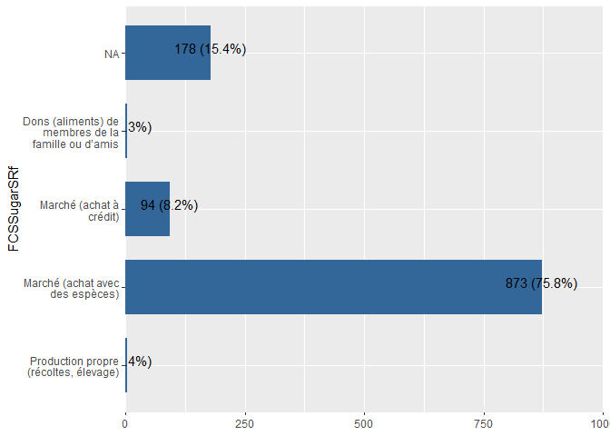<!-- -->

```r
#ea_2022
Mauritania_ea_2022 <- 
Mauritania_ea_2022 %>% dplyr::mutate_at(c("FCSSugarSRf"),recode,"1"=1,"6"=5,"7"=6,"8"=7)
Mauritania_ea_2022$FCSSugarSRf <- labelled::labelled( Mauritania_ea_2022$FCSSugarSRf, c(`Production propre (récoltes, élevage)` = 1, `Pêche / Chasse` = 2, Cueillette= 3,`Prêts`=4,`Marché (achat avec des espèces)`=5,`Marché (achat à crédit)`=6,`Mendicité`=7,`Troc travail ou biens contre des aliments`=8,`Dons (aliments) de membres de la famille ou d’amis`=9,`Aide alimentaire de la société civile, ONG, gouvernement, PAM, etc`=10))

expss::val_lab(Mauritania_ea_2022$FCSSugarSRf)
Mauritania_ea_2022%>% 
  sjPlot::plot_frq(coord.flip =T,FCSSugarSRf,show.na = T)
```

<!-- -->


### FCS : Condiments/épices: tels que (thé, café/cacao, sel, ail, épices, levure/levure chimique, tomate/sauce, viande ou poisson comme condiment, condiments incluant des petites quantités de lait/thé, café.) ?

```r
Mauritania_baseline_2018 %>%
  sjPlot::plot_frq(coord.flip =T,FCSCond,show.na = T)
```

<!-- -->

```r
Mauritania_ea_2019%>% 
  sjPlot::plot_frq(coord.flip =T,FCSCond,show.na = T)
```

<!-- -->

```r
Mauritania_ea_2020%>% 
  sjPlot::plot_frq(coord.flip =T,FCSCond,show.na = T)
```

<!-- -->

```r
Mauritania_ea_2021%>% 
  sjPlot::plot_frq(coord.flip =T,FCSCond,show.na = T)
```

<!-- -->

```r
Mauritania_ea_2022%>% 
  sjPlot::plot_frq(coord.flip =T,FCSCond,show.na = T)
```

<!-- -->

```r
Mauritania_pdm_2020%>% 
  sjPlot::plot_frq(coord.flip =T,FCSCond,show.na = T)
```

<!-- -->

```r
Mauritania_pdm_2021%>% 
  sjPlot::plot_frq(coord.flip =T,FCSCond,show.na = T)
```

<!-- -->

```r
# Mauritania_pdm_2022%>% 
#   sjPlot::plot_frq(coord.flip =T,FCSCond,show.na = T)
```
### FCS : Condiments/épices: tels que (thé, café/cacao, sel, ail, épices, levure/levure chimique, tomate/sauce, viande ou poisson comme condiment, condiments incluant des petites quantités de lait/thé, café.) ? - Sources

```r
#2018
#La variable FCSCondSRf est nulle
expss::val_lab(Mauritania_baseline_2018$FCSCondSRf)
 Mauritania_baseline_2018 %>% 
  plot_frq(coord.flip =T,FCSCondSRf,show.na = T)
```

<!-- -->

```r
Mauritania_baseline_2018$FCSCondSRf <- as.factor(Mauritania_baseline_2018$FCSCondSRf)

##2019
#check labels
expss::val_lab(Mauritania_ea_2019$FCSCondSRf)
Mauritania_ea_2019 %>% 
  plot_frq(coord.flip =T,FCSCondSRf,show.na = T)
```

<!-- -->

```r
Mauritania_ea_2019$FCSCondSRf <- as.factor(Mauritania_ea_2019$FCSCondSRf)
 #2020

expss::val_lab(Mauritania_ea_2020$FCSCondSRf)
Mauritania_ea_2020 %>% 
  plot_frq(coord.flip =T,FCSCondSRf,show.na = T)
```

<!-- -->

```r
Mauritania_ea_2020$FCSCondSRf <- as.factor(Mauritania_ea_2020$FCSCondSRf)

#pdm2020
expss::val_lab(Mauritania_pdm_2020$FCSCondSRf)
Mauritania_pdm_2020%>% 
  sjPlot::plot_frq(coord.flip =T,FCSCondSRf,show.na=T) 
```

<!-- -->

```r
Mauritania_pdm_2020$FCSCondSRf <- as.factor(Mauritania_pdm_2020$FCSCondSRf)


#2021
expss::val_lab(Mauritania_ea_2021$FCSCondSRf)
Mauritania_ea_2021 <- 
Mauritania_ea_2021 %>% dplyr::mutate_at(c("FCSCondSRf"),recode,"1"=1,"2"=5,"3"=6,"4"=8,"7"=9,"5"=4,.default=NA_real_)
Mauritania_ea_2021$FCSCondSRf <- labelled::labelled( Mauritania_ea_2021$FCSCondSRf, c(`Production propre (récoltes, élevage)` = 1, `Pêche / Chasse` = 2, Cueillette= 3,`Prêts`=4,`Marché (achat avec des espèces)`=5,`Marché (achat à crédit)`=6,`Mendicité`=7,`Troc travail ou biens contre des aliments`=8,`Dons (aliments) de membres de la famille ou d’amis`=9,`Aide alimentaire de la société civile, ONG, gouvernement, PAM, etc`=10))
Mauritania_ea_2021%>% 
  sjPlot::plot_frq(coord.flip =T,FCSCondSRf,show.na = T)
```

<!-- -->

```r
#pdm_2021

Mauritania_pdm_2021 <- 
Mauritania_pdm_2021 %>% dplyr::mutate_at(c("FCSCondSRf"),recode,"1"=1,"2"=5,"3"=6,"7"=9,.default=NA_real_)
Mauritania_pdm_2021$FCSCondSRf <- labelled::labelled( Mauritania_pdm_2021$FCSCondSRf, c(`Production propre (récoltes, élevage)` = 1, `Pêche / Chasse` = 2, Cueillette= 3,`Prêts`=4,`Marché (achat avec des espèces)`=5,`Marché (achat à crédit)`=6,`Mendicité`=7,`Troc travail ou biens contre des aliments`=8,`Dons (aliments) de membres de la famille ou d’amis`=9,`Aide alimentaire de la société civile, ONG, gouvernement, PAM, etc`=10))
Mauritania_pdm_2021%>% 
  sjPlot::plot_frq(coord.flip =T,FCSCondSRf,show.na=T)
```

<!-- -->

```r
#ea_2022
Mauritania_ea_2022 <- 
Mauritania_ea_2022 %>% dplyr::mutate_at(c("FCSCondSRf"),recode,"1"=1,"6"=5,"7"=6,"8"=7,"9"=8)
Mauritania_ea_2022$FCSCondSRf <- labelled::labelled( Mauritania_ea_2022$FCSCondSRf, c(`Production propre (récoltes, élevage)` = 1, `Pêche / Chasse` = 2, Cueillette= 3,`Prêts`=4,`Marché (achat avec des espèces)`=5,`Marché (achat à crédit)`=6,`Mendicité`=7,`Troc travail ou biens contre des aliments`=8,`Dons (aliments) de membres de la famille ou d’amis`=9,`Aide alimentaire de la société civile, ONG, gouvernement, PAM, etc`=10))

expss::val_lab(Mauritania_ea_2022$FCSCondSRf)
Mauritania_ea_2022%>% 
  sjPlot::plot_frq(coord.flip =T,FCSCondSRf,show.na = T)
```

<!-- -->

### FCS computation


```r
#calculate FCS
Mauritania_baseline_2018 <- Mauritania_baseline_2018 %>% mutate(FCS = (2 * FCSStap) + (3 * FCSPulse)+ (4*FCSPr) +FCSVeg  +FCSFruit +(4*FCSDairy) + (0.5*FCSFat) + (0.5*FCSSugar))
var_label(Mauritania_baseline_2018$FCS) <- "Score de consommation alimentaire"
#create FCG groups based on 21/25 or 28/42 thresholds - analyst should decide which one to use.
Mauritania_baseline_2018 <- Mauritania_baseline_2018 %>% mutate(
  FCSCat21 = case_when(
    FCS <= 21 ~ "Pauvre", between(FCS, 21.5, 35) ~ "Limite", FCS > 35 ~ "Acceptable"),
  FCSCat28 = case_when(
    FCS <= 28 ~ "Pauvre", between(FCS, 28.5, 42) ~ "Limite", FCS > 42 ~ "Acceptable"))
var_label(Mauritania_baseline_2018$FCSCat21) <- "Groupe de consommation alimentaire - Seuils du 21/35"
var_label(Mauritania_baseline_2018$FCSCat28) <-  "Groupe de consommation alimentaire - Seuils du 28/42"

Mauritania_baseline_2018 %>% 
  sjPlot::plot_frq(coord.flip =T,FCSCat21,show.na = T)
```

<!-- -->

```r
Mauritania_baseline_2018 %>% 
  sjPlot::plot_frq(coord.flip =T,FCSCat28,show.na = T)
```

<!-- -->

```r
#############################
#calculate FCS
Mauritania_ea_2019 <- Mauritania_ea_2019 %>% mutate(FCS = (2 * FCSStap) + (3 * FCSPulse)+ (4*FCSPr) +FCSVeg  +FCSFruit +(4*FCSDairy) + (0.5*FCSFat) + (0.5*FCSSugar))
var_label(Mauritania_ea_2019$FCS) <- "Score de consommation alimentaire"
#create FCG groups based on 21/25 or 28/42 thresholds - analyst should decide which one to use.
Mauritania_ea_2019 <- Mauritania_ea_2019 %>% mutate(
  FCSCat21 = case_when(
    FCS <= 21 ~ "Pauvre", between(FCS, 21.5, 35) ~ "Limite", FCS > 35 ~ "Acceptable"),
  FCSCat28 = case_when(
    FCS <= 28 ~ "Pauvre", between(FCS, 28.5, 42) ~ "Limite", FCS > 42 ~ "Acceptable"))
var_label(Mauritania_ea_2019$FCSCat21) <- "Groupe de consommation alimentaire - Seuils du 21/35"
var_label(Mauritania_ea_2019$FCSCat28) <-  "Groupe de consommation alimentaire - Seuils du 28/42"

Mauritania_ea_2019 %>% 
  sjPlot::plot_frq(coord.flip =T,FCSCat21,show.na = T)
```

<!-- -->

```r
Mauritania_ea_2019 %>% 
  sjPlot::plot_frq(coord.flip =T,FCSCat28,show.na = T)
```

<!-- -->

```r
#######################################
#calculate FCS
#Transformation des variables en numeric()
Mauritania_ea_2020$FCSStap<- as.numeric(Mauritania_ea_2020$FCSStap)
Mauritania_ea_2020$FCSPulse<- as.numeric(Mauritania_ea_2020$FCSPulse)
Mauritania_ea_2020$FCSPr<- as.numeric(Mauritania_ea_2020$FCSPr)
Mauritania_ea_2020$FCSVeg<- as.numeric(Mauritania_ea_2020$FCSVeg)
Mauritania_ea_2020$FCSFruit<- as.numeric(Mauritania_ea_2020$FCSFruit)
Mauritania_ea_2020$FCSSugar<- as.numeric(Mauritania_ea_2020$FCSSugar)
Mauritania_ea_2020$FCSDairy<- as.numeric(Mauritania_ea_2020$FCSDairy)
Mauritania_ea_2020$FCSFat<- as.numeric(Mauritania_ea_2020$FCSFat)
Mauritania_ea_2020 <- Mauritania_ea_2020 %>% mutate(FCS = (2 * FCSStap) + (3 * FCSPulse)+ (4*FCSPr) +FCSVeg  +FCSFruit +(4*FCSDairy) + (0.5*FCSFat) + (0.5*FCSSugar))
var_label(Mauritania_ea_2020$FCS) <- "Score de consommation alimentaire"
#create FCG groups based on 21/25 or 28/42 thresholds - analyst should decide which one to use.
Mauritania_ea_2020 <- Mauritania_ea_2020 %>% mutate(
  FCSCat21 = case_when(
    FCS <= 21 ~ "Pauvre", between(FCS, 21.5, 35) ~ "Limite", FCS > 35 ~ "Acceptable"),
  FCSCat28 = case_when(
    FCS <= 28 ~ "Pauvre", between(FCS, 28.5, 42) ~ "Limite", FCS > 42 ~ "Acceptable"))
var_label(Mauritania_ea_2020$FCSCat21) <- "Groupe de consommation alimentaire - Seuils du 21/35"
var_label(Mauritania_ea_2020$FCSCat28) <-  "Groupe de consommation alimentaire - Seuils du 28/42"

Mauritania_ea_2020 %>% 
  sjPlot::plot_frq(coord.flip =T,FCSCat21,show.na = T)
```

<!-- -->

```r
Mauritania_ea_2020 %>% 
  sjPlot::plot_frq(coord.flip =T,FCSCat28,show.na = T)
```

<!-- -->

```r
#############################################
#calculate FCS
Mauritania_ea_2021 <- Mauritania_ea_2021 %>% mutate(FCS = (2 * FCSStap) + (3 * FCSPulse)+ (4*FCSPr) +FCSVeg  +FCSFruit +(4*FCSDairy) + (0.5*FCSFat) + (0.5*FCSSugar))
var_label(Mauritania_ea_2021$FCS) <- "Score de consommation alimentaire"
#create FCG groups based on 21/25 or 28/42 thresholds - analyst should decide which one to use.
Mauritania_ea_2021 <- Mauritania_ea_2021 %>% mutate(
  FCSCat21 = case_when(
    FCS <= 21 ~ "Pauvre", between(FCS, 21.5, 35) ~ "Limite", FCS > 35 ~ "Acceptable"),
  FCSCat28 = case_when(
    FCS <= 28 ~ "Pauvre", between(FCS, 28.5, 42) ~ "Limite", FCS > 42 ~ "Acceptable"))
var_label(Mauritania_ea_2021$FCSCat21) <- "Groupe de consommation alimentaire - Seuils du 21/35"
var_label(Mauritania_ea_2021$FCSCat28) <-  "Groupe de consommation alimentaire - Seuils du 28/42"

Mauritania_ea_2021 %>% 
  sjPlot::plot_frq(coord.flip =T,FCSCat21,show.na = T)
```

<!-- -->

```r
Mauritania_ea_2021 %>% 
  sjPlot::plot_frq(coord.flip =T,FCSCat28,show.na = T)
```

<!-- -->

```r
########################################
#calculate FCS
Mauritania_ea_2022 <- Mauritania_ea_2022 %>% mutate(FCS = (2 * FCSStap) + (3 * FCSPulse)+ (4*FCSPr) +FCSVeg  +FCSFruit +(4*FCSDairy) + (0.5*FCSFat) + (0.5*FCSSugar))
var_label(Mauritania_ea_2022$FCS) <- "Score de consommation alimentaire"
#create FCG groups based on 21/25 or 28/42 thresholds - analyst should decide which one to use.
Mauritania_ea_2022 <- Mauritania_ea_2022 %>% mutate(
  FCSCat21 = case_when(
    FCS <= 21 ~ "Pauvre", between(FCS, 21.5, 35) ~ "Limite", FCS > 35 ~ "Acceptable"),
  FCSCat28 = case_when(
    FCS <= 28 ~ "Pauvre", between(FCS, 28.5, 42) ~ "Limite", FCS > 42 ~ "Acceptable"))
var_label(Mauritania_ea_2022$FCSCat21) <- "Groupe de consommation alimentaire - Seuils du 21/35"
var_label(Mauritania_ea_2022$FCSCat28) <-  "Groupe de consommation alimentaire - Seuils du 28/42"

Mauritania_ea_2022 %>% 
  sjPlot::plot_frq(coord.flip =T,FCSCat21,show.na = T)
```

<!-- -->

```r
Mauritania_ea_2022 %>% 
  sjPlot::plot_frq(coord.flip =T,FCSCat28,show.na = T)
```

<!-- -->

```r
###########################################
#calculate FCS
Mauritania_pdm_2020 <- Mauritania_pdm_2020 %>% mutate(FCS = (2 * FCSStap) + (3 * FCSPulse)+ (4*FCSPr) +FCSVeg  +FCSFruit +(4*FCSDairy) + (0.5*FCSFat) + (0.5*FCSSugar))
var_label(Mauritania_pdm_2020$FCS) <- "Score de consommation alimentaire"
#create FCG groups based on 21/25 or 28/42 thresholds - analyst should decide which one to use.
Mauritania_pdm_2020 <- Mauritania_pdm_2020 %>% mutate(
  FCSCat21 = case_when(
    FCS <= 21 ~ "Pauvre", between(FCS, 21.5, 35) ~ "Limite", FCS > 35 ~ "Acceptable"),
  FCSCat28 = case_when(
    FCS <= 28 ~ "Pauvre", between(FCS, 28.5, 42) ~ "Limite", FCS > 42 ~ "Acceptable"))
var_label(Mauritania_pdm_2020$FCSCat21) <- "Groupe de consommation alimentaire - Seuils du 21/35"
var_label(Mauritania_pdm_2020$FCSCat28) <-  "Groupe de consommation alimentaire - Seuils du 28/42"

Mauritania_pdm_2020 %>% 
  sjPlot::plot_frq(coord.flip =T,FCSCat21,show.na = T)
```

<!-- -->

```r
Mauritania_pdm_2020 %>% 
  sjPlot::plot_frq(coord.flip =T,FCSCat28,show.na = T)
```

<!-- -->

```r
#############################################
#calculate FCS
Mauritania_pdm_2021 <- Mauritania_pdm_2021 %>% mutate(FCS = (2 * FCSStap) + (3 * FCSPulse)+ (4*FCSPr) +FCSVeg  +FCSFruit +(4*FCSDairy) + (0.5*FCSFat) + (0.5*FCSSugar))
var_label(Mauritania_pdm_2021$FCS) <- "Score de consommation alimentaire"
#create FCG groups based on 21/25 or 28/42 thresholds - analyst should decide which one to use.
Mauritania_pdm_2021 <- Mauritania_pdm_2021 %>% mutate(
  FCSCat21 = case_when(
    FCS <= 21 ~ "Pauvre", between(FCS, 21.5, 35) ~ "Limite", FCS > 35 ~ "Acceptable"),
  FCSCat28 = case_when(
    FCS <= 28 ~ "Pauvre", between(FCS, 28.5, 42) ~ "Limite", FCS > 42 ~ "Acceptable"))
var_label(Mauritania_pdm_2021$FCSCat21) <- "Groupe de consommation alimentaire - Seuils du 21/35"
var_label(Mauritania_pdm_2021$FCSCat28) <-  "Groupe de consommation alimentaire - Seuils du 28/42"

Mauritania_pdm_2021 %>% 
  sjPlot::plot_frq(coord.flip =T,FCSCat21,show.na = T)
```

<!-- -->

```r
Mauritania_pdm_2021 %>% 
  sjPlot::plot_frq(coord.flip =T,FCSCat28,show.na = T)
```

<!-- -->

```r
##############################################
```


## reduced coping strategy index OU l’indice réduit des stratégies de survie (rCSI)

### rCSI : Consommer des aliments moins préférés et moins chers


```r
Mauritania_baseline_2018 %>% 
  sjPlot::plot_frq(coord.flip =T,rCSILessQlty,show.na = T)
```

<!-- -->

```r
Mauritania_ea_2019%>% 
  sjPlot::plot_frq(coord.flip =T,rCSILessQlty,show.na = T)
```

<!-- -->

```r
Mauritania_ea_2020%>% 
  sjPlot::plot_frq(coord.flip =T,rCSILessQlty,show.na = T)
```

<!-- -->

```r
Mauritania_ea_2021%>% 
  sjPlot::plot_frq(coord.flip =T,rCSILessQlty,show.na = T)
```

<!-- -->

```r
Mauritania_ea_2022%>% 
  sjPlot::plot_frq(coord.flip =T,rCSILessQlty,show.na = T)
```

<!-- -->

```r
Mauritania_pdm_2020%>% 
  sjPlot::plot_frq(coord.flip =T,rCSILessQlty,show.na = T)
```

<!-- -->

```r
Mauritania_pdm_2021%>% 
  sjPlot::plot_frq(coord.flip =T,rCSILessQlty,show.na = T)
```

<!-- -->

```r
# Mauritania_pdm_2022%>% 
#   sjPlot::plot_frq(coord.flip =T,rCSILessQlty,show.na = T)
```


### rCSI : Emprunter de la nourriture ou compter sur l’aide des parents/amis


```r
Mauritania_baseline_2018 %>% 
  sjPlot::plot_frq(coord.flip =T,rCSIBorrow,show.na = T)
```

<!-- -->

```r
Mauritania_ea_2019%>% 
  sjPlot::plot_frq(coord.flip =T,rCSIBorrow,show.na = T)
```

<!-- -->

```r
Mauritania_ea_2020%>% 
  sjPlot::plot_frq(coord.flip =T,rCSIBorrow,show.na = T)
```

<!-- -->

```r
Mauritania_ea_2021%>% 
  sjPlot::plot_frq(coord.flip =T,rCSIBorrow,show.na = T)
```

<!-- -->

```r
Mauritania_ea_2022%>% 
  sjPlot::plot_frq(coord.flip =T,rCSIBorrow,show.na = T)
```

<!-- -->

```r
Mauritania_pdm_2020%>% 
  sjPlot::plot_frq(coord.flip =T,rCSIBorrow,show.na = T)
```

<!-- -->

```r
Mauritania_pdm_2021%>% 
  sjPlot::plot_frq(coord.flip =T,rCSIBorrow,show.na = T)
```

<!-- -->

```r
# Mauritania_pdm_2022%>% 
#   sjPlot::plot_frq(coord.flip =T,rCSIBorrow,show.na = T)
```


### rCSI : Diminuer la quantité consommée pendant les repas


```r
Mauritania_baseline_2018 %>% 
  sjPlot::plot_frq(coord.flip =T,rCSIMealSize,show.na = T)
```

<!-- -->

```r
Mauritania_ea_2019%>% 
  sjPlot::plot_frq(coord.flip =T,rCSIMealSize,show.na = T)
```

<!-- -->

```r
Mauritania_ea_2020%>% 
  sjPlot::plot_frq(coord.flip =T,rCSIMealSize,show.na = T)
```

<!-- -->

```r
Mauritania_ea_2021%>% 
  sjPlot::plot_frq(coord.flip =T,rCSIMealSize,show.na = T)
```

<!-- -->

```r
Mauritania_ea_2022%>% 
  sjPlot::plot_frq(coord.flip =T,rCSIMealSize,show.na = T)
```

<!-- -->

```r
Mauritania_pdm_2020%>% 
  sjPlot::plot_frq(coord.flip =T,rCSIMealSize,show.na = T)
```

<!-- -->

```r
Mauritania_pdm_2021%>% 
  sjPlot::plot_frq(coord.flip =T,rCSIMealSize,show.na = T)
```

<!-- -->

```r
# Mauritania_pdm_2022%>% 
#   sjPlot::plot_frq(coord.flip =T,rCSIMealSize,show.na = T)
```


### rCSI :  Restreindre la consommation des adultes  pour nourrir les enfants


```r
#correction
Mauritania_ea_2022 <- Mauritania_ea_2022 %>%
  mutate(rCSIMealAdult  = ifelse(rCSIMealAdult  == 3.001,3 , rCSIMealAdult ))
```


```r
Mauritania_baseline_2018 %>% 
  sjPlot::plot_frq(coord.flip =T,rCSIMealAdult,show.na = T)
```

<!-- -->

```r
Mauritania_ea_2019%>% 
  sjPlot::plot_frq(coord.flip =T,rCSIMealAdult,show.na = T)
```

<!-- -->

```r
Mauritania_ea_2020%>% 
  sjPlot::plot_frq(coord.flip =T,rCSIMealAdult,show.na = T)
```

<!-- -->

```r
Mauritania_ea_2021%>% 
  sjPlot::plot_frq(coord.flip =T,rCSIMealAdult,show.na = T)
```

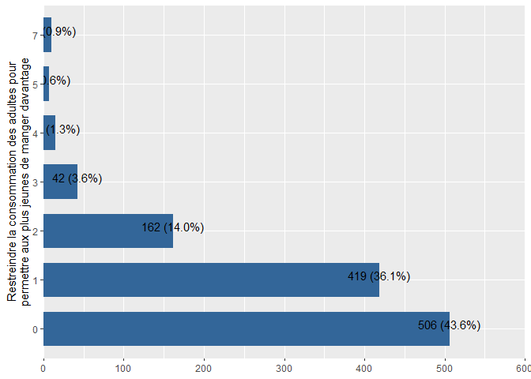<!-- -->

```r
Mauritania_ea_2022%>% 
  sjPlot::plot_frq(coord.flip =T,rCSIMealAdult,show.na = T)
```

<!-- -->

```r
Mauritania_pdm_2020%>% 
  sjPlot::plot_frq(coord.flip =T,rCSIMealAdult,show.na = T)
```

<!-- -->

```r
Mauritania_pdm_2021%>% 
  sjPlot::plot_frq(coord.flip =T,rCSIMealAdult,show.na = T)
```

<!-- -->

```r
# Mauritania_pdm_2022%>% 
#   sjPlot::plot_frq(coord.flip =T,rCSIMealAdult,show.na = T)
```


### rCSI : Diminuer le nombre de repas par jour

```r
#correction
Mauritania_baseline_2018 <- Mauritania_baseline_2018 %>%
  mutate(rCSIMealNb  = ifelse(rCSIMealNb  == 8,7 , rCSIMealNb ))
```


```r
Mauritania_baseline_2018 %>% 
  sjPlot::plot_frq(coord.flip =T,rCSIMealNb,show.na = T)
```

<!-- -->

```r
Mauritania_ea_2019%>% 
  sjPlot::plot_frq(coord.flip =T,rCSIMealNb,show.na = T)
```

<!-- -->

```r
Mauritania_ea_2020%>% 
  sjPlot::plot_frq(coord.flip =T,rCSIMealNb,show.na = T)
```

<!-- -->

```r
Mauritania_ea_2021%>% 
  sjPlot::plot_frq(coord.flip =T,rCSIMealNb,show.na = T)
```

<!-- -->

```r
Mauritania_ea_2022%>% 
  sjPlot::plot_frq(coord.flip =T,rCSIMealNb,show.na = T)
```

<!-- -->

```r
Mauritania_pdm_2020%>% 
  sjPlot::plot_frq(coord.flip =T,rCSIMealNb,show.na = T)
```

<!-- -->

```r
Mauritania_pdm_2021%>% 
  sjPlot::plot_frq(coord.flip =T,rCSIMealNb,show.na = T)
```

<!-- -->

```r
# Mauritania_pdm_2022%>% 
#   sjPlot::plot_frq(coord.flip =T,rCSIMealNb,show.na = T)
```


```r
#calculate rCSI Score
Mauritania_baseline_2018 <- Mauritania_baseline_2018 %>% mutate(rCSI = rCSILessQlty  + (2 * rCSIBorrow) + rCSIMealSize + (3 * rCSIMealAdult) + rCSIMealNb)
var_label(Mauritania_baseline_2018$rCSI) <- "rCSI"
#calculate rCSI Score
Mauritania_ea_2019 <- Mauritania_ea_2019 %>% mutate(rCSI = rCSILessQlty  + (2 * rCSIBorrow) + rCSIMealSize + (3 * rCSIMealAdult) + rCSIMealNb)
var_label(Mauritania_ea_2019$rCSI) <- "rCSI"
#calculate rCSI Score
Mauritania_ea_2020 <- Mauritania_ea_2020 %>% mutate(rCSI = rCSILessQlty  + (2 * rCSIBorrow) + rCSIMealSize + (3 * rCSIMealAdult) + rCSIMealNb)
var_label(Mauritania_ea_2020$rCSI) <- "rCSI"
#calculate rCSI Score
Mauritania_ea_2021 <- Mauritania_ea_2021 %>% mutate(rCSI = rCSILessQlty  + (2 * rCSIBorrow) + rCSIMealSize + (3 * rCSIMealAdult) + rCSIMealNb)
var_label(Mauritania_ea_2021$rCSI) <- "rCSI"
#calculate rCSI Score
Mauritania_ea_2022 <- Mauritania_ea_2022 %>% mutate(rCSI = rCSILessQlty  + (2 * rCSIBorrow) + rCSIMealSize + (3 * rCSIMealAdult) + rCSIMealNb)
var_label(Mauritania_ea_2022$rCSI) <- "rCSI"
#calculate rCSI Score
Mauritania_pdm_2020 <- Mauritania_pdm_2020 %>% mutate(rCSI = rCSILessQlty  + (2 * rCSIBorrow) + rCSIMealSize + (3 * rCSIMealAdult) + rCSIMealNb)
var_label(Mauritania_pdm_2020$rCSI) <- "rCSI"
#calculate rCSI Score
Mauritania_pdm_2021 <- Mauritania_pdm_2021 %>% mutate(rCSI = rCSILessQlty  + (2 * rCSIBorrow) + rCSIMealSize + (3 * rCSIMealAdult) + rCSIMealNb)
var_label(Mauritania_pdm_2021$rCSI) <- "rCSI"
#calculate rCSI Score
```


Households are divided in four classes according to the rCSI score: 0-3, 4-18, and 19 and above which correspond to IPC Phases 1, 2 and 3 and above respectively.


```r
#2018
Mauritania_baseline_2018 <- Mauritania_baseline_2018 %>% mutate(
  rCSI_class = case_when(
    rCSI <= 3 ~ 1, between(rCSI, 3.5, 18.5) ~ 2, rCSI > 18.5 ~ 3))
var_label(Mauritania_baseline_2018$rCSI_class) <- "rCSI into class"

Mauritania_baseline_2018$rCSI_class <- labelled::labelled(Mauritania_baseline_2018$rCSI_class, c(`score rCSI inf à 3` = 1, `score rCSI entre 4 et 18` = 2, `score rCSI sup à 18`=3))
Mauritania_baseline_2018 %>% 
  sjPlot::plot_frq(coord.flip =T,rCSI_class,show.na = T)
```

<!-- -->

```r
#2019
Mauritania_ea_2019 <- Mauritania_ea_2019 %>% mutate(
  rCSI_class = case_when(
    rCSI <= 3 ~ 1, between(rCSI, 3.5, 18.5) ~ 2, rCSI > 18.5 ~ 3))
var_label(Mauritania_ea_2019$rCSI_class) <- "rCSI into class"

Mauritania_ea_2019$rCSI_class <- labelled::labelled(Mauritania_ea_2019$rCSI_class, c(`score rCSI inf à 3` = 1, `score rCSI entre 4 et 18` = 2, `score rCSI sup à 18`=3))

Mauritania_ea_2019 %>% 
  sjPlot::plot_frq(coord.flip =T,rCSI_class,show.na = T)
```

<!-- -->

```r
#2020
Mauritania_ea_2020 <- Mauritania_ea_2020 %>% mutate(
  rCSI_class = case_when(
    rCSI <= 3 ~ 1, between(rCSI, 3.5, 18.5) ~ 2, rCSI > 18.5 ~ 3))
var_label(Mauritania_ea_2020$rCSI_class) <- "rCSI into class"

Mauritania_ea_2020$rCSI_class <- labelled::labelled(Mauritania_ea_2020$rCSI_class, c(`score rCSI inf à 3` = 1, `score rCSI entre 4 et 18` = 2, `score rCSI sup à 18`=3))
Mauritania_ea_2020 %>% 
  sjPlot::plot_frq(coord.flip =T,rCSI_class,show.na = T)
```

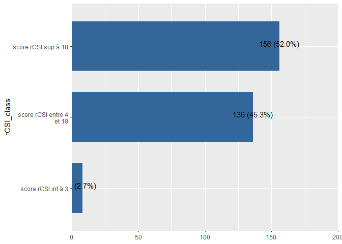<!-- -->

```r
#pdm 2020
Mauritania_pdm_2020 <- Mauritania_pdm_2020 %>% mutate(
  rCSI_class = case_when(
    rCSI <= 3 ~ 1, between(rCSI, 3.5, 18.5) ~ 2, rCSI > 18.5 ~ 3))
var_label(Mauritania_pdm_2020$rCSI_class) <- "rCSI into class"

Mauritania_pdm_2020$rCSI_class <- labelled::labelled(Mauritania_pdm_2020$rCSI_class, c(`score rCSI inf à 3` = 1, `score rCSI entre 4 et 18` = 2, `score rCSI sup à 18`=3))
Mauritania_pdm_2020 %>% 
  sjPlot::plot_frq(coord.flip =T,rCSI_class,show.na = T)
```

<!-- -->

```r
#2021
Mauritania_ea_2021 <- Mauritania_ea_2021 %>% mutate(
  rCSI_class = case_when(
    rCSI <= 3 ~ 1, between(rCSI, 3.5, 18.5) ~ 2, rCSI > 18.5 ~ 3))
var_label(Mauritania_ea_2021$rCSI_class) <- "rCSI into class"

Mauritania_ea_2021$rCSI_class <- labelled::labelled(Mauritania_ea_2021$rCSI_class, c(`score rCSI inf à 3` = 1, `score rCSI entre 4 et 18` = 2, `score rCSI sup à 18`=3))
Mauritania_ea_2021 %>% 
  sjPlot::plot_frq(coord.flip =T,rCSI_class,show.na = T)
```

<!-- -->

```r
#pdm 2021
Mauritania_pdm_2021 <- Mauritania_pdm_2021 %>% mutate(
  rCSI_class = case_when(
    rCSI <= 3 ~ 1, between(rCSI, 3.5, 18.5) ~ 2, rCSI > 18.5 ~ 3))
var_label(Mauritania_pdm_2021$rCSI_class) <- "rCSI into class"

Mauritania_pdm_2021$rCSI_class <- labelled::labelled(Mauritania_pdm_2021$rCSI_class, c(`score rCSI inf à 3` = 1, `score rCSI entre 4 et 18` = 2, `score rCSI sup à 18`=3))
Mauritania_pdm_2021 %>% 
  sjPlot::plot_frq(coord.flip =T,rCSI_class,show.na = T)
```

<!-- -->

```r
#2022
Mauritania_ea_2022 <- Mauritania_ea_2022 %>% mutate(
  rCSI_class = case_when(
    rCSI <= 3 ~ 1, between(rCSI, 3.5, 18.5) ~ 2, rCSI > 18.5 ~ 3))
var_label(Mauritania_ea_2022$rCSI_class) <- "rCSI into class"
Mauritania_ea_2022$rCSI_class <- labelled::labelled(Mauritania_ea_2022$rCSI_class, c(`score rCSI inf à 3` = 1, `score rCSI entre 4 et 18` = 2, `score rCSI sup à 18`=3))
Mauritania_ea_2022 %>% 
  sjPlot::plot_frq(coord.flip =T,rCSI_class,show.na = T)
```

<!-- -->


## Stratégies d'adaptation aux moyens d'existence (LhCSI)


```r
# 1 = Non, je n'ai pas été confronté à une insuffisance de nourriture
# 2 = Non, parce que j’ai déjà vendu ces actifs ou mené cette activité au cours des 12 derniers mois et je ne peux pas continuer à le faire
# 3 = Oui
# 4 = Non applicable
```


### LhCSI : Vendre des actifs/biens non productifs du ménage (radio, meuble, réfrigérateur, télévision, bijoux etc.)


```r
#View labels
expss::val_lab(Mauritania_baseline_2018$LhCSIStress1)
Mauritania_baseline_2018 %>% 
  plot_frq(coord.flip =T,LhCSIStress1)
```

<!-- -->

```r
Mauritania_baseline_2018$LhCSIStress1 <- as.character(Mauritania_baseline_2018$LhCSIStress1)

Mauritania_baseline_2018 <- 
  Mauritania_baseline_2018 %>% dplyr::mutate(LhCSIStress1 = dplyr::recode(LhCSIStress1,"1"=1,"2"=2,"3"=3,"4"=4))
Mauritania_baseline_2018$LhCSIStress1 <- labelled::labelled(Mauritania_baseline_2018$LhCSIStress1, c(`Non, je n'ai pas été confronté à une insuffisance de nourriture` = 1, `Non, parce que j’ai déjà vendu ces actifs ou mené cette activité au cours des 12 derniers mois et je ne peux pas continuer à le faire` = 2, Oui= 3,`Non applicable`=4))
#check labels
expss::val_lab(Mauritania_baseline_2018$LhCSIStress1)
Mauritania_baseline_2018 %>% 
  plot_frq(coord.flip =T,LhCSIStress1)
```

<!-- -->

```r
#2019

#View labels
expss::val_lab(Mauritania_ea_2019$LhCSIStress1)
Mauritania_ea_2019 %>% 
  plot_frq(coord.flip =T,LhCSIStress1)
```

<!-- -->

```r
Mauritania_ea_2019 <- Mauritania_ea_2019 %>% 
  dplyr::mutate(LhCSIStress1 = dplyr::recode(LhCSIStress1,"1"=1,"3"=3,"4"=4))
Mauritania_ea_2019$LhCSIStress1 <- labelled::labelled(Mauritania_ea_2019$LhCSIStress1, c(`Non, je n'ai pas été confronté à une insuffisance de nourriture` = 1, `Non, parce que j’ai déjà vendu ces actifs ou mené cette activité au cours des 12 derniers mois et je ne peux pas continuer à le faire` = 2, Oui= 3,`Non applicable`=4))
#check labels
expss::val_lab(Mauritania_ea_2019$LhCSIStress1)
Mauritania_ea_2019 %>% 
  plot_frq(coord.flip =T,LhCSIStress1)
```

<!-- -->

```r
#2020

#View labels
expss::val_lab(Mauritania_ea_2020$LhCSIStress1)
Mauritania_ea_2020 %>% 
  plot_frq(coord.flip =T,LhCSIStress1)
```

<!-- -->

```r
#change labels
Mauritania_ea_2020 <- Mauritania_ea_2020 %>% 
  dplyr::mutate(LhCSIStress1 = dplyr::recode(LhCSIStress1,"1"=1,"3"=3,"4"=4))
Mauritania_ea_2020$LhCSIStress1 <- labelled::labelled(Mauritania_ea_2020$LhCSIStress1, c(`Non, je n'ai pas été confronté à une insuffisance de nourriture` = 1, `Non, parce que j’ai déjà vendu ces actifs ou mené cette activité au cours des 12 derniers mois et je ne peux pas continuer à le faire` = 2, Oui= 3,`Non applicable`=4))

Mauritania_ea_2020 %>% 
  plot_frq(coord.flip =T,LhCSIStress1)
```

<!-- -->

```r
#2021

#View labels
expss::val_lab(Mauritania_ea_2021$LhCSIStress1)
Mauritania_ea_2021 %>% 
  plot_frq(coord.flip =T,LhCSIStress1)
```

<!-- -->

```r
#change labels
Mauritania_ea_2021 <- Mauritania_ea_2021 %>% 
  dplyr::mutate(LhCSIStress1 = dplyr::recode(LhCSIStress1,"1"=1,"3"=3,"2"=2,"4"=4))
Mauritania_ea_2021$LhCSIStress1 <- labelled::labelled(Mauritania_ea_2021$LhCSIStress1, c(`Non, je n'ai pas été confronté à une insuffisance de nourriture` = 1, `Non, parce que j’ai déjà vendu ces actifs ou mené cette activité au cours des 12 derniers mois et je ne peux pas continuer à le faire` = 2, Oui= 3,`Non applicable`=4))
Mauritania_ea_2021 %>% 
  plot_frq(coord.flip =T,LhCSIStress1)
```

<!-- -->

```r
#2022

#View labels
expss::val_lab(Mauritania_ea_2022$LhCSIStress1)
Mauritania_ea_2022 %>% 
  plot_frq(coord.flip =T,LhCSIStress1)
```

<!-- -->

```r
#update labels
Mauritania_ea_2022$LhCSIStress1 <- labelled::labelled(Mauritania_ea_2022$LhCSIStress1, c(`Non, je n'ai pas été confronté à une insuffisance de nourriture` = 1, `Non, parce que j’ai déjà vendu ces actifs ou mené cette activité au cours des 12 derniers mois et je ne peux pas continuer à le faire` = 2, Oui= 3,`Non applicable`=4))
Mauritania_ea_2022 %>% 
  plot_frq(coord.flip =T,LhCSIStress1)
```

<!-- -->

```r
#pdm 2020
#View labels
expss::val_lab(Mauritania_pdm_2020$LhCSIStress1)
Mauritania_pdm_2020 %>% 
  plot_frq(coord.flip =T,LhCSIStress1)
```

<!-- -->

```r
#change labels
Mauritania_pdm_2020 <- Mauritania_pdm_2020 %>% 
  dplyr::mutate(LhCSIStress1 = dplyr::recode(LhCSIStress1,"1"=1,"3"=3,"4"=4))
Mauritania_pdm_2020$LhCSIStress1 <- labelled::labelled(Mauritania_pdm_2020$LhCSIStress1, c(`Non, je n'ai pas été confronté à une insuffisance de nourriture` = 1, `Non, parce que j’ai déjà vendu ces actifs ou mené cette activité au cours des 12 derniers mois et je ne peux pas continuer à le faire` = 2, Oui= 3,`Non applicable`=4))
Mauritania_pdm_2020 %>% 
  plot_frq(coord.flip =T,LhCSIStress1)
```

<!-- -->

```r
#pdm  2021
#View labels
expss::val_lab(Mauritania_pdm_2021$LhCSIStress1)
Mauritania_pdm_2021 %>% 
  plot_frq(coord.flip =T,LhCSIStress1)
```

<!-- -->

```r
#Change labels
Mauritania_pdm_2021 <- Mauritania_pdm_2021 %>% 
  dplyr::mutate(LhCSIStress1 = dplyr::recode(LhCSIStress1,"1"=1,"3"=3,"2"=2,"4"=4))
Mauritania_pdm_2021$LhCSIStress1 <- labelled::labelled(Mauritania_pdm_2021$LhCSIStress1, c(`Non, je n'ai pas été confronté à une insuffisance de nourriture` = 1, `Non, parce que j’ai déjà vendu ces actifs ou mené cette activité au cours des 12 derniers mois et je ne peux pas continuer à le faire` = 2, Oui= 3,`Non applicable`=4))
Mauritania_pdm_2021 %>% 
  plot_frq(coord.flip =T,LhCSIStress1)
```

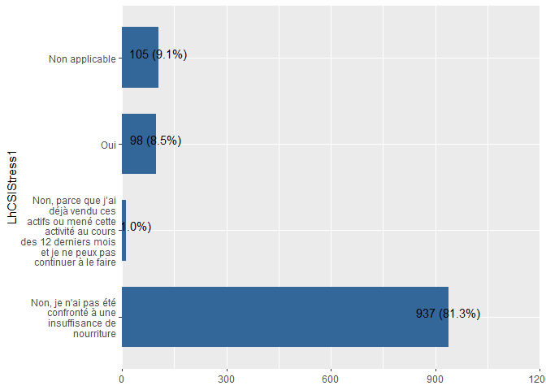<!-- -->


### LhCSI : Vendre plus d’animaux (non-productifs) que d’habitude


```r
#View labels
expss::val_lab(Mauritania_baseline_2018$LhCSIStress2)
Mauritania_baseline_2018 %>% 
  plot_frq(coord.flip =T,LhCSIStress2)
```

<!-- -->

```r
Mauritania_baseline_2018 <- 
  Mauritania_baseline_2018 %>% dplyr::mutate(LhCSIStress2 = dplyr::recode(LhCSIStress2,"1"=1,"2"=2,"3"=3,"4"=4))
Mauritania_baseline_2018$LhCSIStress2 <- labelled::labelled(Mauritania_baseline_2018$LhCSIStress2, c(`Non, je n'ai pas été confronté à une insuffisance de nourriture` = 1, `Non, parce que j’ai déjà vendu ces actifs ou mené cette activité au cours des 12 derniers mois et je ne peux pas continuer à le faire` = 2, Oui= 3,`Non applicable`=4))
#check labels
expss::val_lab(Mauritania_baseline_2018$LhCSIStress2)
Mauritania_baseline_2018 %>% 
  plot_frq(coord.flip =T,LhCSIStress2)
```

<!-- -->

```r
#View labels
expss::val_lab(Mauritania_ea_2019$LhCSIStress2)
Mauritania_ea_2019 %>% 
  plot_frq(coord.flip =T,LhCSIStress2)
```

<!-- -->

```r
Mauritania_ea_2019 <- Mauritania_ea_2019 %>% 
  dplyr::mutate(LhCSIStress2 = dplyr::recode(LhCSIStress2,"1"=1,"3"=3,"4"=4))
Mauritania_ea_2019$LhCSIStress2 <- labelled::labelled(Mauritania_ea_2019$LhCSIStress2, c(`Non, je n'ai pas été confronté à une insuffisance de nourriture` = 1, `Non, parce que j’ai déjà vendu ces actifs ou mené cette activité au cours des 12 derniers mois et je ne peux pas continuer à le faire` = 2, Oui= 3,`Non applicable`=4))
#check labels
expss::val_lab(Mauritania_ea_2019$LhCSIStress2)
Mauritania_ea_2019 %>% 
  plot_frq(coord.flip =T,LhCSIStress2)
```

<!-- -->

```r
#View labels
expss::val_lab(Mauritania_ea_2020$LhCSIStress2)
Mauritania_ea_2020 %>% 
  plot_frq(coord.flip =T,LhCSIStress2)
```

<!-- -->

```r
#change labels
Mauritania_ea_2020 <- Mauritania_ea_2020 %>% 
  dplyr::mutate(LhCSIStress2 = dplyr::recode(LhCSIStress2,"1"=1,"3"=3,"2"=2,"4"=4))
Mauritania_ea_2020$LhCSIStress2 <- labelled::labelled(Mauritania_ea_2020$LhCSIStress2, c(`Non, je n'ai pas été confronté à une insuffisance de nourriture` = 1, `Non, parce que j’ai déjà vendu ces actifs ou mené cette activité au cours des 12 derniers mois et je ne peux pas continuer à le faire` = 2, Oui= 3,`Non applicable`=4))
#check labels
expss::val_lab(Mauritania_ea_2020$LhCSIStress2)
Mauritania_ea_2020 %>% 
  plot_frq(coord.flip =T,LhCSIStress2)
```

<!-- -->

```r
#View labels
expss::val_lab(Mauritania_ea_2021$LhCSIStress2)
Mauritania_ea_2021 %>% 
  plot_frq(coord.flip =T,LhCSIStress2)
```

<!-- -->

```r
Mauritania_ea_2021 <- Mauritania_ea_2021 %>% 
  dplyr::mutate(LhCSIStress2 = dplyr::recode(LhCSIStress2,"1"=1,"3"=3,"2"=2,"4"=4))
#update labels
Mauritania_ea_2021$LhCSIStress2 <- labelled::labelled(Mauritania_ea_2021$LhCSIStress2, c(`Non, je n'ai pas été confronté à une insuffisance de nourriture` = 1, `Non, parce que j’ai déjà vendu ces actifs ou mené cette activité au cours des 12 derniers mois et je ne peux pas continuer à le faire` = 2, Oui= 3,`Non applicable`=4))
Mauritania_ea_2021 %>% 
  plot_frq(coord.flip =T,LhCSIStress2)
```

<!-- -->

```r
# Y a pas cette variable dans Mauritania_ea_2022

# #View labels
expss::val_lab(Mauritania_ea_2022$LhCSIStress2)
Mauritania_ea_2022 <- Mauritania_ea_2022 %>% 
  dplyr::mutate(LhCSIStress2 = dplyr::recode(LhCSIStress2,"1"=1,"3"=3,"2"=2,"4"=4))
Mauritania_ea_2022$LhCSIStress2 <- labelled::labelled(Mauritania_ea_2022$LhCSIStress2, c(`Non, je n'ai pas été confronté à une insuffisance de nourriture` = 1, `Non, parce que j’ai déjà vendu ces actifs ou mené cette activité au cours des 12 derniers mois et je ne peux pas continuer à le faire` = 2, Oui= 3,`Non applicable`=4))


#View labels
expss::val_lab(Mauritania_pdm_2020$LhCSIStress2)
Mauritania_pdm_2020 %>% 
  plot_frq(coord.flip =T,LhCSIStress2)
```

<!-- -->

```r
Mauritania_pdm_2020 <- Mauritania_pdm_2020 %>% 
  dplyr::mutate(LhCSIStress2 = dplyr::recode(LhCSIStress2,"1"=1,"3"=3,"2"=2,"4"=4))
Mauritania_pdm_2020$LhCSIStress2 <- labelled::labelled(Mauritania_pdm_2020$LhCSIStress2, c(`Non, je n'ai pas été confronté à une insuffisance de nourriture` = 1, `Non, parce que j’ai déjà vendu ces actifs ou mené cette activité au cours des 12 derniers mois et je ne peux pas continuer à le faire` = 2, Oui= 3,`Non applicable`=4))
#check labels
expss::val_lab(Mauritania_pdm_2020$LhCSIStress2)
Mauritania_pdm_2020 %>% 
  plot_frq(coord.flip =T,LhCSIStress2)
```

<!-- -->

```r
#View labels
expss::val_lab(Mauritania_pdm_2021$LhCSIStress2)
Mauritania_pdm_2021 %>% 
  plot_frq(coord.flip =T,LhCSIStress2)
```

<!-- -->

```r
#change labels
Mauritania_pdm_2021 <- Mauritania_pdm_2021 %>% 
  dplyr::mutate(LhCSIStress2 = dplyr::recode(LhCSIStress2,"1"=1,"3"=3,"2"=2,"4"=4))
Mauritania_pdm_2021$LhCSIStress2 <- labelled::labelled(Mauritania_pdm_2021$LhCSIStress2, c(`Non, je n'ai pas été confronté à une insuffisance de nourriture` = 1, `Non, parce que j’ai déjà vendu ces actifs ou mené cette activité au cours des 12 derniers mois et je ne peux pas continuer à le faire` = 2, Oui= 3,`Non applicable`=4))
#check labels
expss::val_lab(Mauritania_pdm_2021$LhCSIStress2)
Mauritania_pdm_2021 %>% 
  plot_frq(coord.flip =T,LhCSIStress2)
```

<!-- -->

### LhCSI : Dépenser l’épargne en raison d'un manque de nourriture ou d'argent pour acheter de la nourriture ?


```r
#View labels
expss::val_lab(Mauritania_baseline_2018$LhCSIStress3)
Mauritania_baseline_2018 %>% 
  plot_frq(coord.flip =T,LhCSIStress3)
```

<!-- -->

```r
Mauritania_baseline_2018$LhCSIStress3 <- as.character(Mauritania_baseline_2018$LhCSIStress3)
Mauritania_baseline_2018 <- 
  Mauritania_baseline_2018 %>% dplyr::mutate(LhCSIStress3 = dplyr::recode(LhCSIStress3,"1"=1,"2"=2,"3"=3,"4"=4))
Mauritania_baseline_2018$LhCSIStress3 <- labelled::labelled(Mauritania_baseline_2018$LhCSIStress3, c(`Non, je n'ai pas été confronté à une insuffisance de nourriture` = 1, `Non, parce que j’ai déjà vendu ces actifs ou mené cette activité au cours des 12 derniers mois et je ne peux pas continuer à le faire` = 2, Oui= 3,`Non applicable`=4))
#check labels
expss::val_lab(Mauritania_baseline_2018$LhCSIStress3)
Mauritania_baseline_2018 %>% 
  plot_frq(coord.flip =T,LhCSIStress3)
```

<!-- -->

```r
#View labels
expss::val_lab(Mauritania_ea_2019$LhCSIStress3)
Mauritania_ea_2019 %>% 
  plot_frq(coord.flip =T,LhCSIStress3)
```

<!-- -->

```r
Mauritania_ea_2019 <- Mauritania_ea_2019 %>% 
  dplyr::mutate(LhCSIStress3 = dplyr::recode(LhCSIStress3,"1"=1,"3"=3,"4"=4))
Mauritania_ea_2019$LhCSIStress3 <- labelled::labelled(Mauritania_ea_2019$LhCSIStress3, c(`Non, je n'ai pas été confronté à une insuffisance de nourriture` = 1, `Non, parce que j’ai déjà vendu ces actifs ou mené cette activité au cours des 12 derniers mois et je ne peux pas continuer à le faire` = 2, Oui= 3,`Non applicable`=4))
#check labels
expss::val_lab(Mauritania_ea_2019$LhCSIStress3)
Mauritania_ea_2019 %>% 
  plot_frq(coord.flip =T,LhCSIStress3)
```

<!-- -->

```r
#View labels
expss::val_lab(Mauritania_ea_2020$LhCSIStress3)
Mauritania_ea_2020 %>% 
  plot_frq(coord.flip =T,LhCSIStress3)
```

<!-- -->

```r
#change labels
Mauritania_ea_2020 <- Mauritania_ea_2020 %>% 
  dplyr::mutate(LhCSIStress3 = dplyr::recode(LhCSIStress3,"1"=1,"3"=3,"2"=2,"4"=4))
Mauritania_ea_2020$LhCSIStress3 <- labelled::labelled(Mauritania_ea_2020$LhCSIStress3, c(`Non, je n'ai pas été confronté à une insuffisance de nourriture` = 1, `Non, parce que j’ai déjà vendu ces actifs ou mené cette activité au cours des 12 derniers mois et je ne peux pas continuer à le faire` = 2, Oui= 3,`Non applicable`=4))
#check labels
expss::val_lab(Mauritania_ea_2020$LhCSIStress3)
Mauritania_ea_2020 %>% 
  plot_frq(coord.flip =T,LhCSIStress3)
```

<!-- -->

```r
#View labels
expss::val_lab(Mauritania_ea_2021$LhCSIStress3)
Mauritania_ea_2021 %>% 
  plot_frq(coord.flip =T,LhCSIStress3)
```

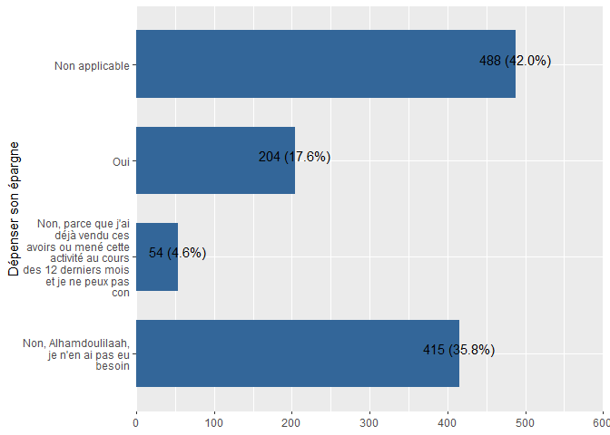<!-- -->

```r
#update labels
Mauritania_ea_2021$LhCSIStress3 <- labelled::labelled(Mauritania_ea_2021$LhCSIStress3, c(`Non, je n'ai pas été confronté à une insuffisance de nourriture` = 1, `Non, parce que j’ai déjà vendu ces actifs ou mené cette activité au cours des 12 derniers mois et je ne peux pas continuer à le faire` = 2, Oui= 3,`Non applicable`=4))
#check labels
expss::val_lab(Mauritania_ea_2021$LhCSIStress3)
Mauritania_ea_2021 %>% 
  plot_frq(coord.flip =T,LhCSIStress3)
```

<!-- -->

```r
#View labels
expss::val_lab(Mauritania_ea_2022$LhCSIStress3)
Mauritania_ea_2022 %>% 
  plot_frq(coord.flip =T,LhCSIStress3)
```

<!-- -->

```r
#update labels
Mauritania_ea_2022$LhCSIStress3 <- labelled::labelled(Mauritania_ea_2022$LhCSIStress3, c(`Non, je n'ai pas été confronté à une insuffisance de nourriture` = 1, `Non, parce que j’ai déjà vendu ces actifs ou mené cette activité au cours des 12 derniers mois et je ne peux pas continuer à le faire` = 2, Oui= 3,`Non applicable`=4))
#check labels
expss::val_lab(Mauritania_ea_2022$LhCSIStress3)
Mauritania_ea_2022 %>% 
  plot_frq(coord.flip =T,LhCSIStress3)
```

<!-- -->

```r
#View labels
expss::val_lab(Mauritania_pdm_2020$LhCSIStress3)
Mauritania_pdm_2020 %>% 
  plot_frq(coord.flip =T,LhCSIStress3)
```

<!-- -->

```r
#change labels
Mauritania_pdm_2020 <- Mauritania_pdm_2020 %>% 
  dplyr::mutate(LhCSIStress3 = dplyr::recode(LhCSIStress3,"1"=1,"3"=3,"4"=4))
Mauritania_pdm_2020$LhCSIStress3 <- labelled::labelled(Mauritania_pdm_2020$LhCSIStress3, c(`Non, je n'ai pas été confronté à une insuffisance de nourriture` = 1, `Non, parce que j’ai déjà vendu ces actifs ou mené cette activité au cours des 12 derniers mois et je ne peux pas continuer à le faire` = 2, Oui= 3,`Non applicable`=4))
#check labels
expss::val_lab(Mauritania_pdm_2020$LhCSIStress3)
Mauritania_pdm_2020 %>% 
  plot_frq(coord.flip =T,LhCSIStress3)
```

<!-- -->

```r
#View labels
expss::val_lab(Mauritania_pdm_2021$LhCSIStress3)
Mauritania_pdm_2021 %>% 
  plot_frq(coord.flip =T,LhCSIStress3)
```

<!-- -->

```r
#change labels
Mauritania_pdm_2021 <- Mauritania_pdm_2021 %>% 
  dplyr::mutate(LhCSIStress3 = dplyr::recode(LhCSIStress3,"1"=1,"3"=3,"2"=2,"4"=4))
Mauritania_pdm_2021$LhCSIStress3 <- labelled::labelled(Mauritania_pdm_2021$LhCSIStress3, c(`Non, je n'ai pas été confronté à une insuffisance de nourriture` = 1, `Non, parce que j’ai déjà vendu ces actifs ou mené cette activité au cours des 12 derniers mois et je ne peux pas continuer à le faire` = 2, Oui= 3,`Non applicable`=4))
#check labels
expss::val_lab(Mauritania_pdm_2021$LhCSIStress3)
Mauritania_pdm_2021 %>% 
  plot_frq(coord.flip =T,LhCSIStress3)
```

<!-- -->

### LhCSI : Emprunter de l’argent / nourriture auprès d’un prêteur formel /banque


```r
#View labels
expss::val_lab(Mauritania_baseline_2018$LhCSIStress4)
Mauritania_baseline_2018 %>% 
  plot_frq(coord.flip =T,LhCSIStress4)
```

<!-- -->

```r
Mauritania_baseline_2018$LhCSIStress4 <- as.character(Mauritania_baseline_2018$LhCSIStress4)
Mauritania_baseline_2018 <- 
  Mauritania_baseline_2018 %>% dplyr::mutate(LhCSIStress4 = dplyr::recode(LhCSIStress4,"1"=1,"2"=2,"3"=3,"4"=4))
Mauritania_baseline_2018$LhCSIStress4 <- labelled::labelled(Mauritania_baseline_2018$LhCSIStress4, c(`Non, je n'ai pas été confronté à une insuffisance de nourriture` = 1, `Non, parce que j’ai déjà vendu ces actifs ou mené cette activité au cours des 12 derniers mois et je ne peux pas continuer à le faire` = 2, Oui= 3,`Non applicable`=4))
#check labels
expss::val_lab(Mauritania_baseline_2018$LhCSIStress4)
Mauritania_baseline_2018 %>% 
  plot_frq(coord.flip =T,LhCSIStress4)
```

<!-- -->

```r
#View labels
expss::val_lab(Mauritania_ea_2019$LhCSIStress4)
Mauritania_ea_2019 %>% 
  plot_frq(coord.flip =T,LhCSIStress4)
```

<!-- -->

```r
Mauritania_ea_2019 <- Mauritania_ea_2019 %>% 
  dplyr::mutate(LhCSIStress4 = dplyr::recode(LhCSIStress4,"1"=1,"2"=2,"3"=3,"4"=4))
Mauritania_ea_2019$LhCSIStress4 <- labelled::labelled(Mauritania_ea_2019$LhCSIStress4, c(`Non, je n'ai pas été confronté à une insuffisance de nourriture` = 1, `Non, parce que j’ai déjà vendu ces actifs ou mené cette activité au cours des 12 derniers mois et je ne peux pas continuer à le faire` = 2, Oui= 3,`Non applicable`=4))
#check labels
expss::val_lab(Mauritania_ea_2019$LhCSIStress4)
Mauritania_ea_2019 %>% 
  plot_frq(coord.flip =T,LhCSIStress4)
```

<!-- -->

```r
#View labels
expss::val_lab(Mauritania_ea_2020$LhCSIStress4)
Mauritania_ea_2020 %>% 
  plot_frq(coord.flip =T,LhCSIStress4)
```

<!-- -->

```r
#change labels
Mauritania_ea_2020 <- Mauritania_ea_2020 %>% 
  dplyr::mutate(LhCSIStress4 = dplyr::recode(LhCSIStress4,"1"=1,"3"=3,"4"=4))
Mauritania_ea_2020$LhCSIStress4 <- labelled::labelled(Mauritania_ea_2020$LhCSIStress4, c(`Non, je n'ai pas été confronté à une insuffisance de nourriture` = 1, `Non, parce que j’ai déjà vendu ces actifs ou mené cette activité au cours des 12 derniers mois et je ne peux pas continuer à le faire` = 2, Oui= 3,`Non applicable`=4))
#check labels
expss::val_lab(Mauritania_ea_2020$LhCSIStress4)
Mauritania_ea_2020 %>% 
  plot_frq(coord.flip =T,LhCSIStress4)
```

<!-- -->

```r
#View labels
expss::val_lab(Mauritania_ea_2021$LhCSIStress4)
Mauritania_ea_2021 %>% 
  plot_frq(coord.flip =T,LhCSIStress4)
```

<!-- -->

```r
#update labels
Mauritania_ea_2021$LhCSIStress4 <- labelled::labelled(Mauritania_ea_2021$LhCSIStress4, c(`Non, je n'ai pas été confronté à une insuffisance de nourriture` = 1, `Non, parce que j’ai déjà vendu ces actifs ou mené cette activité au cours des 12 derniers mois et je ne peux pas continuer à le faire` = 2, Oui= 3,`Non applicable`=4))
#check labels
expss::val_lab(Mauritania_ea_2021$LhCSIStress4)
Mauritania_ea_2021 %>% 
  plot_frq(coord.flip =T,LhCSIStress4)
```

<!-- -->

```r
#View labels
expss::val_lab(Mauritania_ea_2022$LhCSIStress4)
Mauritania_ea_2022 %>% 
  plot_frq(coord.flip =T,LhCSIStress4)
```

<!-- -->

```r
#update labels
Mauritania_ea_2022$LhCSIStress4 <- labelled::labelled(Mauritania_ea_2022$LhCSIStress4, c(`Non, je n'ai pas été confronté à une insuffisance de nourriture` = 1, `Non, parce que j’ai déjà vendu ces actifs ou mené cette activité au cours des 12 derniers mois et je ne peux pas continuer à le faire` = 2, Oui= 3,`Non applicable`=4))
#check labels
expss::val_lab(Mauritania_ea_2022$LhCSIStress4)
Mauritania_ea_2022 %>% 
  plot_frq(coord.flip =T,LhCSIStress4)
```

<!-- -->

```r
#View labels
expss::val_lab(Mauritania_pdm_2020$LhCSIStress4)
Mauritania_pdm_2020 %>% 
  plot_frq(coord.flip =T,LhCSIStress4)
```

<!-- -->

```r
#change labels
Mauritania_pdm_2020 <- Mauritania_pdm_2020 %>% 
  dplyr::mutate(LhCSIStress4 = dplyr::recode(LhCSIStress4,"1"=1,"3"=3,"2"=2,"4"=4))
Mauritania_pdm_2020$LhCSIStress4 <- labelled::labelled(Mauritania_pdm_2020$LhCSIStress4, c(`Non, je n'ai pas été confronté à une insuffisance de nourriture` = 1, `Non, parce que j’ai déjà vendu ces actifs ou mené cette activité au cours des 12 derniers mois et je ne peux pas continuer à le faire` = 2, Oui= 3,`Non applicable`=4))
#check labels
expss::val_lab(Mauritania_pdm_2020$LhCSIStress4)
Mauritania_pdm_2020 %>% 
  plot_frq(coord.flip =T,LhCSIStress4)
```

<!-- -->

```r
#View labels
expss::val_lab(Mauritania_pdm_2021$LhCSIStress4)
Mauritania_pdm_2021 %>% 
  plot_frq(coord.flip =T,LhCSIStress4)
```

<!-- -->

```r
#change labels
Mauritania_pdm_2021 <- Mauritania_pdm_2021 %>% 
  dplyr::mutate(LhCSIStress4 = dplyr::recode(LhCSIStress4,"1"=1,"3"=3,"2"=2,"4"=4))
Mauritania_pdm_2021$LhCSIStress4 <- labelled::labelled(Mauritania_pdm_2021$LhCSIStress4, c(`Non, je n'ai pas été confronté à une insuffisance de nourriture` = 1, `Non, parce que j’ai déjà vendu ces actifs ou mené cette activité au cours des 12 derniers mois et je ne peux pas continuer à le faire` = 2, Oui= 3,`Non applicable`=4))
#check labels
expss::val_lab(Mauritania_pdm_2021$LhCSIStress4)
Mauritania_pdm_2021 %>% 
  plot_frq(coord.flip =T,LhCSIStress4)
```

<!-- -->

### LhCSI : Réduire les dépenses non alimentaires essentielles telles que l’éducation, la santé (dont de médicaments)


```r
#View labels
expss::val_lab(Mauritania_baseline_2018$LhCSICrisis1)
 Mauritania_baseline_2018 %>%
 plot_frq(coord.flip =T,LhCSICrisis1)
```

<!-- -->

```r
#update labels
Mauritania_baseline_2018$LhCSICrisis1 <- labelled::labelled(Mauritania_baseline_2018$LhCSICrisis1, c(`Non, je n'ai pas été confronté à une insuffisance de nourriture` = 1, `Non, parce que j’ai déjà vendu ces actifs ou mené cette activité au cours des 12 derniers mois et je ne peux pas continuer à le faire` = 2, Oui= 3,`Non applicable`=4))
#check labels
expss::val_lab(Mauritania_baseline_2018$LhCSICrisis1)
Mauritania_baseline_2018 %>% 
  plot_frq(coord.flip =T,LhCSICrisis1)
```

<!-- -->

```r
 #View labels
 expss::val_lab(Mauritania_ea_2019$LhCSICrisis1)
 Mauritania_ea_2019 %>%
   plot_frq(coord.flip =T,LhCSICrisis1)
```

<!-- -->

```r
 #update labels
Mauritania_ea_2019$LhCSICrisis1 <- labelled::labelled(Mauritania_ea_2019$LhCSICrisis1, c(`Non, je n'ai pas été confronté à une insuffisance de nourriture` = 1, `Non, parce que j’ai déjà vendu ces actifs ou mené cette activité au cours des 12 derniers mois et je ne peux pas continuer à le faire` = 2, Oui= 3,`Non applicable`=4))
#check labels
expss::val_lab(Mauritania_ea_2019$LhCSICrisis1)
Mauritania_ea_2019 %>% 
  plot_frq(coord.flip =T,LhCSICrisis1)
```

<!-- -->

```r
#View labels
 expss::val_lab(Mauritania_ea_2020$LhCSICrisis1)
 Mauritania_ea_2020 %>%
   plot_frq(coord.flip =T,LhCSICrisis1)
```

<!-- -->

```r
 #update labels
Mauritania_ea_2020$LhCSICrisis1 <- labelled::labelled(Mauritania_ea_2020$LhCSICrisis1, c(`Non, je n'ai pas été confronté à une insuffisance de nourriture` = 1, `Non, parce que j’ai déjà vendu ces actifs ou mené cette activité au cours des 12 derniers mois et je ne peux pas continuer à le faire` = 2, Oui= 3,`Non applicable`=4))
#check labels
expss::val_lab(Mauritania_ea_2020$LhCSICrisis1)
Mauritania_ea_2020 %>% 
  plot_frq(coord.flip =T,LhCSICrisis1)
```

<!-- -->

```r
#View labels
expss::val_lab(Mauritania_ea_2021$LhCSICrisis1)
Mauritania_ea_2021 %>% 
  plot_frq(coord.flip =T,LhCSICrisis1)
```

<!-- -->

```r
#update labels
Mauritania_ea_2021$LhCSICrisis1 <- labelled::labelled(Mauritania_ea_2021$LhCSICrisis1, c(`Non, je n'ai pas été confronté à une insuffisance de nourriture` = 1, `Non, parce que j’ai déjà vendu ces actifs ou mené cette activité au cours des 12 derniers mois et je ne peux pas continuer à le faire` = 2, Oui= 3,`Non applicable`=4))
#check labels
expss::val_lab(Mauritania_ea_2021$LhCSICrisis1)
Mauritania_ea_2021 %>% 
  plot_frq(coord.flip =T,LhCSICrisis1)
```

<!-- -->

```r
#View labels
expss::val_lab(Mauritania_ea_2022$LhCSICrisis1)
Mauritania_ea_2022 %>% 
  plot_frq(coord.flip =T,LhCSICrisis1)
```

<!-- -->

```r
#update labels
Mauritania_ea_2022$LhCSICrisis1 <- labelled::labelled(Mauritania_ea_2022$LhCSICrisis1, c(`Non, je n'ai pas été confronté à une insuffisance de nourriture` = 1, `Non, parce que j’ai déjà vendu ces actifs ou mené cette activité au cours des 12 derniers mois et je ne peux pas continuer à le faire` = 2, Oui= 3,`Non applicable`=4))
#check labels
expss::val_lab(Mauritania_ea_2022$LhCSICrisis1)
Mauritania_ea_2022 %>% 
  plot_frq(coord.flip =T,LhCSICrisis1)
```

<!-- -->

```r
#View labels
expss::val_lab(Mauritania_pdm_2020$LhCSICrisis1)
 Mauritania_pdm_2020 %>% 
   plot_frq(coord.flip =T,LhCSICrisis1)
```

<!-- -->

```r
 #update labels
Mauritania_pdm_2020$LhCSICrisis1 <- labelled::labelled(Mauritania_pdm_2020$LhCSICrisis1, c(`Non, je n'ai pas été confronté à une insuffisance de nourriture` = 1, `Non, parce que j’ai déjà vendu ces actifs ou mené cette activité au cours des 12 derniers mois et je ne peux pas continuer à le faire` = 2, Oui= 3,`Non applicable`=4))
#check labels
expss::val_lab(Mauritania_pdm_2020$LhCSICrisis1)
Mauritania_pdm_2020 %>% 
  plot_frq(coord.flip =T,LhCSICrisis1)
```

<!-- -->

```r
#View labels
 expss::val_lab(Mauritania_pdm_2021$LhCSICrisis1)
 Mauritania_pdm_2021 %>% 
  plot_frq(coord.flip =T,LhCSICrisis1)
```

<!-- -->

```r
 #update labels
Mauritania_pdm_2021$LhCSICrisis1 <- labelled::labelled(Mauritania_pdm_2021$LhCSICrisis1, c(`Non, je n'ai pas été confronté à une insuffisance de nourriture` = 1, `Non, parce que j’ai déjà vendu ces actifs ou mené cette activité au cours des 12 derniers mois et je ne peux pas continuer à le faire` = 2, Oui= 3,`Non applicable`=4))
#check labels
expss::val_lab(Mauritania_pdm_2021$LhCSICrisis1)
Mauritania_pdm_2021 %>% 
  plot_frq(coord.flip =T,LhCSICrisis1)
```

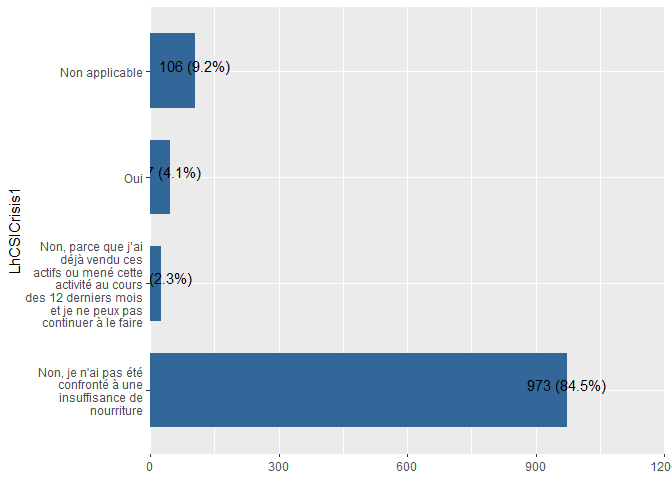<!-- -->


### LhCSI : Vendre des biens productifs ou des moyens de transport (machine à coudre, brouette, vélo, car, etc.)


```r
#View labels
expss::val_lab(Mauritania_baseline_2018$LhCSICrisis2)
Mauritania_baseline_2018 %>% 
  plot_frq(coord.flip =T,LhCSICrisis2)
```

<!-- -->

```r
Mauritania_baseline_2018$LhCSICrisis2 <- as.character(Mauritania_baseline_2018$LhCSICrisis2)

Mauritania_baseline_2018 <- 
  Mauritania_baseline_2018 %>% dplyr::mutate(LhCSICrisis2 = dplyr::recode(LhCSICrisis2,"1"=1,"2"=2,"3"=3,"4"=4))
Mauritania_baseline_2018$LhCSICrisis2 <- labelled::labelled(Mauritania_baseline_2018$LhCSICrisis2, c(`Non, je n'ai pas été confronté à une insuffisance de nourriture` = 1, `Non, parce que j’ai déjà vendu ces actifs ou mené cette activité au cours des 12 derniers mois et je ne peux pas continuer à le faire` = 2, Oui= 3,`Non applicable`=4))
#check labels
expss::val_lab(Mauritania_baseline_2018$LhCSICrisis2)
Mauritania_baseline_2018 %>% 
  plot_frq(coord.flip =T,LhCSICrisis2)
```

<!-- -->

```r
#View labels
expss::val_lab(Mauritania_ea_2019$LhCSICrisis2)
Mauritania_ea_2019 %>% 
  plot_frq(coord.flip =T,LhCSICrisis2)
```

<!-- -->

```r
Mauritania_ea_2019 <- Mauritania_ea_2019 %>% 
  dplyr::mutate(LhCSICrisis2 = dplyr::recode(LhCSICrisis2,"1"=1,"2"=2,"3"=3,"4"=4))
Mauritania_ea_2019$LhCSICrisis2 <- labelled::labelled(Mauritania_ea_2019$LhCSICrisis2, c(`Non, je n'ai pas été confronté à une insuffisance de nourriture` = 1, `Non, parce que j’ai déjà vendu ces actifs ou mené cette activité au cours des 12 derniers mois et je ne peux pas continuer à le faire` = 2, Oui= 3,`Non applicable`=4))
#check labels
expss::val_lab(Mauritania_ea_2019$LhCSICrisis2)
Mauritania_ea_2019 %>% 
  plot_frq(coord.flip =T,LhCSICrisis2)
```

<!-- -->

```r
#View labels
expss::val_lab(Mauritania_ea_2020$LhCSICrisis2)
Mauritania_ea_2020 %>% 
  plot_frq(coord.flip =T,LhCSICrisis2)
```

<!-- -->

```r
#change labels
Mauritania_ea_2020 <- Mauritania_ea_2020 %>% 
  dplyr::mutate(LhCSICrisis2 = dplyr::recode(LhCSICrisis2,"1"=1,"3"=3,"2"=2,"4"=4))
Mauritania_ea_2020$LhCSICrisis2 <- labelled::labelled(Mauritania_ea_2020$LhCSICrisis2, c(`Non, je n'ai pas été confronté à une insuffisance de nourriture` = 1, `Non, parce que j’ai déjà vendu ces actifs ou mené cette activité au cours des 12 derniers mois et je ne peux pas continuer à le faire` = 2, Oui= 3,`Non applicable`=4))
#check labels
expss::val_lab(Mauritania_ea_2020$LhCSICrisis2)
Mauritania_ea_2020 %>% 
  plot_frq(coord.flip =T,LhCSICrisis2)
```

<!-- -->

```r
#View labels
expss::val_lab(Mauritania_ea_2021$LhCSICrisis2)
Mauritania_ea_2021 %>% 
  plot_frq(coord.flip =T,LhCSICrisis2)
```

<!-- -->

```r
#update labels
Mauritania_ea_2021$LhCSICrisis2 <- labelled::labelled(Mauritania_ea_2021$LhCSICrisis2, c(`Non, je n'ai pas été confronté à une insuffisance de nourriture` = 1, `Non, parce que j’ai déjà vendu ces actifs ou mené cette activité au cours des 12 derniers mois et je ne peux pas continuer à le faire` = 2, Oui= 3,`Non applicable`=4))
#check labels
expss::val_lab(Mauritania_ea_2021$LhCSICrisis2)
Mauritania_ea_2021 %>% 
  plot_frq(coord.flip =T,LhCSICrisis2)
```

<!-- -->

```r
#View labels
expss::val_lab(Mauritania_ea_2022$LhCSICrisis2)
Mauritania_ea_2022 %>% 
  plot_frq(coord.flip =T,LhCSICrisis2)
```

<!-- -->

```r
#update labels
Mauritania_ea_2022$LhCSICrisis2 <- labelled::labelled(Mauritania_ea_2022$LhCSICrisis2, c(`Non, je n'ai pas été confronté à une insuffisance de nourriture` = 1, `Non, parce que j’ai déjà vendu ces actifs ou mené cette activité au cours des 12 derniers mois et je ne peux pas continuer à le faire` = 2, Oui= 3,`Non applicable`=4))
#check labels
expss::val_lab(Mauritania_ea_2022$LhCSICrisis2)
Mauritania_ea_2022 %>% 
  plot_frq(coord.flip =T,LhCSICrisis2)
```

<!-- -->

```r
#View labels
expss::val_lab(Mauritania_pdm_2020$LhCSICrisis2)
Mauritania_pdm_2020 %>% 
  plot_frq(coord.flip =T,LhCSICrisis2)
```

<!-- -->

```r
Mauritania_pdm_2020 <- Mauritania_pdm_2020 %>% 
  dplyr::mutate(LhCSICrisis2 = dplyr::recode(LhCSICrisis2,"1"=1,"3"=3,"2"=2,"4"=4))
Mauritania_pdm_2020$LhCSICrisis2 <- labelled::labelled(Mauritania_pdm_2020$LhCSICrisis2, c(`Non, je n'ai pas été confronté à une insuffisance de nourriture` = 1, `Non, parce que j’ai déjà vendu ces actifs ou mené cette activité au cours des 12 derniers mois et je ne peux pas continuer à le faire` = 2, Oui= 3,`Non applicable`=4))
#check labels
expss::val_lab(Mauritania_pdm_2020$LhCSICrisis2)
Mauritania_pdm_2020 %>% 
  plot_frq(coord.flip =T,LhCSICrisis2)
```

<!-- -->

```r
#View labels
expss::val_lab(Mauritania_pdm_2021$LhCSICrisis2)
Mauritania_pdm_2021 %>% 
  plot_frq(coord.flip =T,LhCSICrisis2)
```

<!-- -->

```r
#change labels
Mauritania_pdm_2021 <- Mauritania_pdm_2021 %>% 
  dplyr::mutate(LhCSICrisis2 = dplyr::recode(LhCSICrisis2,"1"=1,"3"=3,"2"=2,"4"=4))
Mauritania_pdm_2021$LhCSICrisis2 <- labelled::labelled(Mauritania_pdm_2021$LhCSICrisis2, c(`Non, je n'ai pas été confronté à une insuffisance de nourriture` = 1, `Non, parce que j’ai déjà vendu ces actifs ou mené cette activité au cours des 12 derniers mois et je ne peux pas continuer à le faire` = 2, Oui= 3,`Non applicable`=4))
#check labels
expss::val_lab(Mauritania_pdm_2021$LhCSICrisis2)
Mauritania_pdm_2021 %>% 
  plot_frq(coord.flip =T,LhCSICrisis2)
```

<!-- -->

### LhCSI : Retirer les enfants de l’école


```r
#View labels
expss::val_lab(Mauritania_baseline_2018$LhCSICrisis3)
Mauritania_baseline_2018 %>% 
  plot_frq(coord.flip =T,LhCSICrisis3)
```

<!-- -->

```r
Mauritania_baseline_2018$LhCSICrisis3 <- as.character(Mauritania_baseline_2018$LhCSICrisis3)

Mauritania_baseline_2018 <- 
  Mauritania_baseline_2018 %>% dplyr::mutate(LhCSICrisis3 = dplyr::recode(LhCSICrisis3,"1"=1,"2"=2,"3"=3,"4"=4))
Mauritania_baseline_2018$LhCSICrisis3 <- labelled::labelled(Mauritania_baseline_2018$LhCSICrisis3, c(`Non, je n'ai pas été confronté à une insuffisance de nourriture` = 1, `Non, parce que j’ai déjà vendu ces actifs ou mené cette activité au cours des 12 derniers mois et je ne peux pas continuer à le faire` = 2, Oui= 3,`Non applicable`=4))
#check labels
expss::val_lab(Mauritania_baseline_2018$LhCSICrisis3)
Mauritania_baseline_2018 %>% 
  plot_frq(coord.flip =T,LhCSICrisis3)
```

<!-- -->

```r
#View labels
expss::val_lab(Mauritania_ea_2019$LhCSICrisis3)
Mauritania_ea_2019 %>% 
  plot_frq(coord.flip =T,LhCSICrisis3)
```

<!-- -->

```r
Mauritania_ea_2019 <- Mauritania_ea_2019 %>% 
  dplyr::mutate(LhCSICrisis3 = dplyr::recode(LhCSICrisis3,"1"=1,"2"=2,"3"=3,"4"=4))
Mauritania_ea_2019$LhCSICrisis3 <- labelled::labelled(Mauritania_ea_2019$LhCSICrisis3, c(`Non, je n'ai pas été confronté à une insuffisance de nourriture` = 1, `Non, parce que j’ai déjà vendu ces actifs ou mené cette activité au cours des 12 derniers mois et je ne peux pas continuer à le faire` = 2, Oui= 3,`Non applicable`=4))
#check labels
expss::val_lab(Mauritania_ea_2019$LhCSICrisis3)
Mauritania_ea_2019 %>% 
  plot_frq(coord.flip =T,LhCSICrisis3)
```

<!-- -->

```r
#View labels
expss::val_lab(Mauritania_ea_2020$LhCSICrisis3)
Mauritania_ea_2020 %>% 
  plot_frq(coord.flip =T,LhCSICrisis3)
```

<!-- -->

```r
#change labels
Mauritania_ea_2020 <- Mauritania_ea_2020 %>% 
  dplyr::mutate(LhCSICrisis3 = dplyr::recode(LhCSICrisis3,"1"=1,"3"=3,"2"=2,"4"=4))
Mauritania_ea_2020$LhCSICrisis3 <- labelled::labelled(Mauritania_ea_2020$LhCSICrisis3, c(`Non, je n'ai pas été confronté à une insuffisance de nourriture` = 1, `Non, parce que j’ai déjà vendu ces actifs ou mené cette activité au cours des 12 derniers mois et je ne peux pas continuer à le faire` = 2, Oui= 3,`Non applicable`=4))
#check labels
expss::val_lab(Mauritania_ea_2020$LhCSICrisis3)
Mauritania_ea_2020 %>% 
  plot_frq(coord.flip =T,LhCSICrisis3)
```

<!-- -->

```r
#View labels
expss::val_lab(Mauritania_ea_2021$LhCSICrisis3)
Mauritania_ea_2021 %>% 
  plot_frq(coord.flip =T,LhCSICrisis3)
```

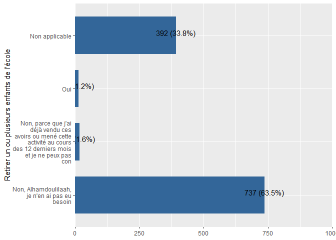<!-- -->

```r
#update labels
Mauritania_ea_2021$LhCSICrisis3 <- labelled::labelled(Mauritania_ea_2021$LhCSICrisis3, c(`Non, je n'ai pas été confronté à une insuffisance de nourriture` = 1, `Non, parce que j’ai déjà vendu ces actifs ou mené cette activité au cours des 12 derniers mois et je ne peux pas continuer à le faire` = 2, Oui= 3,`Non applicable`=4))
#check labels
expss::val_lab(Mauritania_ea_2021$LhCSICrisis3)
Mauritania_ea_2021 %>% 
  plot_frq(coord.flip =T,LhCSICrisis3)
```

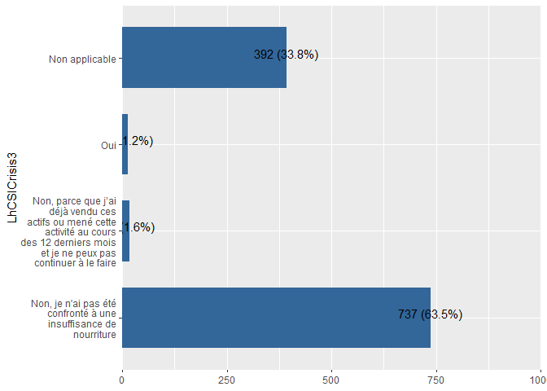<!-- -->

```r
#View labels
expss::val_lab(Mauritania_ea_2022$LhCSICrisis3)
Mauritania_ea_2022 %>% 
  plot_frq(coord.flip =T,LhCSICrisis3)
```

<!-- -->

```r
#update labels
Mauritania_ea_2022$LhCSICrisis3 <- labelled::labelled(Mauritania_ea_2022$LhCSICrisis3, c(`Non, je n'ai pas été confronté à une insuffisance de nourriture` = 1, `Non, parce que j’ai déjà vendu ces actifs ou mené cette activité au cours des 12 derniers mois et je ne peux pas continuer à le faire` = 2, Oui= 3,`Non applicable`=4))
#check labels
expss::val_lab(Mauritania_ea_2022$LhCSICrisis3)
Mauritania_ea_2022 %>% 
  plot_frq(coord.flip =T,LhCSICrisis3)
```

<!-- -->

```r
#View labels
expss::val_lab(Mauritania_pdm_2020$LhCSICrisis3)
Mauritania_pdm_2020 %>% 
  plot_frq(coord.flip =T,LhCSICrisis3)
```

<!-- -->

```r
#change labels
Mauritania_pdm_2020 <- Mauritania_pdm_2020 %>% 
  dplyr::mutate(LhCSICrisis3 = dplyr::recode(LhCSICrisis3,"1"=1,"3"=3,"2"=2,"4"=4))
Mauritania_pdm_2020$LhCSICrisis3 <- labelled::labelled(Mauritania_pdm_2020$LhCSICrisis3, c(`Non, je n'ai pas été confronté à une insuffisance de nourriture` = 1, `Non, parce que j’ai déjà vendu ces actifs ou mené cette activité au cours des 12 derniers mois et je ne peux pas continuer à le faire` = 2, Oui= 3,`Non applicable`=4))
#check labels
expss::val_lab(Mauritania_pdm_2020$LhCSICrisis3)
Mauritania_pdm_2020 %>% 
  plot_frq(coord.flip =T,LhCSICrisis3)
```

<!-- -->

```r
#View labels
expss::val_lab(Mauritania_pdm_2021$LhCSICrisis3)
Mauritania_pdm_2021 %>% 
  plot_frq(coord.flip =T,LhCSICrisis3)
```

<!-- -->

```r
#change labels
Mauritania_pdm_2021 <- Mauritania_pdm_2021 %>% 
  dplyr::mutate(LhCSICrisis3 = dplyr::recode(LhCSICrisis3,"1"=1,"3"=3,"2"=2,"4"=4))
Mauritania_pdm_2021$LhCSICrisis3 <- labelled::labelled(Mauritania_pdm_2021$LhCSICrisis3, c(`Non, je n'ai pas été confronté à une insuffisance de nourriture` = 1, `Non, parce que j’ai déjà vendu ces actifs ou mené cette activité au cours des 12 derniers mois et je ne peux pas continuer à le faire` = 2, Oui= 3,`Non applicable`=4))
#check labels
expss::val_lab(Mauritania_pdm_2021$LhCSICrisis3)
Mauritania_pdm_2021 %>% 
  plot_frq(coord.flip =T,LhCSICrisis3)
```

<!-- -->

### LhCSI : Vendre la maison ou des terrains


```r
#View labels
expss::val_lab(Mauritania_baseline_2018$LhCSIEmergency1)
Mauritania_baseline_2018 %>% 
  plot_frq(coord.flip =T,LhCSIEmergency1)
```

<!-- -->

```r
Mauritania_baseline_2018$LhCSIEmergency1 <- as.character(Mauritania_baseline_2018$LhCSIEmergency1)
Mauritania_baseline_2018 <- 
  Mauritania_baseline_2018 %>% dplyr::mutate(LhCSIEmergency1 = dplyr::recode(LhCSIEmergency1,"1"=1,"2"=2,"3"=3,"4"=4))
Mauritania_baseline_2018$LhCSIEmergency1 <- labelled::labelled(Mauritania_baseline_2018$LhCSIEmergency1, c(`Non, je n'ai pas été confronté à une insuffisance de nourriture` = 1, `Non, parce que j’ai déjà vendu ces actifs ou mené cette activité au cours des 12 derniers mois et je ne peux pas continuer à le faire` = 2, Oui= 3,`Non applicable`=4))
#check labels
expss::val_lab(Mauritania_baseline_2018$LhCSIEmergency1)
Mauritania_baseline_2018 %>% 
  plot_frq(coord.flip =T,LhCSIEmergency1)
```

<!-- -->

```r
#View labels
expss::val_lab(Mauritania_ea_2019$LhCSIEmergency1)
Mauritania_ea_2019 %>% 
  plot_frq(coord.flip =T,LhCSIEmergency1)
```

<!-- -->

```r
Mauritania_ea_2019 <- Mauritania_ea_2019 %>% 
  dplyr::mutate(LhCSIEmergency1 = dplyr::recode(LhCSIEmergency1,"1"=1,"2"=2,"3"=3,"4"=4))
Mauritania_ea_2019$LhCSIEmergency1 <- labelled::labelled(Mauritania_ea_2019$LhCSIEmergency1, c(`Non, je n'ai pas été confronté à une insuffisance de nourriture` = 1, `Non, parce que j’ai déjà vendu ces actifs ou mené cette activité au cours des 12 derniers mois et je ne peux pas continuer à le faire` = 2, Oui= 3,`Non applicable`=4))
#check labels
expss::val_lab(Mauritania_ea_2019$LhCSIEmergency1)
Mauritania_ea_2019 %>% 
  plot_frq(coord.flip =T,LhCSIEmergency1)
```

<!-- -->

```r
#View labels
expss::val_lab(Mauritania_ea_2020$LhCSIEmergency1)
Mauritania_ea_2020 %>% 
  plot_frq(coord.flip =T,LhCSIEmergency1)
```

<!-- -->

```r
#change labels
Mauritania_ea_2020 <- Mauritania_ea_2020 %>% 
  dplyr::mutate(LhCSIEmergency1 = dplyr::recode(LhCSIEmergency1,"1"=1,"3"=3,"2"=2,"4"=4))
Mauritania_ea_2020$LhCSIEmergency1 <- labelled::labelled(Mauritania_ea_2020$LhCSIEmergency1, c(`Non, je n'ai pas été confronté à une insuffisance de nourriture` = 1, `Non, parce que j’ai déjà vendu ces actifs ou mené cette activité au cours des 12 derniers mois et je ne peux pas continuer à le faire` = 2, Oui= 3,`Non applicable`=4))
#check labels
expss::val_lab(Mauritania_ea_2020$LhCSIEmergency1)
Mauritania_ea_2020 %>% 
  plot_frq(coord.flip =T,LhCSIEmergency1)
```

<!-- -->

```r
#View labels
expss::val_lab(Mauritania_ea_2021$LhCSIEmergency1)
Mauritania_ea_2021 %>% 
  plot_frq(coord.flip =T,LhCSIEmergency1)
```

<!-- -->

```r
#update labels
Mauritania_ea_2021$LhCSIEmergency1 <- labelled::labelled(Mauritania_ea_2021$LhCSIEmergency1, c(`Non, je n'ai pas été confronté à une insuffisance de nourriture` = 1, `Non, parce que j’ai déjà vendu ces actifs ou mené cette activité au cours des 12 derniers mois et je ne peux pas continuer à le faire` = 2, Oui= 3,`Non applicable`=4))
#check labels
expss::val_lab(Mauritania_ea_2021$LhCSIEmergency1)
Mauritania_ea_2021 %>% 
  plot_frq(coord.flip =T,LhCSIEmergency1)
```

<!-- -->

```r
#View labels
expss::val_lab(Mauritania_ea_2022$LhCSIEmergency1)
Mauritania_ea_2022 %>% 
  plot_frq(coord.flip =T,LhCSIEmergency1)
```

<!-- -->

```r
#update labels
Mauritania_ea_2022$LhCSIEmergency1 <- labelled::labelled(Mauritania_ea_2022$LhCSIEmergency1, c(`Non, je n'ai pas été confronté à une insuffisance de nourriture` = 1, `Non, parce que j’ai déjà vendu ces actifs ou mené cette activité au cours des 12 derniers mois et je ne peux pas continuer à le faire` = 2, Oui= 3,`Non applicable`=4))
#check labels
expss::val_lab(Mauritania_ea_2022$LhCSIEmergency1)
Mauritania_ea_2022 %>% 
  plot_frq(coord.flip =T,LhCSIEmergency1)
```

<!-- -->

```r
#View labels
expss::val_lab(Mauritania_pdm_2020$LhCSIEmergency1)
Mauritania_pdm_2020 %>% 
  plot_frq(coord.flip =T,LhCSIEmergency1)
```

<!-- -->

```r
Mauritania_pdm_2020 <- Mauritania_pdm_2020 %>% 
  dplyr::mutate(LhCSIEmergency1 = dplyr::recode(LhCSIEmergency1,"1"=1,"3"=3,"2"=2,"4"=4))
Mauritania_pdm_2020$LhCSIEmergency1 <- labelled::labelled(Mauritania_pdm_2020$LhCSIEmergency1, c(`Non, je n'ai pas été confronté à une insuffisance de nourriture` = 1, `Non, parce que j’ai déjà vendu ces actifs ou mené cette activité au cours des 12 derniers mois et je ne peux pas continuer à le faire` = 2, Oui= 3,`Non applicable`=4))
#check labels
expss::val_lab(Mauritania_pdm_2020$LhCSIEmergency1)
Mauritania_pdm_2020 %>% 
  plot_frq(coord.flip =T,LhCSIEmergency1)
```

<!-- -->

```r
#View labels
expss::val_lab(Mauritania_pdm_2021$LhCSIEmergency1)
Mauritania_pdm_2021 %>% 
  plot_frq(coord.flip =T,LhCSIEmergency1)
```

<!-- -->

```r
#change labels
Mauritania_pdm_2021 <- Mauritania_pdm_2021 %>% 
  dplyr::mutate(LhCSIEmergency1 = dplyr::recode(LhCSIEmergency1,"1"=1,"3"=3,"2"=2,"4"=4))
Mauritania_pdm_2021$LhCSIEmergency1 <- labelled::labelled(Mauritania_pdm_2021$LhCSIEmergency1, c(`Non, je n'ai pas été confronté à une insuffisance de nourriture` = 1, `Non, parce que j’ai déjà vendu ces actifs ou mené cette activité au cours des 12 derniers mois et je ne peux pas continuer à le faire` = 2, Oui= 3,`Non applicable`=4))
#check labels
expss::val_lab(Mauritania_pdm_2021$LhCSIEmergency1)
Mauritania_pdm_2021 %>% 
  plot_frq(coord.flip =T,LhCSIEmergency1)
```

<!-- -->

### LhCSI : Mendier


```r
#View labels
expss::val_lab(Mauritania_baseline_2018$LhCSIEmergency2)
Mauritania_baseline_2018 %>% 
  plot_frq(coord.flip =T,LhCSIEmergency2)
```

<!-- -->

```r
Mauritania_baseline_2018$LhCSIEmergency2 <- as.character(Mauritania_baseline_2018$LhCSIEmergency2)
Mauritania_baseline_2018 <- 
  Mauritania_baseline_2018 %>% dplyr::mutate(LhCSIEmergency2 = dplyr::recode(LhCSIEmergency2,"1"=1,"2"=2,"3"=3,"4"=4))
Mauritania_baseline_2018$LhCSIEmergency2 <- labelled::labelled(Mauritania_baseline_2018$LhCSIEmergency2, c(`Non, je n'ai pas été confronté à une insuffisance de nourriture` = 1, `Non, parce que j’ai déjà vendu ces actifs ou mené cette activité au cours des 12 derniers mois et je ne peux pas continuer à le faire` = 2, Oui= 3,`Non applicable`=4))
#check labels
expss::val_lab(Mauritania_baseline_2018$LhCSIEmergency2)
Mauritania_baseline_2018 %>% 
  plot_frq(coord.flip =T,LhCSIEmergency2)
```

<!-- -->

```r
#View labels
expss::val_lab(Mauritania_ea_2019$LhCSIEmergency2)
Mauritania_ea_2019 %>% 
  plot_frq(coord.flip =T,LhCSIEmergency2)
```

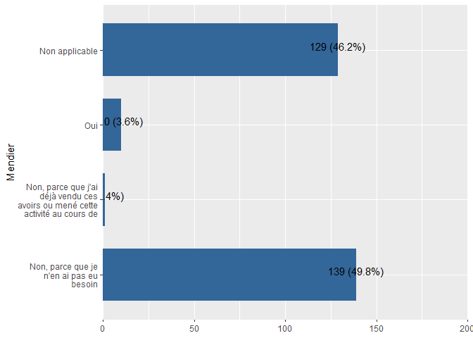<!-- -->

```r
Mauritania_ea_2019 <- Mauritania_ea_2019 %>% 
  dplyr::mutate(LhCSIEmergency2 = dplyr::recode(LhCSIEmergency2,"1"=1,"2"=2,"3"=3,"4"=4))
Mauritania_ea_2019$LhCSIEmergency2 <- labelled::labelled(Mauritania_ea_2019$LhCSIEmergency2, c(`Non, je n'ai pas été confronté à une insuffisance de nourriture` = 1, `Non, parce que j’ai déjà vendu ces actifs ou mené cette activité au cours des 12 derniers mois et je ne peux pas continuer à le faire` = 2, Oui= 3,`Non applicable`=4))
#check labels
expss::val_lab(Mauritania_ea_2019$LhCSIEmergency2)
Mauritania_ea_2019 %>% 
  plot_frq(coord.flip =T,LhCSIEmergency2)
```

<!-- -->

```r
#View labels
expss::val_lab(Mauritania_ea_2020$LhCSIEmergency2)
Mauritania_ea_2020 %>% 
  plot_frq(coord.flip =T,LhCSIEmergency2)
```

<!-- -->

```r
#change labels
Mauritania_ea_2020 <- Mauritania_ea_2020 %>% 
  dplyr::mutate(LhCSIEmergency2 = dplyr::recode(LhCSIEmergency2,"1"=1,"3"=3,"2"=2,"4"=4))
Mauritania_ea_2020$LhCSIEmergency2 <- labelled::labelled(Mauritania_ea_2020$LhCSIEmergency2, c(`Non, je n'ai pas été confronté à une insuffisance de nourriture` = 1, `Non, parce que j’ai déjà vendu ces actifs ou mené cette activité au cours des 12 derniers mois et je ne peux pas continuer à le faire` = 2, Oui= 3,`Non applicable`=4))
#check labels
expss::val_lab(Mauritania_ea_2020$LhCSIEmergency2)
Mauritania_ea_2020 %>% 
  plot_frq(coord.flip =T,LhCSIEmergency2)
```

<!-- -->

```r
#View labels
expss::val_lab(Mauritania_ea_2021$LhCSIEmergency2)
Mauritania_ea_2021 %>% 
  plot_frq(coord.flip =T,LhCSIEmergency2)
```

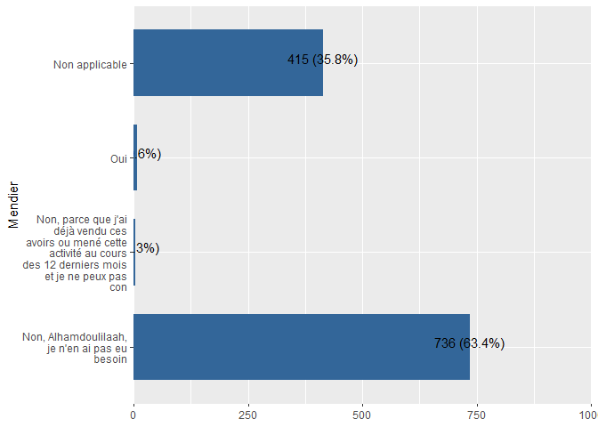<!-- -->

```r
#update labels
Mauritania_ea_2021$LhCSIEmergency2 <- labelled::labelled(Mauritania_ea_2021$LhCSIEmergency2, c(`Non, je n'ai pas été confronté à une insuffisance de nourriture` = 1, `Non, parce que j’ai déjà vendu ces actifs ou mené cette activité au cours des 12 derniers mois et je ne peux pas continuer à le faire` = 2, Oui= 3,`Non applicable`=4))
#check labels
expss::val_lab(Mauritania_ea_2021$LhCSIEmergency2)
Mauritania_ea_2021 %>% 
  plot_frq(coord.flip =T,LhCSIEmergency2)
```

<!-- -->

```r
#View labels
expss::val_lab(Mauritania_ea_2022$LhCSIEmergency2)
Mauritania_ea_2022 %>% 
  plot_frq(coord.flip =T,LhCSIEmergency2)
```

<!-- -->

```r
#update labels
Mauritania_ea_2022$LhCSIEmergency2 <- labelled::labelled(Mauritania_ea_2022$LhCSIEmergency2, c(`Non, je n'ai pas été confronté à une insuffisance de nourriture` = 1, `Non, parce que j’ai déjà vendu ces actifs ou mené cette activité au cours des 12 derniers mois et je ne peux pas continuer à le faire` = 2, Oui= 3,`Non applicable`=4))
#check labels
expss::val_lab(Mauritania_ea_2022$LhCSIEmergency2)
Mauritania_ea_2022 %>% 
  plot_frq(coord.flip =T,LhCSIEmergency2)
```

<!-- -->

```r
#View labels
expss::val_lab(Mauritania_pdm_2020$LhCSIEmergency2)
Mauritania_pdm_2020 %>% 
  plot_frq(coord.flip =T,LhCSIEmergency2)
```

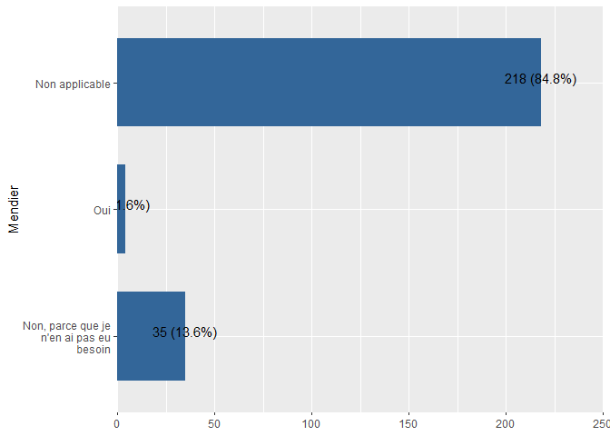<!-- -->

```r
Mauritania_pdm_2020 <- Mauritania_pdm_2020 %>% 
  dplyr::mutate(LhCSIEmergency2 = dplyr::recode(LhCSIEmergency2,"1"=1,"3"=3,"2"=2,"4"=4))
Mauritania_pdm_2020$LhCSIEmergency2 <- labelled::labelled(Mauritania_pdm_2020$LhCSIEmergency2, c(`Non, je n'ai pas été confronté à une insuffisance de nourriture` = 1, `Non, parce que j’ai déjà vendu ces actifs ou mené cette activité au cours des 12 derniers mois et je ne peux pas continuer à le faire` = 2, Oui= 3,`Non applicable`=4))
#check labels
expss::val_lab(Mauritania_pdm_2020$LhCSIEmergency2)
Mauritania_pdm_2020 %>% 
  plot_frq(coord.flip =T,LhCSIEmergency2)
```

<!-- -->

```r
#View labels
expss::val_lab(Mauritania_pdm_2021$LhCSIEmergency2)
Mauritania_pdm_2021 %>% 
  plot_frq(coord.flip =T,LhCSIEmergency2)
```

<!-- -->

```r
#change labels
Mauritania_pdm_2021 <- Mauritania_pdm_2021 %>% 
  dplyr::mutate(LhCSIEmergency2 = dplyr::recode(LhCSIEmergency2,"1"=1,"3"=3,"2"=2,"4"=4))
Mauritania_pdm_2021$LhCSIEmergency2 <- labelled::labelled(Mauritania_pdm_2021$LhCSIEmergency2, c(`Non, je n'ai pas été confronté à une insuffisance de nourriture` = 1, `Non, parce que j’ai déjà vendu ces actifs ou mené cette activité au cours des 12 derniers mois et je ne peux pas continuer à le faire` = 2, Oui= 3,`Non applicable`=4))
#check labels
expss::val_lab(Mauritania_pdm_2021$LhCSIEmergency2)
Mauritania_pdm_2021 %>% 
  plot_frq(coord.flip =T,LhCSIEmergency2)
```

<!-- -->


### LhCSI : Vendre les derniers animaux femelles reproductrices


```r
#View labels
expss::val_lab(Mauritania_baseline_2018$LhCSIEmergency3)
Mauritania_baseline_2018 %>% 
  plot_frq(coord.flip =T,LhCSIEmergency3)
```

<!-- -->

```r
Mauritania_baseline_2018$LhCSIEmergency3 <- as.character(Mauritania_baseline_2018$LhCSIEmergency3)

Mauritania_baseline_2018 <- 
  Mauritania_baseline_2018 %>% dplyr::mutate(LhCSIEmergency3 = dplyr::recode(LhCSIEmergency3,"1"=1,"2"=2,"3"=3,"4"=4))
Mauritania_baseline_2018$LhCSIEmergency3 <- labelled::labelled(Mauritania_baseline_2018$LhCSIEmergency3, c(`Non, je n'ai pas été confronté à une insuffisance de nourriture` = 1, `Non, parce que j’ai déjà vendu ces actifs ou mené cette activité au cours des 12 derniers mois et je ne peux pas continuer à le faire` = 2, Oui= 3,`Non applicable`=4))
#check labels
expss::val_lab(Mauritania_baseline_2018$LhCSIEmergency3)
Mauritania_baseline_2018 %>% 
  plot_frq(coord.flip =T,LhCSIEmergency3)
```

<!-- -->

```r
#View labels
expss::val_lab(Mauritania_ea_2019$LhCSIEmergency3)
Mauritania_ea_2019 %>% 
  plot_frq(coord.flip =T,LhCSIEmergency3)
```

<!-- -->

```r
Mauritania_ea_2019 <- Mauritania_ea_2019 %>% 
  dplyr::mutate(LhCSIEmergency3 = dplyr::recode(LhCSIEmergency3,"1"=1,"2"=2,"3"=3,"4"=4))
Mauritania_ea_2019$LhCSIEmergency3 <- labelled::labelled(Mauritania_ea_2019$LhCSIEmergency3, c(`Non, je n'ai pas été confronté à une insuffisance de nourriture` = 1, `Non, parce que j’ai déjà vendu ces actifs ou mené cette activité au cours des 12 derniers mois et je ne peux pas continuer à le faire` = 2, Oui= 3,`Non applicable`=4))
#check labels
expss::val_lab(Mauritania_ea_2019$LhCSIEmergency3)
Mauritania_ea_2019 %>% 
  plot_frq(coord.flip =T,LhCSIEmergency3)
```

<!-- -->

```r
#View labels
expss::val_lab(Mauritania_ea_2020$LhCSIEmergency3)
Mauritania_ea_2020 %>% 
  plot_frq(coord.flip =T,LhCSIEmergency3)
```

<!-- -->

```r
#change labels
Mauritania_ea_2020 <- Mauritania_ea_2020 %>% 
  dplyr::mutate(LhCSIEmergency3 = dplyr::recode(LhCSIEmergency3,"1"=1,"3"=3,"2"=2,"4"=4))
Mauritania_ea_2020$LhCSIEmergency3 <- labelled::labelled(Mauritania_ea_2020$LhCSIEmergency3, c(`Non, je n'ai pas été confronté à une insuffisance de nourriture` = 1, `Non, parce que j’ai déjà vendu ces actifs ou mené cette activité au cours des 12 derniers mois et je ne peux pas continuer à le faire` = 2, Oui= 3,`Non applicable`=4))
#check labels
expss::val_lab(Mauritania_ea_2020$LhCSIEmergency3)
Mauritania_ea_2020 %>% 
  plot_frq(coord.flip =T,LhCSIEmergency3)
```

<!-- -->

```r
#View labels
expss::val_lab(Mauritania_ea_2021$LhCSIEmergency3)
Mauritania_ea_2021 %>% 
  plot_frq(coord.flip =T,LhCSIEmergency3)
```

<!-- -->

```r
#update labels
Mauritania_ea_2021$LhCSIEmergency3 <- labelled::labelled(Mauritania_ea_2021$LhCSIEmergency3, c(`Non, je n'ai pas été confronté à une insuffisance de nourriture` = 1, `Non, parce que j’ai déjà vendu ces actifs ou mené cette activité au cours des 12 derniers mois et je ne peux pas continuer à le faire` = 2, Oui= 3,`Non applicable`=4))
#check labels
expss::val_lab(Mauritania_ea_2021$LhCSIEmergency3)
Mauritania_ea_2021 %>% 
  plot_frq(coord.flip =T,LhCSIEmergency3)
```

<!-- -->

```r
# Cette variable n'existe pas dans dans Mauritania_ea_2022
Mauritania_ea_2022$LhCSIEmergency3 <- as.factor(Mauritania_ea_2022$LhCSIEmergency3)


#View labels
expss::val_lab(Mauritania_pdm_2020$LhCSIEmergency3)
Mauritania_pdm_2020 %>% 
  plot_frq(coord.flip =T,LhCSIEmergency3)
```

<!-- -->

```r
Mauritania_pdm_2020 <- Mauritania_pdm_2020 %>% 
  dplyr::mutate(LhCSIEmergency3 = dplyr::recode(LhCSIEmergency3,"1"=1,"3"=3,"2"=2,"4"=4))
Mauritania_pdm_2020$LhCSIEmergency3 <- labelled::labelled(Mauritania_pdm_2020$LhCSIEmergency3, c(`Non, je n'ai pas été confronté à une insuffisance de nourriture` = 1, `Non, parce que j’ai déjà vendu ces actifs ou mené cette activité au cours des 12 derniers mois et je ne peux pas continuer à le faire` = 2, Oui= 3,`Non applicable`=4))
#check labels
expss::val_lab(Mauritania_pdm_2020$LhCSIEmergency3)
Mauritania_pdm_2020 %>% 
  plot_frq(coord.flip =T,LhCSIEmergency3)
```

<!-- -->

```r
#View labels
expss::val_lab(Mauritania_pdm_2021$LhCSIEmergency3)
Mauritania_pdm_2021 %>% 
  plot_frq(coord.flip =T,LhCSIEmergency3)
```

<!-- -->

```r
#change labels
Mauritania_pdm_2021 <- Mauritania_pdm_2021 %>% 
  dplyr::mutate(LhCSIEmergency3 = dplyr::recode(LhCSIEmergency3,"1"=1,"3"=3,"2"=2,"4"=4))
Mauritania_pdm_2021$LhCSIEmergency3 <- labelled::labelled(Mauritania_pdm_2021$LhCSIEmergency3, c(`Non, je n'ai pas été confronté à une insuffisance de nourriture` = 1, `Non, parce que j’ai déjà vendu ces actifs ou mené cette activité au cours des 12 derniers mois et je ne peux pas continuer à le faire` = 2, Oui= 3,`Non applicable`=4))
#check labels
expss::val_lab(Mauritania_pdm_2021$LhCSIEmergency3)
Mauritania_pdm_2021 %>% 
  plot_frq(coord.flip =T,LhCSIEmergency3)
```

<!-- -->


# Self-evaluated resilience score (SERS) 


```r
sers_variables = Mauritania_ea_2021 %>% dplyr::select(gtsummary::starts_with("SERS")) %>% names()

Mauritania_baseline_2018 <- Mauritania_baseline_2018 %>%
  mutate(across(all_of(sers_variables), factor))
Mauritania_ea_2019 <- Mauritania_ea_2019 %>%
  mutate(across(all_of(sers_variables), factor))

Mauritania_ea_2020 <- Mauritania_ea_2020 %>%
  mutate(across(all_of(sers_variables), factor))
Mauritania_pdm_2020 <- Mauritania_pdm_2020 %>%
  mutate(across(all_of(sers_variables), factor))


expss::val_lab(Mauritania_ea_2021$SERSRebondir)
Mauritania_ea_2021 <- Mauritania_ea_2021 %>% 
  dplyr::mutate(across(sers_variables,
                ~labelled(., labels = c(
                  "tout à fait d'accord" = 1,
                  "d'accord" = 2,
                  "ni d'accord ni pas d'accord " = 3,
                  "pas d'accord" = 4,
                  "pas du tout d'accord" = 5
                )
                )
  )
  )
Mauritania_ea_2021 %>% 
  plot_frq(coord.flip =T,SERSRebondir)
```

<!-- -->

```r
expss::val_lab(Mauritania_ea_2022$SERSRebondir)
Mauritania_ea_2022 <- Mauritania_ea_2022 %>% 
  dplyr::mutate(across(sers_variables,
                ~labelled(., labels = c(
                  "tout à fait d'accord" = 1,
                  "d'accord" = 2,
                  "ni d'accord ni pas d'accord " = 3,
                  "pas d'accord" = 4,
                  "pas du tout d'accord" = 5
                )
                )
  )
  )
Mauritania_ea_2022 %>% 
  plot_frq(coord.flip =T,SERSRebondir)
```

<!-- -->

```r
expss::val_lab(Mauritania_pdm_2021$SERSRebondir)
Mauritania_pdm_2021 <- Mauritania_pdm_2021 %>% 
  dplyr::mutate(across(sers_variables,
                ~labelled(., labels = c(
                  "tout à fait d'accord" = 1,
                  "d'accord" = 2,
                  "ni d'accord ni pas d'accord " = 3,
                  "pas d'accord" = 4,
                  "pas du tout d'accord" = 5
                )
                )
  )
  )
Mauritania_pdm_2021 %>% 
  plot_frq(coord.flip =T,SERSRebondir)
```

<!-- -->


# ASSET BENEFIT INDICATOR (ABI) 


```r
abi_variables = Mauritania_ea_2021 %>% dplyr::select(gtsummary::starts_with("ABI")) %>% names()
#
abi_variables <- abi_variables[! abi_variables %in% c('ABISexparticipant')]

#Mauritania_baseline_2018 <- Mauritania_baseline_2018 %>%
#  mutate_at(abi_variables, as.factor)

Mauritania_ea_2019 <- Mauritania_ea_2019 %>%
  mutate_at(abi_variables, as.numeric)

expss::val_lab(Mauritania_ea_2019$ABIProteger)
Mauritania_ea_2019 <- Mauritania_ea_2019 %>%
  mutate(
    across(abi_variables,
           ~ recode(.,
                    `2` = 0,
                    `1` = 1,
                    `3` = 888)
    )
  )

# Mauritania_ea_2019 <- Mauritania_ea_2019 %>%
#   dplyr::mutate(across(abi_variables,
#                 ~labelled(., labels = c(
#                   "Non" = 0,
#                   "Oui" = 1,
#                   "Ne sait pas" = 888
#                 )
#                 )
#   )
#   )
expss::val_lab(Mauritania_ea_2019$ABIProteger)
Mauritania_ea_2019 %>% 
  plot_frq(coord.flip =T,ABIProteger)
```

<!-- -->

```r
expss::val_lab(Mauritania_ea_2020$ABIProteger)
Mauritania_ea_2020 <- Mauritania_ea_2020 %>%
  mutate_at(abi_variables, as.numeric)

Mauritania_ea_2020 <- Mauritania_ea_2020 %>%
  mutate(
    across(abi_variables,
           ~ recode(.,
                    `2` = 0,
                    `1` = 1,
                    `3` = 888)
    )
  )

# Mauritania_ea_2020 <- Mauritania_ea_2020 %>%
#   dplyr::mutate(across(abi_variables,
#                        ~labelled(., labels = c(
#                          "Non" = 0,
#                          "Oui" = 1,
#                          "Ne sait pas" = 888
#                        )
#                        )
#   )
#   )
expss::val_lab(Mauritania_ea_2020$ABIProteger)
Mauritania_ea_2020 %>% 
  plot_frq(coord.flip =T,ABIProteger)
```

<!-- -->

```r
expss::val_lab(Mauritania_ea_2021$ABIProteger)
# Tout est ok pour 2021 recodeage et labelisation
Mauritania_ea_2021 <- Mauritania_ea_2021 %>%
  mutate_at(abi_variables, as.numeric)

# Mauritania_ea_2021 <- Mauritania_ea_2021 %>%
#   mutate(
#     across(abi_variables,
#            ~ recode(.,
#                     `0` = 0,
#                     `1` = 1,
#                     `888` = 888)
#     )
#   )

# Mauritania_ea_2021 <- Mauritania_ea_2021 %>%
#   dplyr::mutate(across(abi_variables,
#                        ~labelled(., labels = c(
#                          "Non" = 0,
#                          "Oui" = 1,
#                          "Ne sait pas" = 888
#                        )
#                        )
#   )
#   )

Mauritania_ea_2021 %>% 
  plot_frq(coord.flip =T,ABIProteger)
```

<!-- -->

```r
expss::val_lab(Mauritania_ea_2022$ABIProteger)
# Tout est ok pour 2021 recodeage et labelisation
Mauritania_ea_2022 <- Mauritania_ea_2022 %>%
  mutate_at(abi_variables, as.numeric)

Mauritania_ea_2022 <- Mauritania_ea_2022 %>%
  mutate(
    across(abi_variables,
           ~ recode(.,
                    `0` = 0,
                    `1` = 1,
                    `888` = 888)
    )
  )

# Mauritania_ea_2022 <- Mauritania_ea_2022 %>%
#   dplyr::mutate(across(abi_variables,
#                        ~labelled(., labels = c(
#                          "Non" = 0,
#                          "Oui" = 1,
#                          "Ne sait pas" = 888
#                        )
#                        )
#   )
#   )

Mauritania_ea_2022 %>% 
  plot_frq(coord.flip =T,ABIProteger)
```

<!-- -->

```r
expss::val_lab(Mauritania_pdm_2020$ABIProteger)
Mauritania_pdm_2020 <- Mauritania_pdm_2020 %>%
  mutate_at(abi_variables, as.numeric)

Mauritania_pdm_2020 <- Mauritania_pdm_2020 %>%
  mutate(
    across(abi_variables,
           ~ recode(.,
                    `2` = 0,
                    `1` = 1,
                    `3` = 888)
    )
  )

# Mauritania_pdm_2020 <- Mauritania_pdm_2020 %>%
#   dplyr::mutate(across(abi_variables,
#                        ~labelled(., labels = c(
#                          "Non" = 0,
#                          "Oui" = 1,
#                          "Ne sait pas" = 888
#                        )
#                        )
#   )
#   )
expss::val_lab(Mauritania_pdm_2020$ABIProteger)
Mauritania_pdm_2020 %>% 
  plot_frq(coord.flip =T,ABIProteger)
```

<!-- -->

```r
expss::val_lab(Mauritania_pdm_2021$ABIProteger)
# Tout est ok pour pdm 2021 recodeage et labelisation
Mauritania_pdm_2021 <- Mauritania_pdm_2021 %>%
  mutate_at(abi_variables, as.numeric)
Mauritania_pdm_2021 <- Mauritania_pdm_2021 %>%
  mutate(
    across(abi_variables,
           ~ recode(.,
                    `0` = 0,
                    `1` = 1,
                    `888` = 888)
    )
  )

# Mauritania_pdm_2021 <- Mauritania_pdm_2021 %>%
#   dplyr::mutate(across(abi_variables,
#                        ~labelled(., labels = c(
#                          "Non" = 0,
#                          "Oui" = 1,
#                          "Ne sait pas" = 888
#                        )
#                        )
#   )
#   )

Mauritania_pdm_2021 %>% 
  plot_frq(coord.flip =T,ABIProteger)
```

<!-- -->


```r
Mauritania_baseline_2018$ABISexparticipant <- as_factor(Mauritania_baseline_2018$ABISexparticipant)
Mauritania_ea_2019$ABISexparticipant <- as_factor(Mauritania_ea_2019$ABISexparticipant)
Mauritania_ea_2020$ABISexparticipant <- as_factor(Mauritania_ea_2020$ABISexparticipant)
Mauritania_pdm_2020$ABISexparticipant <- as_factor(Mauritania_pdm_2020$ABISexparticipant)


Mauritania_ea_2021 <- Mauritania_ea_2021 %>%
   mutate(ABISexparticipant= as_factor(ABISexparticipant),ABISexparticipant= recode(ABISexparticipant,`2` = 0L, `1` = 1L))

Mauritania_ea_2021 %>% 
  plot_frq(coord.flip =T,ABISexparticipant)
```

<!-- -->

```r
# Mauritania_ea_2021$ABISexparticipant <- labelled::labelled(Mauritania_ea_2021$ABISexparticipant, c(Femme = 0, Homme = 1))

Mauritania_pdm_2021 <- Mauritania_pdm_2021 %>%
   mutate(ABISexparticipant= as_factor(ABISexparticipant),ABISexparticipant= recode(ABISexparticipant,`2` = 0L, `1` = 1L))


# Mauritania_pdm_2021$ABISexparticipant<-dplyr::recode(Mauritania_pdm_2021$ABISexparticipant, `2` = 0L, `1` = 1L,.default = NA_real_)
# Mauritania_pdm_2021 %>% 
#   plot_frq(coord.flip =T,ABISexparticipant)

# Mauritania_pdm_2021$ABISexparticipant <- labelled::labelled(Mauritania_pdm_2021$ABISexparticipant, c(Femme = 0, Homme = 1))

Mauritania_ea_2022 <- Mauritania_ea_2022 %>%
   mutate(ABISexparticipant= as_factor(ABISexparticipant),ABISexparticipant= recode(ABISexparticipant,`2` = 0L, `1` = 1L))


# Mauritania_ea_2022$ABISexparticipant<-dplyr::recode(Mauritania_ea_2022$ABISexparticipant, `2` = 0L, `1` = 1L,.default = NA_real_)
# Mauritania_ea_2022 %>% 
#   plot_frq(coord.flip =T,ABISexparticipant)

# Mauritania_ea_2022$ABISexparticipant <- labelled::labelled(Mauritania_ea_2022$ABISexparticipant, c(Femme = 0, Homme = 1))
```

# DEPART EN EXODE ET MIGRATION  


Nous allons le faire par variable et uniquement pour les bases où ses variables sont disponibles


```r
#
# Nous allons recoder O.Non,1.Oui
#2018

expss::val_lab(Mauritania_baseline_2018$MigrationEmploi)

Mauritania_baseline_2018 <- Mauritania_baseline_2018 %>%
   mutate(MigrationEmploi= as_factor(MigrationEmploi),MigrationEmploi= recode(MigrationEmploi,`2` = 0L, `1` = 1L))
# Mauritania_baseline_2018 <- Mauritania_baseline_2018 %>% 
#   dplyr::mutate(MigrationEmploi = dplyr::recode(MigrationEmploi,`1`=1L,`2`=0L))

Mauritania_baseline_2018 %>% 
  plot_frq(coord.flip =T,MigrationEmploi,show.na = T)
```

<!-- -->

```r
Mauritania_ea_2019$MigrationEmploi <- as.factor(Mauritania_ea_2019$MigrationEmploi)
# Mauritania_ea_2019 <- Mauritania_ea_2019 %>% 
#   dplyr::mutate(MigrationEmploi = dplyr::recode(MigrationEmploi,`1`=1L,`2`=0L))
#Mauritania_ea_2019$MigrationEmploi <- labelled::labelled(Mauritania_ea_2019$MigrationEmploi, c(`Non` = 0, `Oui` = 1 ))

Mauritania_ea_2020$MigrationEmploi <- as.factor(Mauritania_ea_2020$MigrationEmploi)
# Mauritania_ea_2020 <- Mauritania_ea_2020 %>% 
#   dplyr::mutate(MigrationEmploi = dplyr::recode(MigrationEmploi,`1`=1L,`2`=0L))
#Mauritania_ea_2020$MigrationEmploi <- labelled::labelled(Mauritania_ea_2020$MigrationEmploi, c(`Non` = 0, `Oui` = 1 ))
Mauritania_pdm_2020$MigrationEmploi <- as.factor(Mauritania_pdm_2020$MigrationEmploi)
# Mauritania_pdm_2020 <- Mauritania_pdm_2020 %>% 
#   dplyr::mutate(MigrationEmploi = dplyr::recode(MigrationEmploi,`1`=1L,`2`=0L))
#Mauritania_pdm_2020$MigrationEmploi <- labelled::labelled(Mauritania_pdm_2020$MigrationEmploi, c(`Non` = 0, `Oui` = 1 ))

expss::val_lab(Mauritania_ea_2021$MigrationEmploi)

Mauritania_ea_2021 <- Mauritania_ea_2021 %>%
   mutate(MigrationEmploi= as_factor(MigrationEmploi),MigrationEmploi= recode(MigrationEmploi,`0` = 0L, `1` = 1L,`888`=NA_integer_))

# Mauritania_ea_2021 <- Mauritania_ea_2021 %>% 
#   dplyr::mutate(MigrationEmploi = dplyr::recode(MigrationEmploi,`0`=0L,`1`=1L,`888`=NA_integer_))
#Mauritania_ea_2021$MigrationEmploi <- labelled::labelled(Mauritania_ea_2021$MigrationEmploi, c(`Non` = 0, `Oui` = 1 ))
Mauritania_ea_2021 %>% 
  plot_frq(coord.flip =T,MigrationEmploi,show.na = T)
```

<!-- -->

```r
expss::val_lab(Mauritania_pdm_2021$MigrationEmploi)
Mauritania_pdm_2021 <- Mauritania_pdm_2021 %>%
   mutate(MigrationEmploi= as_factor(MigrationEmploi),MigrationEmploi= recode(MigrationEmploi,`0` = 0L, `1` = 1L,`888`=NA_integer_))


# Mauritania_pdm_2021 <- Mauritania_pdm_2021 %>% 
#   dplyr::mutate(MigrationEmploi = dplyr::recode(MigrationEmploi,`0`=0L,`1`=1L,`888`=NA_integer_))
#Mauritania_pdm_2021$MigrationEmploi <- labelled::labelled(Mauritania_pdm_2021$MigrationEmploi, c(`Non` = 0, `Oui` = 1 ))
Mauritania_pdm_2021 %>% 
  plot_frq(coord.flip =T,MigrationEmploi,show.na = T)
```

<!-- -->

```r
expss::val_lab(Mauritania_ea_2022$MigrationEmploi)
Mauritania_ea_2022 <- Mauritania_ea_2022 %>%
   mutate(MigrationEmploi= as_factor(MigrationEmploi),MigrationEmploi= recode(MigrationEmploi,`0` = 0L, `1` = 1L,`888`=NA_integer_))


# Mauritania_ea_2022 <- Mauritania_ea_2022 %>% 
#   dplyr::mutate(MigrationEmploi = dplyr::recode(MigrationEmploi,`0`=0L,`1`=1L,`888`=NA_integer_))
#Mauritania_ea_2022$MigrationEmploi <- labelled::labelled(Mauritania_ea_2022$MigrationEmploi, c(`Non` = 0, `Oui` = 1 ))
Mauritania_ea_2022 %>% 
  plot_frq(coord.flip =T,MigrationEmploi,show.na = T)
```

<!-- -->

#nombre de migrants

```r
Mauritania_ea_2021$NbMigrants <- ifelse(Mauritania_ea_2021$NbMigrants==800,8,Mauritania_ea_2021$NbMigrants)
```


```r
Mauritania_baseline_2018 %>% 
  plot_frq(coord.flip =T,NbMigrants,show.na = T)
```

<!-- -->

```r
Mauritania_ea_2021 %>% 
  plot_frq(coord.flip =T,NbMigrants,show.na = T)
```

<!-- -->

```r
Mauritania_pdm_2021 %>% 
  plot_frq(coord.flip =T,NbMigrants,show.na = T)
```

<!-- -->

```r
Mauritania_ea_2022 %>% 
  plot_frq(coord.flip =T,NbMigrants,show.na = T)
```

<!-- -->

```r
#1.	Recherche d’opportunités économiques  
# 2.	 Catastrophes naturelles (par ex., inondations, sécheresse, etc.)
# 3.	Accès aux services de base (santé, éducation…)
# 4.	Difficultés alimentaires conjoncturelles
# 5.	Uniquement en année de crise alimentaire
# 6.	La migration fait désormais partie des moyens d’existence classique  
# 7.	Guerre/conflit 
# 8.	Violence ciblée ou persécution 
# 9.	Autres à préciser 
expss::val_lab(Mauritania_baseline_2018$RaisonMigration)

Mauritania_baseline_2018 <- Mauritania_baseline_2018 %>% 
  dplyr::mutate(RaisonMigration = dplyr::recode(RaisonMigration,"1"=4,"2"=1,"3"=5,"4"=6,"Other"=9))
Mauritania_baseline_2018$RaisonMigration <- labelled::labelled(Mauritania_baseline_2018$RaisonMigration, c(`Recherche d’opportunités économiques  ` = 1, `Catastrophes naturelles` = 2,`Accès aux services de base`=3,`Difficultés alimentaires conjoncturelles`=4,`	Uniquement en année de crise alimentaire`=5,`moyens d’existence classique`=6,`	Guerre/conflit`=7,`Violence ciblée ou persécution`=8,`Autres`=9 ))
Mauritania_baseline_2018 %>% 
  plot_frq(coord.flip =T,RaisonMigration,show.na = T)
```

<!-- -->

```r
Mauritania_ea_2019$RaisonMigration <- as.factor(Mauritania_ea_2019$RaisonMigration)
Mauritania_ea_2020$RaisonMigration <- as.factor(Mauritania_ea_2020$RaisonMigration)
Mauritania_pdm_2020$RaisonMigration <- as.factor(Mauritania_pdm_2020$RaisonMigration)


expss::val_lab(Mauritania_ea_2021$RaisonMigration)

Mauritania_ea_2021 <- Mauritania_ea_2021 %>% 
  dplyr::mutate(RaisonMigration = dplyr::recode(RaisonMigration,"1"=1,"2"=2,"3"=3,"4"=4,"5"=5,"6"=6,"7"=7,"8"=8,"9"=9))
Mauritania_ea_2021$RaisonMigration <- labelled::labelled(Mauritania_ea_2021$RaisonMigration, c(`Recherche d’opportunités économiques  ` = 1, `Catastrophes naturelles` = 2,`Accès aux services de base`=3,`Difficultés alimentaires conjoncturelles`=4,`	Uniquement en année de crise alimentaire`=5,`moyens d’existence classique`=6,`	Guerre/conflit`=7,`Violence ciblée ou persécution`=8,`Autres`=9 ))
Mauritania_ea_2021 %>% 
  plot_frq(coord.flip =T,RaisonMigration,show.na = T)
```

<!-- -->

```r
expss::val_lab(Mauritania_pdm_2021$RaisonMigration)
Mauritania_pdm_2021 <- Mauritania_pdm_2021 %>% 
  dplyr::mutate(RaisonMigration = dplyr::recode(RaisonMigration,"1"=1,"2"=2,"3"=3,"4"=4,"5"=5,"6"=6,"7"=7,"8"=8,"9"=9))
Mauritania_pdm_2021$RaisonMigration <- labelled::labelled(Mauritania_pdm_2021$RaisonMigration, c(`Recherche d’opportunités économiques  ` = 1, `Catastrophes naturelles` = 2,`Accès aux services de base`=3,`Difficultés alimentaires conjoncturelles`=4,`	Uniquement en année de crise alimentaire`=5,`moyens d’existence classique`=6,`	Guerre/conflit`=7,`Violence ciblée ou persécution`=8,`Autres`=9 ))
Mauritania_pdm_2021 %>% 
  plot_frq(coord.flip =T,RaisonMigration,show.na = T)
```

<!-- -->

```r
expss::val_lab(Mauritania_ea_2022$RaisonMigration)
Mauritania_ea_2022 <- Mauritania_ea_2022 %>% 
  dplyr::mutate(RaisonMigration = dplyr::recode(RaisonMigration,"1"=1,"2"=2,"3"=3,"4"=4,"5"=5,"6"=6,"7"=7,"8"=8,"9"=9))
Mauritania_ea_2022$RaisonMigration <- labelled::labelled(Mauritania_ea_2022$RaisonMigration, c(`Recherche d’opportunités économiques  ` = 1, `Catastrophes naturelles` = 2,`Accès aux services de base`=3,`Difficultés alimentaires conjoncturelles`=4,`	Uniquement en année de crise alimentaire`=5,`moyens d’existence classique`=6,`	Guerre/conflit`=7,`Violence ciblée ou persécution`=8,`Autres`=9 ))
Mauritania_ea_2022 %>% 
  plot_frq(coord.flip =T,RaisonMigration,show.na = T)
```

<!-- -->

```r
# 1. Affaires (marché, vente/achat) 
# 2. Déplacements quotidiens/hebdomadaires pour le travail
# 3. Activité agricole et pastorale (transhumance, migration saisonnière) 
# 4. Recherche d'opportunités d'emploi à l'étranger 
# 5. Autre, précisez 

Mauritania_baseline_2018 <- Mauritania_baseline_2018 %>% 
  dplyr::mutate(AutreRaisonEconomiques = dplyr::recode(AutreRaisonEconomiques,"Problème de santé"=5,.default=NA_real_))
Mauritania_baseline_2018$AutreRaisonEconomiques <- labelled::labelled(Mauritania_baseline_2018$AutreRaisonEconomiques, c(`Affaires`= 1, `Déplacements quotidiens/hebdomadaires pour le travail` = 2,`Activité agricole et pastorale`=3,`Recherche d'opportunités d'emploi à l'étranger`=4,`Autres`=5 ))
Mauritania_baseline_2018 %>% 
  plot_frq(coord.flip =T,AutreRaisonEconomiques,show.na = T)
```

<!-- -->

```r
Mauritania_ea_2019$AutreRaisonEconomiques <- as.factor(Mauritania_ea_2019$AutreRaisonEconomiques)
Mauritania_ea_2020$AutreRaisonEconomiques <- as.factor(Mauritania_ea_2020$AutreRaisonEconomiques)
Mauritania_pdm_2020$AutreRaisonEconomiques <- as.factor(Mauritania_pdm_2020$AutreRaisonEconomiques)


expss::val_lab(Mauritania_ea_2021$AutreRaisonEconomiques)

Mauritania_ea_2021 <- Mauritania_ea_2021 %>% 
  dplyr::mutate(AutreRaisonEconomiques = dplyr::recode(AutreRaisonEconomiques,"1"=1,"2"=2,"3"=3,"4"=4,"other"=5,.default=NA_real_))
Mauritania_ea_2021$AutreRaisonEconomiques <- labelled::labelled(Mauritania_ea_2021$AutreRaisonEconomiques, 
                                                                c(`Affaires` = 1, `Déplacements quotidiens/hebdomadaires pour le travail` = 2,`Activité agricole et pastorale`=3,`Recherche d'opportunités d'emploi à l'étranger`=4,`Autres`=5 ))
Mauritania_ea_2021 %>% 
  plot_frq(coord.flip =T,AutreRaisonEconomiques,show.na = T)
```

<!-- -->

```r
expss::val_lab(Mauritania_pdm_2021$AutreRaisonEconomiques)
Mauritania_pdm_2021 <- Mauritania_pdm_2021 %>% 
  dplyr::mutate(AutreRaisonEconomiques = dplyr::recode(AutreRaisonEconomiques,"1"=1,"2"=2,"3"=3,"4"=4,"other"=5,.default=NA_real_))
Mauritania_pdm_2021$AutreRaisonEconomiques <- labelled::labelled(Mauritania_pdm_2021$AutreRaisonEconomiques, 
                                                                 c(`Affaires` = 1, `Déplacements quotidiens/hebdomadaires pour le travail` = 2,`Activité agricole et pastorale`=3,`Recherche d'opportunités d'emploi à l'étranger`=4,`Autres`=5 ))
Mauritania_pdm_2021 %>% 
  plot_frq(coord.flip =T,AutreRaisonEconomiques,show.na = T)
```

<!-- -->

```r
expss::val_lab(Mauritania_ea_2022$AutreRaisonEconomiques)
Mauritania_ea_2022 <- Mauritania_ea_2022 %>% 
  dplyr::mutate(AutreRaisonEconomiques = dplyr::recode(AutreRaisonEconomiques,"1"=1,"2"=2,"3"=3,"4"=4,"other"=5,.default=NA_real_))
Mauritania_ea_2022$AutreRaisonEconomiques <- labelled::labelled(Mauritania_ea_2022$AutreRaisonEconomiques, 
                                                                c(`Affaires` = 1, `Déplacements quotidiens/hebdomadaires pour le travail` = 2,`Activité agricole et pastorale`=3,`Recherche d'opportunités d'emploi à l'étranger`=4,`Autres`=5 ))
Mauritania_ea_2022 %>% 
  plot_frq(coord.flip =T,AutreRaisonEconomiques,show.na = T)
```

<!-- -->

```r
Mauritania_baseline_2018$RaisonAccesServices <- as.factor(Mauritania_baseline_2018$RaisonAccesServices)

Mauritania_ea_2019$RaisonAccesServices <- as.factor(Mauritania_ea_2019$RaisonAccesServices)
Mauritania_ea_2020$RaisonAccesServices <- as.factor(Mauritania_ea_2020$RaisonAccesServices)
Mauritania_pdm_2020$RaisonAccesServices <- as.factor(Mauritania_pdm_2020$RaisonAccesServices)


expss::val_lab(Mauritania_ea_2021$RaisonAccesServices)

Mauritania_ea_2021 <- Mauritania_ea_2021 %>% 
  dplyr::mutate(RaisonAccesServices = dplyr::recode(RaisonAccesServices,"1"=1,"2"=2,"3"=3,"4"=4,"other"=5,.default=NA_real_))
Mauritania_ea_2021$RaisonAccesServices <- labelled::labelled(Mauritania_ea_2021$RaisonAccesServices, c(` Accès à la nourriture, à l'eau ` = 1, `L'accès aux services de base` = 2,`Accès aux services humanitaires`=3,` Santé`=4,`Autres`=5 ))
Mauritania_ea_2021 %>% 
  plot_frq(coord.flip =T,RaisonAccesServices,show.na = T)
```

<!-- -->

```r
expss::val_lab(Mauritania_pdm_2021$RaisonAccesServices)
Mauritania_pdm_2021 <- Mauritania_pdm_2021 %>% 
  dplyr::mutate(RaisonAccesServices = dplyr::recode(RaisonAccesServices,"1"=1,"2"=2,"3"=3,"4"=4,"other"=5,.default=NA_real_))
Mauritania_pdm_2021$RaisonAccesServices <- labelled::labelled(Mauritania_pdm_2021$RaisonAccesServices, c(` Accès à la nourriture, à l'eau ` = 1, `L'accès aux services de base` = 2,`Accès aux services humanitaires`=3,` Santé`=4,`Autres`=5 ))
Mauritania_pdm_2021 %>% 
  plot_frq(coord.flip =T,RaisonAccesServices,show.na = T)
```

<!-- -->

```r
expss::val_lab(Mauritania_ea_2022$RaisonAccesServices)
Mauritania_ea_2022 <- Mauritania_ea_2022 %>% 
  dplyr::mutate(RaisonAccesServices = dplyr::recode(RaisonAccesServices,"1"=1,"2"=2,"3"=3,"4"=4,"other"=5,.default=NA_real_))
Mauritania_ea_2022$RaisonAccesServices <- labelled::labelled(Mauritania_ea_2022$RaisonAccesServices, c(` Accès à la nourriture, à l'eau ` = 1, `L'accès aux services de base` = 2,`Accès aux services humanitaires`=3,` Santé`=4,`Autres`=5 ))
Mauritania_ea_2022 %>% 
  plot_frq(coord.flip =T,RaisonAccesServices,show.na = T)
```

<!-- -->

```r
# 1.Ville/Capitale                 
# 2. Un autre pays d’Afrique 
# 3. Hors Afrique            

expss::val_lab(Mauritania_baseline_2018$DestinationMigration)

Mauritania_baseline_2018 <- Mauritania_baseline_2018 %>% 
  dplyr::mutate(DestinationMigration = dplyr::recode(DestinationMigration,"1"=1,"2"=1,"3"=1,"4"=2,"5"=3))
Mauritania_baseline_2018$DestinationMigration <- labelled::labelled(Mauritania_baseline_2018$DestinationMigration, c(`Ville/Capitale ` = 1, `Un autre pays d’Afrique` = 2,`Hors Afrique`=3))
Mauritania_baseline_2018 %>% 
  plot_frq(coord.flip =T,DestinationMigration,show.na = T)
```

<!-- -->

```r
Mauritania_ea_2019$DestinationMigration <- as.factor(Mauritania_ea_2019$DestinationMigration)
Mauritania_ea_2020$DestinationMigration <- as.factor(Mauritania_ea_2020$DestinationMigration)
Mauritania_pdm_2020$DestinationMigration <- as.factor(Mauritania_pdm_2020$DestinationMigration)


expss::val_lab(Mauritania_ea_2021$DestinationMigration)

Mauritania_ea_2021 <- Mauritania_ea_2021 %>% 
  dplyr::mutate(DestinationMigration = dplyr::recode(DestinationMigration,"1"=1,"2"=2,"3"=3,"1 2"=NA_real_,"2 1"=NA_real_,"3 1"=NA_real_,"other"=NA_real_))
Mauritania_ea_2021$DestinationMigration <- labelled::labelled(Mauritania_ea_2021$DestinationMigration, c(`Ville/Capitale ` = 1, `Un autre pays d’Afrique` = 2,`Hors Afrique`=3))
Mauritania_ea_2021 %>% 
  plot_frq(coord.flip =T,DestinationMigration,show.na = T)
```

<!-- -->

```r
expss::val_lab(Mauritania_pdm_2021$DestinationMigration)
Mauritania_pdm_2021 <- Mauritania_pdm_2021 %>% 
  dplyr::mutate(DestinationMigration = dplyr::recode(DestinationMigration,"1"=1,"2"=2,"3"=3,"other"=NA_real_,.default = NA_real_))
Mauritania_pdm_2021$DestinationMigration <- labelled::labelled(Mauritania_pdm_2021$DestinationMigration, c(`Ville/Capitale ` = 1, `Un autre pays d’Afrique` = 2,`Hors Afrique`=3))
Mauritania_pdm_2021 %>% 
  plot_frq(coord.flip =T,DestinationMigration,show.na = T)
```

<!-- -->

```r
expss::val_lab(Mauritania_ea_2022$DestinationMigration)
Mauritania_ea_2022 <- Mauritania_ea_2022 %>% 
  dplyr::mutate(DestinationMigration = dplyr::recode(DestinationMigration,"1"=1,"2"=2,"3"=3,"other"=NA_real_,.default = NA_real_))
Mauritania_ea_2022$DestinationMigration <- labelled::labelled(Mauritania_ea_2022$DestinationMigration, c(`Ville/Capitale ` = 1, `Un autre pays d’Afrique` = 2,`Hors Afrique`=3))
Mauritania_ea_2022 %>% 
  plot_frq(coord.flip =T,DestinationMigration,show.na = T)
```

<!-- -->


```r
# 1. Moins d’un mois 
# 2. 1 à 3 mois
# 3. 3 à 6 mois                             
# 4. 6 à 9 mois
# 5. 10 à 12 mois
# 6. Plus de 12 mois. 
expss::val_lab(Mauritania_baseline_2018$DureeMigration)

Mauritania_baseline_2018 <- Mauritania_baseline_2018 %>% 
  dplyr::mutate(DureeMigration = dplyr::recode(DureeMigration,"1"=1,"2"=2,"3"=3,"4"=4,"5"=5,"6"=6))
Mauritania_baseline_2018$DureeMigration <- labelled::labelled(Mauritania_baseline_2018$DureeMigration, c(`Moins d’un mois ` = 1, `1 à 3 mois` = 2,`3 à 6 mois`=3,` 6 à 9 mois`=4,`10 à 12 mois`=5,`Plus de 12 mois`=6))
Mauritania_baseline_2018 %>% 
  plot_frq(coord.flip =T,DureeMigration,show.na = T)
```

<!-- -->

```r
Mauritania_ea_2019$DureeMigration <- as.factor(Mauritania_ea_2019$DureeMigration)
Mauritania_ea_2020$DureeMigration <- as.factor(Mauritania_ea_2020$DureeMigration)
Mauritania_pdm_2020$DureeMigration <- as.factor(Mauritania_pdm_2020$DureeMigration)


expss::val_lab(Mauritania_ea_2021$DureeMigration)

Mauritania_ea_2021 <- Mauritania_ea_2021 %>% 
  dplyr::mutate(DureeMigration = dplyr::recode(DureeMigration,"1"=1,"2"=2,"3"=3,"4"=4,"5"=5,"6"=6,"other"=NA_real_))
Mauritania_ea_2021$DureeMigration <- labelled::labelled(Mauritania_ea_2021$DureeMigration, c(`Moins d’un mois ` = 1, `1 à 3 mois` = 2,`3 à 6 mois`=3,` 6 à 9 mois`=4,`10 à 12 mois`=5,`Plus de 12 mois`=6))
Mauritania_ea_2021 %>% 
  plot_frq(coord.flip =T,DureeMigration,show.na = T)
```

<!-- -->

```r
expss::val_lab(Mauritania_pdm_2021$DureeMigration)
Mauritania_pdm_2021 <- Mauritania_pdm_2021 %>% 
  dplyr::mutate(DureeMigration = dplyr::recode(DureeMigration,"1"=1,"2"=2,"3"=3,"4"=4,"5"=5,"6"=6,"other"=NA_real_))
Mauritania_pdm_2021$DureeMigration <- labelled::labelled(Mauritania_pdm_2021$DureeMigration, c(`Moins d’un mois ` = 1, `1 à 3 mois` = 2,`3 à 6 mois`=3,` 6 à 9 mois`=4,`10 à 12 mois`=5,`Plus de 12 mois`=6))
Mauritania_pdm_2021 %>% 
  plot_frq(coord.flip =T,DureeMigration,show.na = T)
```

<!-- -->

```r
expss::val_lab(Mauritania_ea_2022$DureeMigration)
Mauritania_ea_2022 <- Mauritania_ea_2022 %>% 
  dplyr::mutate(DureeMigration = dplyr::recode(DureeMigration,"1"=1,"2"=2,"3"=3,"4"=4,"5"=5,"6"=6,"other"=NA_real_))
Mauritania_ea_2022$DureeMigration <- labelled::labelled(Mauritania_ea_2022$DureeMigration, c(`Moins d’un mois ` = 1, `1 à 3 mois` = 2,`3 à 6 mois`=3,` 6 à 9 mois`=4,`10 à 12 mois`=5,`Plus de 12 mois`=6))
Mauritania_ea_2022 %>% 
  plot_frq(coord.flip =T,DureeMigration,show.na = T)
```

<!-- -->

```r
# 1. Beaucoup augmenté
# 2. Légèrement augmenté 
# 3. Stable                                      |__|
# 4. Beaucoup baissé 
# 5. Légèrement baissé 
# 6. Ne sait pas
Mauritania_baseline_2018$TendanceMigration <- as.factor(Mauritania_baseline_2018$TendanceMigration)

Mauritania_ea_2019$TendanceMigration <- as.factor(Mauritania_ea_2019$TendanceMigration)
Mauritania_ea_2020$TendanceMigration <- as.factor(Mauritania_ea_2020$TendanceMigration)
Mauritania_pdm_2020$TendanceMigration <- as.factor(Mauritania_pdm_2020$TendanceMigration)


expss::val_lab(Mauritania_ea_2021$TendanceMigration)

Mauritania_ea_2021 <- Mauritania_ea_2021 %>% 
  dplyr::mutate(TendanceMigration = dplyr::recode(TendanceMigration,"1"=1,"2"=2,"3"=3,"4"=4,"5"=5,"6"=6,.default =NA_real_))
Mauritania_ea_2021$TendanceMigration <- labelled::labelled(Mauritania_ea_2021$TendanceMigration, c(`Beaucoup augmenté ` = 1, `Légèrement augmenté` = 2,`Stable`=3,` Beaucoup baissé`=4,`Légèrement baissé`=5,`Ne sait pas`=6))
Mauritania_ea_2021 %>% 
  plot_frq(coord.flip =T,TendanceMigration,show.na = T)
```

<!-- -->

```r
expss::val_lab(Mauritania_pdm_2021$TendanceMigration)
Mauritania_pdm_2021 <- Mauritania_pdm_2021 %>% 
  dplyr::mutate(TendanceMigration = dplyr::recode(TendanceMigration,"1"=1,"2"=2,"3"=3,"4"=4,"5"=5,"6"=6,.default =NA_real_))
Mauritania_pdm_2021$TendanceMigration <- labelled::labelled(Mauritania_pdm_2021$TendanceMigration, c(`Beaucoup augmenté ` = 1, `Légèrement augmenté` = 2,`Stable`=3,` Beaucoup baissé`=4,`Légèrement baissé`=5,`Ne sait pas`=6))
Mauritania_pdm_2021 %>% 
  plot_frq(coord.flip =T,TendanceMigration,show.na = T)
```

<!-- -->

```r
expss::val_lab(Mauritania_ea_2022$TendanceMigration)
Mauritania_ea_2022 <- Mauritania_ea_2022 %>% 
  dplyr::mutate(TendanceMigration = dplyr::recode(TendanceMigration,"1"=1,"2"=2,"3"=3,"4"=4,"5"=5,"6"=6,.default  =NA_real_))
Mauritania_ea_2022$TendanceMigration <- labelled::labelled(Mauritania_ea_2022$TendanceMigration, c(`Beaucoup augmenté ` = 1, `Légèrement augmenté` = 2,`Stable`=3,` Beaucoup baissé`=4,`Légèrement baissé`=5,`Ne sait pas`=6))
Mauritania_ea_2022 %>% 
  plot_frq(coord.flip =T,TendanceMigration,show.na = T)
```

<!-- -->

```r
# 1. Difficultés alimentaires conjoncturelles
# 2. Manque d’opportunités économiques
# 3. Dégradation de l’environnement (pertes de bétail, baisse de la production et du rendement à cause de la sécheresse, et des faibles précipitations, etc.) |__|
# 4. La migration fait désormais partie des moyens d’existence classique 
# 5. Autres à préciser 
Mauritania_baseline_2018$RaisonHausseMig <- as.factor(Mauritania_baseline_2018$RaisonHausseMig)

Mauritania_ea_2019$RaisonHausseMig <- as.factor(Mauritania_ea_2019$RaisonHausseMig)
Mauritania_ea_2020$RaisonHausseMig <- as.factor(Mauritania_ea_2020$RaisonHausseMig)
Mauritania_pdm_2020$RaisonHausseMig <- as.factor(Mauritania_pdm_2020$RaisonHausseMig)


expss::val_lab(Mauritania_ea_2021$RaisonHausseMig)

Mauritania_ea_2021 <- Mauritania_ea_2021 %>% 
  dplyr::mutate(RaisonHausseMig = dplyr::recode(RaisonHausseMig,"1"=1,"2"=2,"3"=3,"4"=4,"other"=5))
Mauritania_ea_2021$RaisonHausseMig <- labelled::labelled(Mauritania_ea_2021$RaisonHausseMig, c(`Difficultés alimentaires conjoncturelles ` = 1, `Manque d’opportunités économiques` = 2,`Dégradation de l’environnement `=3,` moyens d’existence classique`=4,`Autres`=5))
Mauritania_ea_2021 %>% 
  plot_frq(coord.flip =T,RaisonHausseMig,show.na = T)
```

<!-- -->

```r
expss::val_lab(Mauritania_pdm_2021$RaisonHausseMig)
Mauritania_pdm_2021 <- Mauritania_pdm_2021 %>% 
  dplyr::mutate(RaisonHausseMig = dplyr::recode(RaisonHausseMig,"1"=1,"2"=2,"3"=3,"4"=4,"other"=5 ))
Mauritania_pdm_2021$RaisonHausseMig <- labelled::labelled(Mauritania_pdm_2021$RaisonHausseMig, c(`Difficultés alimentaires conjoncturelles ` = 1, `Manque d’opportunités économiques` = 2,`Dégradation de l’environnement `=3,` moyens d’existence classique`=4,`Autres`=5))
Mauritania_pdm_2021 %>% 
  plot_frq(coord.flip =T,RaisonHausseMig,show.na = T)
```

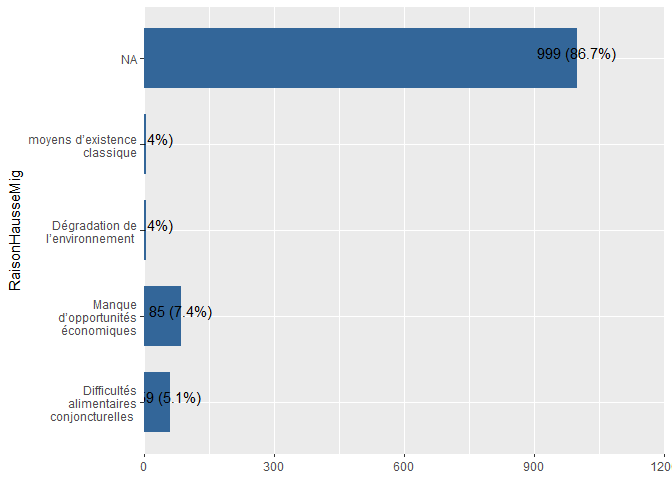<!-- -->

```r
expss::val_lab(Mauritania_ea_2022$RaisonHausseMig)
Mauritania_ea_2022 <- Mauritania_ea_2022 %>% 
  dplyr::mutate(RaisonHausseMig = dplyr::recode(RaisonHausseMig,"1"=1,"2"=2,"3"=3,"4"=4,"other"=5))
Mauritania_ea_2022$RaisonHausseMig <- labelled::labelled(Mauritania_ea_2022$RaisonHausseMig, c(`Difficultés alimentaires conjoncturelles ` = 1, `Manque d’opportunités économiques` = 2,`Dégradation de l’environnement `=3,` moyens d’existence classique`=4,`Autres`=5))
Mauritania_ea_2022 %>% 
  plot_frq(coord.flip =T,RaisonHausseMig,show.na = T)
```

<!-- -->

```r
# 1.Moins d’opportunités économiques ou insécurité au Nigéria ou en Lybie
# 2.Voyage vers la Lybie/ Nigeria devenu trop dangereux/ couteux
# 3.Les ménages pauvres ont accès à une assistance régulière/ les bras valides sont occupés par les travaux FFA
# 4.La situation alimentaire générale du village s’est améliorée
# 5. La migration fait désormais partie des moyens d’existence classique 
#6. Emergence d’opportunités économiques grâce aux actifs créés/réhabilités
# 7. Autres à préciser 
Mauritania_baseline_2018$RaisonBaisseMig <- as.factor(Mauritania_baseline_2018$RaisonBaisseMig)

Mauritania_ea_2019$RaisonBaisseMig <- as.factor(Mauritania_ea_2019$RaisonBaisseMig)
Mauritania_ea_2020$RaisonBaisseMig <- as.factor(Mauritania_ea_2020$RaisonBaisseMig)
Mauritania_pdm_2020$RaisonBaisseMig <- as.factor(Mauritania_pdm_2020$RaisonBaisseMig)


expss::val_lab(Mauritania_ea_2021$RaisonBaisseMig)

Mauritania_ea_2021 <- Mauritania_ea_2021 %>% 
  dplyr::mutate(RaisonBaisseMig = dplyr::recode(RaisonBaisseMig,"1"=6,"2"=3,"3"=4,"4"=5,"other"=7,"5"=6,.default=NA_real_))
Mauritania_ea_2021$RaisonBaisseMig <- labelled::labelled(Mauritania_ea_2021$RaisonBaisseMig, c(`Moins d’opportunités économiques ou insécurité au Nigéria ou en Lybie ` = 1, `Voyage vers la Lybie/ Nigeria devenu trop dangereux/ couteux` = 2,`Les ménages pauvres ont accès à une assistance régulièr `=3,` La situation alimentaire générale du village s’est améliorée`=4,`La migration fait désormais partie des moyens d’existence classique`=5,`Emergence d’opportunités économiques grâce aux actifs créés/réhabilités`=6,`Autres`=7))
Mauritania_ea_2021 %>% 
  plot_frq(coord.flip =T,RaisonBaisseMig,show.na = T)
```

<!-- -->

```r
expss::val_lab(Mauritania_pdm_2021$RaisonBaisseMig)
Mauritania_pdm_2021 <- Mauritania_pdm_2021 %>% 
  dplyr::mutate(RaisonBaisseMig = dplyr::recode(RaisonBaisseMig,"1"=6,"2"=3,"3"=4,"4"=5,"other"=7,"5"=6,.default=NA_real_ ))
Mauritania_pdm_2021$RaisonBaisseMig <- labelled::labelled(Mauritania_pdm_2021$RaisonBaisseMig, c(`Moins d’opportunités économiques ou insécurité au Nigéria ou en Lybie ` = 1, `Voyage vers la Lybie/ Nigeria devenu trop dangereux/ couteux` = 2,`Les ménages pauvres ont accès à une assistance régulièr `=3,` La situation alimentaire générale du village s’est améliorée`=4,`La migration fait désormais partie des moyens d’existence classique`=5,`Emergence d’opportunités économiques grâce aux actifs créés/réhabilités`=6,`Autres`=7))
Mauritania_pdm_2021 %>% 
  plot_frq(coord.flip =T,RaisonBaisseMig,show.na = T)
```

<!-- -->

```r
expss::val_lab(Mauritania_ea_2022$RaisonBaisseMig)
Mauritania_ea_2022 <- Mauritania_ea_2022 %>% 
  dplyr::mutate(RaisonBaisseMig = dplyr::recode(RaisonBaisseMig,"1"=6,"2"=3,"3"=4,"4"=5,"other"=7,"5"=6,.default=NA_real_))
Mauritania_ea_2022$RaisonBaisseMig <- labelled::labelled(Mauritania_ea_2022$RaisonBaisseMig, c(`Moins d’opportunités économiques ou insécurité au Nigéria ou en Lybie ` = 1, `Voyage vers la Lybie/ Nigeria devenu trop dangereux/ couteux` = 2,`Les ménages pauvres ont accès à une assistance régulièr `=3,` La situation alimentaire générale du village s’est améliorée`=4,`La migration fait désormais partie des moyens d’existence classique`=5,`Emergence d’opportunités économiques grâce aux actifs créés/réhabilités`=6,`Autres`=7))
Mauritania_ea_2022 %>% 
  plot_frq(coord.flip =T,RaisonBaisseMig,show.na = T)
```

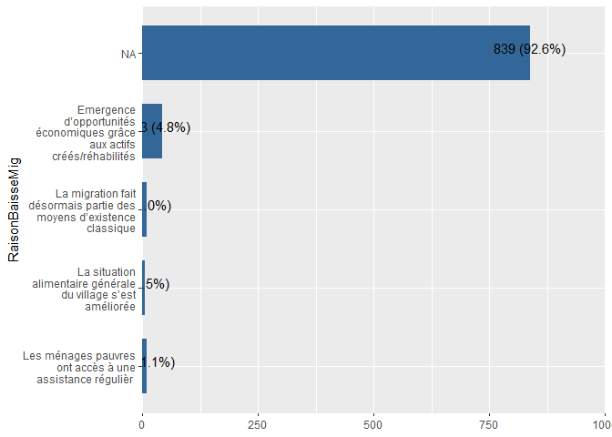<!-- -->

# Social capital index (Indice de capital social)

Ici Nous allons utiliser les labels fournis de le questionnaire word


```r
SCI_var1 = c("SCIAideIntraCom",
"SCIAideDehorsCom",
"SCIPersAAiderEnDehorsCom","SCIPersAAiderCom")

#1.Parents
#2.Les personnes non apparentées de mon groupe ethnique/clan
#3.Non parents dans un autre groupe ethnique/clan
#4.Personne
#5.Autre (précisez) ;
#6. Ne sait pas ;
#7. Refuse de répondre

Mauritania_baseline_2018 <- Mauritania_baseline_2018 %>%
  mutate(across(all_of(SCI_var1), factor))
Mauritania_ea_2019 <- Mauritania_ea_2019 %>%
  mutate(across(all_of(SCI_var1), factor))
Mauritania_ea_2020 <- Mauritania_ea_2020 %>%
  mutate(across(all_of(SCI_var1), factor))

Mauritania_pdm_2020 <- Mauritania_pdm_2020 %>%
  mutate(across(all_of(SCI_var1), factor))


expss::val_lab(Mauritania_ea_2021$SCIAideIntraCom)
#Mauritania_ea_2021 <- Mauritania_ea_2021 %>% 
#  dplyr::mutate(SCIAideIntraCom = ifelse(SCIAideIntraCom==0,NA,SCIAideIntraCom))

Mauritania_ea_2021 <- Mauritania_ea_2021 %>% 
  dplyr::mutate(across(SCI_var1,
                       ~recode(.,"1"=1,"2"=2,"3"=3,"4"=4,"5"=5,"888"=6,"8888"=7,.default = NA_real_
                       )
  )
  )
Mauritania_ea_2021 <- Mauritania_ea_2021 %>% 
  dplyr::mutate(across(SCI_var1,
                       ~labelled(., labels = c(
                         "Parents" = 1, "Les personnes non apparentées de mon groupe ethnique/clan" = 2, "Non parents dans un autre groupe ethnique/clan"= 3,"Personne"=4,"Autre"=5,"NSP"=6,"Refus"=7
                       )
                       )
  )
  )
Mauritania_ea_2021 %>% 
  plot_frq(coord.flip =T,SCIAideIntraCom,show.na = T)
```

<!-- -->

```r
expss::val_lab(Mauritania_pdm_2021$SCIAideIntraCom)
#Mauritania_pdm_2021 <- Mauritania_pdm_2021 %>% 
#  dplyr::mutate(SCIAideIntraCom = ifelse(SCIAideIntraCom==0,NA,SCIAideIntraCom))

Mauritania_pdm_2021 <- Mauritania_pdm_2021 %>% 
  dplyr::mutate(across(SCI_var1,
                       ~recode(.,"1"=1,"2"=2,"3"=3,"4"=4,"5"=5,"888"=6,"8888"=7,.default = NA_real_
                       )
  )
  )
Mauritania_pdm_2021 <- Mauritania_pdm_2021 %>% 
  dplyr::mutate(across(SCI_var1,
                       ~labelled(., labels = c(
                         "Parents" = 1, "Les personnes non apparentées de mon groupe ethnique/clan" = 2, "Non parents dans un autre groupe ethnique/clan"= 3,"Personne"=4,"Autre"=5,"NSP"=6,"Refus"=7
                       )
                       )
  )
  )

Mauritania_pdm_2021 %>% 
  plot_frq(coord.flip =T,SCIAideIntraCom,show.na = T)
```

<!-- -->

```r
#2022

expss::val_lab(Mauritania_ea_2022$SCIAideIntraCom)
#Mauritania_ea_2022 <- Mauritania_ea_2022 %>% 
#  dplyr::mutate(SCIAideIntraCom = ifelse(SCIAideIntraCom==0,NA,SCIAideIntraCom))

Mauritania_ea_2022 <- Mauritania_ea_2022 %>% 
  dplyr::mutate(across(SCI_var1,
                       ~recode(.,"1"=1,"2"=2,"3"=3,"4"=4,"5"=5,"888"=6,"8888"=7,.default = NA_real_
                       )
  )
  )
Mauritania_ea_2022 <- Mauritania_ea_2022 %>% 
  dplyr::mutate(across(SCI_var1,
                       ~labelled(., labels = c(
                         "Parents" = 1, "Les personnes non apparentées de mon groupe ethnique/clan" = 2, "Non parents dans un autre groupe ethnique/clan"= 3,"Personne"=4,"Autre"=5,"NSP"=6,"Refus"=7
                       )
                       )
  )
  )

Mauritania_ea_2022 %>% 
  plot_frq(coord.flip =T,SCIAideIntraCom,show.na = T)
```

<!-- -->


```r
#Nous allons utiliser les labels suivants
#1.	Augmenté ; 2. Est resté le même ; 3. A diminué ; 4. Ne sait pas ; 5. Refuse de répondre
Mauritania_baseline_2018$SCIEvolRessSociales <- as.factor(Mauritania_baseline_2018$SCIEvolRessSociales)

Mauritania_ea_2019$SCIEvolRessSociales <- as.factor(Mauritania_ea_2019$SCIEvolRessSociales)


Mauritania_ea_2020$SCIEvolRessSociales <- as.factor(Mauritania_ea_2020$SCIEvolRessSociales)

Mauritania_pdm_2020$SCIEvolRessSociales <- as.factor(Mauritania_pdm_2020$SCIEvolRessSociales)


expss::val_lab(Mauritania_ea_2021$SCIEvolRessSociales)

Mauritania_ea_2021 <- Mauritania_ea_2021 %>% 
  dplyr::mutate(SCIEvolRessSociales = dplyr::recode(SCIEvolRessSociales,"1"=1,"2"=2,"3"=3,"888"=4,"8888"=5))
Mauritania_ea_2021$SCIEvolRessSociales <- labelled::labelled(Mauritania_ea_2021$SCIEvolRessSociales, c(`Augmenté` = 1, `Est resté le même` = 2, `A diminué`= 3,`NSP`=4,`Refus`=5))
Mauritania_ea_2021 %>% 
  plot_frq(coord.flip =T,SCIEvolRessSociales,show.na = T)
```

<!-- -->

```r
expss::val_lab(Mauritania_pdm_2021$SCIEvolRessSociales)
Mauritania_pdm_2021 <- Mauritania_pdm_2021 %>% 
  dplyr::mutate(SCIEvolRessSociales = dplyr::recode(SCIEvolRessSociales,"1"=1,"2"=2,"3"=3,"888"=4,"8888"=5))
Mauritania_pdm_2021$SCIEvolRessSociales <- labelled::labelled(Mauritania_pdm_2021$SCIEvolRessSociales, c(`Augmenté` = 1, `Est resté le même` = 2, `A diminué`= 3,`NSP`=4,`Refus`=5))
Mauritania_pdm_2021 %>% 
  plot_frq(coord.flip =T,SCIEvolRessSociales,show.na = T)
```

<!-- -->

```r
expss::val_lab(Mauritania_ea_2022$SCIEvolRessSociales)
Mauritania_ea_2022 <- Mauritania_ea_2022 %>% 
  dplyr::mutate(SCIEvolRessSociales = dplyr::recode(SCIEvolRessSociales,"1"=1,"2"=2,"3"=3,"888"=4,"8888"=5))
Mauritania_ea_2022$SCIEvolRessSociales <- labelled::labelled(Mauritania_ea_2022$SCIEvolRessSociales, c(`Augmenté` = 1, `Est resté le même` = 2, `A diminué`= 3,`NSP`=4,`Refus`=5))
Mauritania_ea_2022 %>% 
  plot_frq(coord.flip =T,SCIEvolRessSociales,show.na = T)
```

<!-- -->

```r
SCI_var2 = c("SCIConMembreGvrnmt",
"SCICapAideGvnmt",
"SCIConMembreNGO","SCIAideAubesoin")

#Nous allons utiliser les labels suivants
# 1.Non ; 2. Oui 3. Ne sait pas ; 4. Refus

Mauritania_baseline_2018 <- Mauritania_baseline_2018 %>%
  mutate_at(SCI_var2, as.factor)

Mauritania_ea_2019 <- Mauritania_ea_2019 %>%
  mutate_at(SCI_var2, as.factor)
Mauritania_ea_2020 <- Mauritania_ea_2020 %>%
  mutate_at(SCI_var2, as.factor)

Mauritania_pdm_2020 <- Mauritania_pdm_2020 %>%
  mutate_at(SCI_var2, as.factor)


expss::val_lab(Mauritania_ea_2021$SCIConMembreGvrnmt)
Mauritania_ea_2021 <- Mauritania_ea_2021 %>% 
  dplyr::mutate(across(SCI_var2,
                       ~recode(.,"0"=1,"1"=2,"888"=3,"8888"=4
                       )
  )
  )
Mauritania_ea_2021 <- Mauritania_ea_2021 %>% 
  dplyr::mutate(across(SCI_var2,
                       ~labelled(., labels = c("Non" = 1, "Oui" = 2,"NSP"=3,"Refus"=4)
                       )
  )
  )
Mauritania_ea_2021 %>% 
  plot_frq(coord.flip =T,SCIConMembreGvrnmt,show.na = T)
```

<!-- -->

```r
expss::val_lab(Mauritania_pdm_2021$SCIConMembreGvrnmt)

Mauritania_pdm_2021 <- Mauritania_pdm_2021 %>% 
  dplyr::mutate(across(SCI_var2,
                       ~recode(.,"0"=1,"1"=2,"888"=3,"8888"=4
                       )
  )
  )
Mauritania_pdm_2021 <- Mauritania_pdm_2021 %>% 
  dplyr::mutate(across(SCI_var2,
                       ~labelled(., labels = c("Non" = 1, "Oui" = 2,"NSP"=3,"Refus"=4)
                       )
  )
  )

Mauritania_pdm_2021 %>% 
  plot_frq(coord.flip =T,SCIConMembreGvrnmt,show.na = T)
```

<!-- -->

```r
#2022

expss::val_lab(Mauritania_ea_2022$SCIConMembreGvrnmt)

Mauritania_ea_2022 <- Mauritania_ea_2022 %>% 
  dplyr::mutate(across(SCI_var2,
                       ~recode(.,"0"=1,"1"=2,"888"=3,"8888"=4
                       )
  )
  )
Mauritania_ea_2022 <- Mauritania_ea_2022 %>% 
  dplyr::mutate(across(SCI_var2,
                       ~labelled(., labels = c("Non" = 1, "Oui" = 2,"NSP"=3,"Refus"=4)
                       )
  )
  )

Mauritania_ea_2022 %>% 
  plot_frq(coord.flip =T,SCIConMembreGvrnmt,show.na = T)
```

<!-- -->

```r
SCI_var3 = c("SCIPersConMembreNGO",
"SCIPersConMembreGvrnmt")

#Nous allons utiliser les labels suivants
#1. Un membre de la famille ou un parent
#2.	Ami(e)
#3.	Voisin
#4.	Connaissance (membre d'un groupe, ami d'un ami, etc.)
#7.	Autre (précisez) ; 5 Ne sait pas ; 6. Refuse de répondre.

Mauritania_baseline_2018 <- Mauritania_baseline_2018 %>%
  mutate_at(SCI_var3, as.factor)

Mauritania_ea_2019 <- Mauritania_ea_2019 %>%
  mutate_at(SCI_var3, as.factor)

Mauritania_ea_2020 <- Mauritania_ea_2020 %>%
  mutate_at(SCI_var3, as.factor)

Mauritania_pdm_2020 <- Mauritania_pdm_2020 %>%
  mutate_at(SCI_var3, as.factor)


expss::val_lab(Mauritania_ea_2021$SCIPersConMembreNGO)
Mauritania_ea_2021 <- Mauritania_ea_2021 %>% 
  dplyr::mutate(across(SCI_var3,
                       ~recode(.,"1"=1,"2"=2,"3"=3,"4"=4,"888"=5,"8888"=6,"5"=7,.default=NA_real_
                       )
  )
  )
Mauritania_ea_2021 <- Mauritania_ea_2021 %>% 
  dplyr::mutate(across(SCI_var3,
                       ~labelled(., labels = c("Un membre de la famille ou un parent" = 1, "Ami(e)" = 2,"Voisin"=3,"Connaissance"=4,"NSP"=5,"Refus"=6,"Autre"=7)
                       )
  )
  )
Mauritania_ea_2021 %>% 
  plot_frq(coord.flip =T,SCIPersConMembreNGO,show.na = T)
```

<!-- -->

```r
expss::val_lab(Mauritania_pdm_2021$SCIPersConMembreNGO)

Mauritania_pdm_2021 <- Mauritania_pdm_2021 %>% 
  dplyr::mutate(across(SCI_var3,
                       ~recode(.,"1"=1,"2"=2,"3"=3,"4"=4,"888"=5,"8888"=6,"5"=7,.default=NA_real_
                       )
  )
  )
Mauritania_pdm_2021 <- Mauritania_pdm_2021 %>% 
  dplyr::mutate(across(SCI_var3,
                       ~labelled(., labels = c("Un membre de la famille ou un parent" = 1, "Ami(e)" = 2,"Voisin"=3,"Connaissance"=4,"NSP"=5,"Refus"=6,"Autre"=7)
                       )
  )
  )

Mauritania_pdm_2021 %>% 
  plot_frq(coord.flip =T,SCIPersConMembreNGO,show.na = T)
```

<!-- -->

```r
#2022

expss::val_lab(Mauritania_ea_2022$SCIPersConMembreNGO)

Mauritania_ea_2022 <- Mauritania_ea_2022 %>% 
  dplyr::mutate(across(SCI_var3,
                       ~recode(.,"1"=1,"2"=2,"3"=3,"4"=4,"888"=5,"8888"=6,"5"=7,.default=NA_real_
                       )
  )
  )
Mauritania_ea_2022 <- Mauritania_ea_2022 %>% 
  dplyr::mutate(across(SCI_var3,
                       ~labelled(., labels = c("Un membre de la famille ou un parent" = 1, "Ami(e)" = 2,"Voisin"=3,"Connaissance"=4,"NSP"=5,"Refus"=6,"Autre"=7)
                       )
  )
  )

Mauritania_ea_2022 %>% 
  plot_frq(coord.flip =T,SCIPersConMembreNGO,show.na = T)
```

<!-- -->

# DIVERSITE ALIMENTAIRE DES FEMMES 


# Régime alimentaire minimum acceptable (MAD)


#Proportion de ménage ayant un membre qui participe à un groupe d’épargne et ou qui fait l’épargne sur pieds

```r
EPAR = c("ExistGroupeEpargne","MembreGroupeEpargne","EpargneAvantPam",
         "EpargneSansPam","PossibilitePret","AutreSourcePret","EpargnePieds")

#Nous allons utiliser les labels suivants
#0=Non ; 1=Oui ; 888=Ne sait pas 

Mauritania_baseline_2018 <- Mauritania_baseline_2018 %>%
  mutate_at(EPAR, as.factor)

Mauritania_ea_2019 <- Mauritania_ea_2019 %>%
  mutate_at(EPAR, as.factor)

Mauritania_ea_2020 <- Mauritania_ea_2020 %>%
  mutate_at(EPAR, as.factor)

Mauritania_pdm_2020 <- Mauritania_pdm_2020 %>%
  mutate_at(EPAR, as.factor)


Mauritania_ea_2021 <- Mauritania_ea_2021 %>% 
  dplyr::mutate(across(EPAR,
                       ~recode(.,"0"=0,"1"=1,"888"=888,"8888"=888, .default = NA_real_)
  )
  )
Mauritania_ea_2021 <- Mauritania_ea_2021 %>% 
  dplyr::mutate(across(EPAR,
                       ~labelled(., labels = c("Non" = 0, "Oui" = 1,"Ne Sait Pas"=888)
                       )
  )
  )
Mauritania_ea_2021 %>% 
  plot_frq(coord.flip =T,ExistGroupeEpargne,show.na = T)
```

<!-- -->

```r
#pdm 2021
Mauritania_pdm_2021 <- Mauritania_pdm_2021 %>% 
  dplyr::mutate(across(EPAR,
                       ~recode(.,"0"=0,"1"=1,"888"=888,"8888"=888, .default = NA_real_)
  )
  )
Mauritania_pdm_2021 <- Mauritania_pdm_2021 %>% 
  dplyr::mutate(across(EPAR,
                       ~labelled(., labels = c("Non" = 0, "Oui" = 1,"Ne Sait Pas"=888)
                       )
  )
  )
Mauritania_pdm_2021 %>% 
  plot_frq(coord.flip =T,ExistGroupeEpargne,show.na = T)
```

<!-- -->

```r
#2022
Mauritania_ea_2022 <- Mauritania_ea_2022 %>% 
  dplyr::mutate(across(EPAR,
                       ~recode(.,"0"=0,"1"=1,"888"=888,"8888"=888, .default = NA_real_)
  )
  )
Mauritania_ea_2022 <- Mauritania_ea_2022 %>% 
  dplyr::mutate(across(EPAR,
                       ~labelled(., labels = c("Non" = 0, "Oui" = 1,"Ne Sait Pas"=888)
                       )
  )
  )

  
Mauritania_ea_2022 %>% 
  plot_frq(coord.flip =T,ExistGroupeEpargne,show.na = T)
```

<!-- -->

#SHOCK EXPOSURE INDEX (Indice d’exposition aux chocs) & ABILITY TO RECOVER INDEX


```r
GRA = c("GraviteImpactRevenus","GraviteImpactSAN")

#Nous allons utiliser les labels suivants
#1) Pas d'impact ; 2) Légère diminution ; 3) Forte diminution ; 4) Pire que jamais ; 
#-888 Ne sait pas ; -8888 Refus.

# Mauritania_baseline_2018 <- Mauritania_baseline_2018 %>%
#   mutate_at(GRA, as_numeric())
# 
# Mauritania_ea_2019 <- Mauritania_ea_2019 %>%
#   mutate_at(GRA, as_numeric)
# 
# Mauritania_ea_2020 <- Mauritania_ea_2020 %>%
#   mutate_at(GRA, as_numeric)
# 
# Mauritania_pdm_2020 <- Mauritania_pdm_2020 %>%
#   mutate_at(GRA, as_numeric)


Mauritania_ea_2021$GraviteImpactRevenus <- as.numeric(Mauritania_ea_2021$GraviteImpactRevenus)
Mauritania_ea_2021$GraviteImpactSAN <- as.numeric(Mauritania_ea_2021$GraviteImpactSAN)

Mauritania_ea_2021 <- Mauritania_ea_2021 %>% 
  dplyr::mutate(across(GRA,
                       ~recode(.,`1`=1L,`2`=2L,`3`=3L,`4`=4L,.default=NA_integer_
                       )
  )
  )
# Mauritania_ea_2021 <- Mauritania_ea_2021 %>%
#   dplyr::mutate(across(GRA,
#                        ~labelled(., labels = c("Pas d'impact" = 1, "Légère diminution" = 2,"Forte diminution"=3,"Pire que jamais"=4,"Ne sait pas"=888,"Refus"=8888)
#                        )
#   )
#   )
Mauritania_ea_2021 %>% 
  plot_frq(coord.flip =T,GraviteImpactSAN,show.na = T)
```

<!-- -->

```r
#pdm 2021
Mauritania_pdm_2021$GraviteImpactRevenus <- as.numeric(Mauritania_pdm_2021$GraviteImpactRevenus)
Mauritania_pdm_2021$GraviteImpactSAN <- as.numeric(Mauritania_pdm_2021$GraviteImpactSAN)

Mauritania_pdm_2021 <- Mauritania_pdm_2021 %>% 
  dplyr::mutate(across(GRA,
                       ~recode(.,`1`=1L,`2`=2L,`3`=3L,`4`=4L,.default=NA_integer_  )
  )
  )
# Mauritania_pdm_2021 <- Mauritania_pdm_2021 %>%
#   dplyr::mutate(across(GRA,
#                        ~labelled(., labels = c("Pas d'impact" = 1, "Légère diminution" = 2,"Forte diminution"=3,"Pire que jamais"=4,"Ne sait pas"=888,"Refus"=8888)
#                        )
#   )
#   )
Mauritania_pdm_2021 %>% 
  plot_frq(coord.flip =T,GraviteImpactSAN,show.na = T)
```

<!-- -->

```r
#2022

Mauritania_ea_2022$GraviteImpactRevenus <- as.numeric(Mauritania_ea_2022$GraviteImpactRevenus)
Mauritania_ea_2022$GraviteImpactSAN <- as.numeric(Mauritania_ea_2022$GraviteImpactSAN)


Mauritania_ea_2022 <- Mauritania_ea_2022 %>% 
  dplyr::mutate(across(GRA,
                       ~recode(.,`1`=1L,`2`=2L,`3`=3L,`4`=4L,`888`=888L,`8888`=8888L,.default=NA_integer_             )
  )
  )
# Mauritania_ea_2022 <- Mauritania_ea_2022 %>%
#   dplyr::mutate(across(GRA,
#                        ~labelled(., labels = c("Pas d'impact" = 1, "Légère diminution" = 2,"Forte diminution"=3,"Pire que jamais"=4,"Ne sait pas"=888,"Refus"=8888)
#                        )
#   )
#   )
Mauritania_ea_2022 %>% 
  plot_frq(coord.flip =T,GraviteImpactSAN,show.na = T)
```

<!-- -->


```r
VAR = c("CACRetabCapAlim","CACRetabCapAlim_1y")

#Nous allons utiliser les labels suivants
#1= La capacité à satisfaire les besoins alimentaires est pire qu'avant le choc.
#2= La capacité à satisfaire les besoins alimentaires est la même qu'avant le choc.
#3= La capacité à satisfaire les besoins alimentaires est meilleure qu'avant le choc.


Mauritania_baseline_2018 <- Mauritania_baseline_2018 %>%
  mutate_at(VAR, as.factor)

Mauritania_ea_2019 <- Mauritania_ea_2019 %>%
  mutate_at(VAR, as.factor)

Mauritania_ea_2020 <- Mauritania_ea_2020 %>%
  mutate_at(VAR, as.factor)

Mauritania_pdm_2020 <- Mauritania_pdm_2020 %>%
  mutate_at(VAR, as.factor)


Mauritania_ea_2021 <- Mauritania_ea_2021 %>% 
  dplyr::mutate(across(VAR,
                       ~recode(.,"1"=1,"2"=2,"3"=3,.default=NA_real_
                       )
  )
  )
Mauritania_ea_2021 <- Mauritania_ea_2021 %>% 
  dplyr::mutate(across(VAR,
                       ~labelled(., labels = c("La capacité à satisfaire les besoins alimentaires est pire qu'avant le choc" = 1, "La capacité à satisfaire les besoins alimentaires est pire qu'avant le choc" = 2,"La capacité à satisfaire les besoins alimentaires est meilleure qu'avant le choc"=3)
                       )
  )
  )
Mauritania_ea_2021 %>% 
  plot_frq(coord.flip =T,CACRetabCapAlim,show.na = T)
```

<!-- -->

```r
#pdm 2021
Mauritania_pdm_2021 <- Mauritania_pdm_2021 %>% 
  dplyr::mutate(across(VAR,
                       ~recode(.,"1"=1,"2"=2,"3"=3,.default=NA_real_
                       )
  )
  )
Mauritania_pdm_2021 <- Mauritania_pdm_2021 %>% 
  dplyr::mutate(across(VAR,
                       ~labelled(., labels = c("La capacité à satisfaire les besoins alimentaires est pire qu'avant le choc" = 1, "La capacité à satisfaire les besoins alimentaires est pire qu'avant le choc" = 2,"La capacité à satisfaire les besoins alimentaires est meilleure qu'avant le choc"=3)
                       )
  )
  )
Mauritania_pdm_2021 %>% 
  plot_frq(coord.flip =T,CACRetabCapAlim,show.na = T)
```

<!-- -->

```r
#2022

Mauritania_ea_2022 <- Mauritania_ea_2022 %>% 
  dplyr::mutate(across(VAR,
                       ~recode(.,"1"=1,"2"=2,"3"=3,.default=NA_real_
                       )
  )
  )
Mauritania_ea_2022 <- Mauritania_ea_2022 %>% 
  dplyr::mutate(across(VAR,
                       ~labelled(., labels = c("La capacité à satisfaire les besoins alimentaires est pire qu'avant le choc" = 1, "La capacité à satisfaire les besoins alimentaires est pire qu'avant le choc" = 2,"La capacité à satisfaire les besoins alimentaires est meilleure qu'avant le choc"=3)
                       )
  )
  )
Mauritania_ea_2022 %>% 
  plot_frq(coord.flip =T,CACRetabCapAlim,show.na = T)
```

<!-- -->


# Date format check


```r
#as.Date(19213, origin = "1970-01-01")
#as.Date(43791, origin = "1899-12-30")
Mauritania_baseline_2018$SvyDatePDM<-as.Date(Mauritania_baseline_2018$SvyDatePDM)
Mauritania_ea_2019$SvyDatePDM<-as.Date(Mauritania_ea_2019$SvyDatePDM)
Mauritania_ea_2020$SvyDatePDM<-as.Date(Mauritania_ea_2020$SvyDatePDM)
Mauritania_ea_2021$SvyDatePDM<-as.Date(Mauritania_ea_2021$SvyDatePDM)
Mauritania_ea_2022$SvyDatePDM<-as.Date(Mauritania_ea_2022$SvyDatePDM)
Mauritania_pdm_2020$SvyDatePDM<-as.Date(Mauritania_pdm_2020$SvyDatePDM)
Mauritania_pdm_2021$SvyDatePDM<-as.Date(Mauritania_pdm_2021$SvyDatePDM)
```


# Gender recodification


```r
# We need to recode gender label to:
# 0 = Femme
# 1 = Homme


#View labels
expss::val_lab(Mauritania_baseline_2018$HHHSex)
Mauritania_baseline_2018 %>% 
  plot_frq(coord.flip =T,HHHSex)
```

<!-- -->

```r
# Mauritania_baseline_2018 <- Mauritania_baseline_2018 %>%
#   mutate(
#     HHHSex = recode(HHHSex, `2` = 0L, `1` = 1L),  
#     HHHSex = as_factor(HHHSex, labels = c("Femme", "Homme"))  
#   )

 Mauritania_baseline_2018 <- Mauritania_baseline_2018 %>%
   mutate(HHHSex= as_factor(HHHSex),HHHSex= recode(HHHSex,`2` = 0L, `1` = 1L))

#Check new labels
expss::val_lab(Mauritania_baseline_2018$HHHSex)
Mauritania_baseline_2018 %>% 
  plot_frq(coord.flip =T,HHHSex)
```

<!-- -->

```r
#View labels
expss::val_lab(Mauritania_ea_2019$HHHSex)
Mauritania_ea_2019 %>% 
  plot_frq(coord.flip =T,HHHSex)
```

<!-- -->

```r
# Mauritania_ea_2019 <- Mauritania_ea_2019 %>%
#   mutate(
#     HHHSex = recode(HHHSex, `2` = 0L, `1` = 1L),  
#     HHHSex = as_factor(HHHSex, labels = c("Femme", "Homme"))  
#   )


Mauritania_ea_2019 <- Mauritania_ea_2019 %>%
 mutate(HHHSex= as_factor(HHHSex),HHHSex= recode(HHHSex,`2` = 0L, `1` = 1L))
#Mauritania_ea_2019$HHHSex <- labelled::labelled(Mauritania_ea_2019$HHHSex, labels=c(Femme = 0, Homme = 1))


#Check labels
expss::val_lab(Mauritania_ea_2019$HHHSex)
Mauritania_ea_2019 %>% 
  plot_frq(coord.flip =T,HHHSex)
```

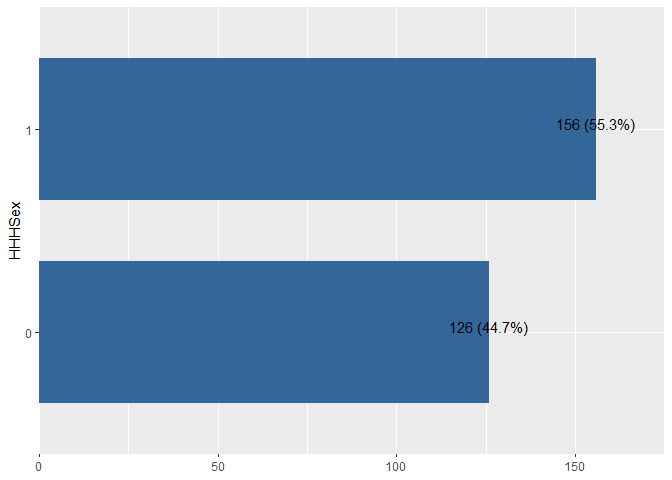<!-- -->

```r
#View labels
expss::val_lab(Mauritania_ea_2020$HHHSex)
Mauritania_ea_2020 %>% 
  plot_frq(coord.flip =T,HHHSex)
```

<!-- -->

```r
Mauritania_ea_2020 <- Mauritania_ea_2020 %>%
 mutate(HHHSex= as_factor(HHHSex),HHHSex= recode(HHHSex,`2` = 0L, `1` = 1L))
#Mauritania_ea_2020$HHHSex <- labelled::labelled(Mauritania_ea_2020$HHHSex, labels=c(Femme = 0, Homme = 1))
# Mauritania_ea_2020 <- Mauritania_ea_2020 %>%
#   mutate(
#     HHHSex = recode(HHHSex, `2` = 0L, `1` = 1L),  
#     HHHSex = as_factor(HHHSex, labels = c("Femme", "Homme"))  
#   )

#Check new labels
expss::val_lab(Mauritania_ea_2020$HHHSex)
Mauritania_ea_2020 %>% 
  plot_frq(coord.flip =T,HHHSex)
```

<!-- -->

```r
#View labels
expss::val_lab(Mauritania_ea_2021$HHHSex)
Mauritania_ea_2021 %>% 
  plot_frq(coord.flip =T,HHHSex)
```

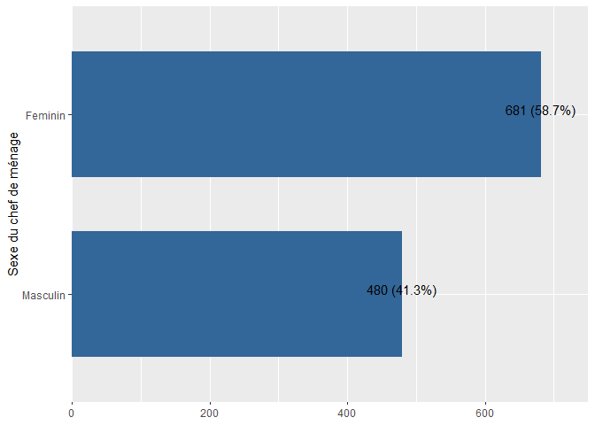<!-- -->

```r
Mauritania_ea_2021 <- Mauritania_ea_2021 %>%
  mutate(HHHSex= as_factor(HHHSex),HHHSex= recode(HHHSex,`2` = 0L, `1` = 1L))
#Mauritania_ea_2021$HHHSex <- labelled::labelled(Mauritania_ea_2021$HHHSex, labels=c(Femme = 0, Homme = 1))
# Mauritania_ea_2021 <- Mauritania_ea_2021 %>%
#   mutate(
#     HHHSex = recode(HHHSex, `2` = 0L, `1` = 1L),  
#     HHHSex = as_factor(HHHSex, labels = c("Femme", "Homme"))  
#   )

#Check labels
expss::val_lab(Mauritania_ea_2021$HHHSex)
Mauritania_ea_2021 %>% 
  plot_frq(coord.flip =T,HHHSex)
```

<!-- -->

```r
#View labels
expss::val_lab(Mauritania_ea_2022$HHHSex)
Mauritania_ea_2022 %>% 
  plot_frq(coord.flip =T,HHHSex)
```

<!-- -->

```r
# Mauritania_ea_2022 <- Mauritania_ea_2022 %>%
#   mutate(
#     HHHSex = recode(HHHSex, `2` = 0L, `1` = 1L),  
#     HHHSex = as_factor(HHHSex, labels = c("Femme", "Homme"))  
#   )

 Mauritania_ea_2022 <- Mauritania_ea_2022 %>%
   mutate(HHHSex= as_factor(HHHSex),HHHSex= recode(HHHSex,`2` = 0L, `1` = 1L))
 #Mauritania_ea_2022$HHHSex <- labelled::labelled(Mauritania_ea_2022$HHHSex, labels=c(Femme = 0, Homme = 1))


#Check labels
expss::val_lab(Mauritania_ea_2022$HHHSex)
Mauritania_ea_2022 %>% 
  plot_frq(coord.flip =T,HHHSex)
```

<!-- -->

```r
#View labels NULL
expss::val_lab(Mauritania_pdm_2020$HHHSex)
Mauritania_pdm_2020 %>%
  plot_frq(coord.flip =T,HHHSex)
```

<!-- -->

```r
 Mauritania_pdm_2020 <- Mauritania_pdm_2020 %>%
   mutate(HHHSex= as_factor(HHHSex),HHHSex= recode(HHHSex,`2` = 0L, `1` = 1L))
 #Mauritania_pdm_2020$HHHSex <- labelled::labelled(Mauritania_pdm_2020$HHHSex, labels=c(Femme = 0, Homme = 1))

# Mauritania_pdm_2020 <- Mauritania_pdm_2020 %>%
#   mutate(
#     HHHSex = recode(HHHSex, `2` = 0L, `1` = 1L),  
#     HHHSex = as_factor(HHHSex, labels = c("Femme", "Homme"))  
#   )

#Check labels
expss::val_lab(Mauritania_pdm_2020$HHHSex)
Mauritania_pdm_2020 %>%
  plot_frq(coord.flip =T,HHHSex)
```

<!-- -->

```r
#View labels
expss::val_lab(Mauritania_pdm_2021$HHHSex)
Mauritania_pdm_2021 %>% 
  plot_frq(coord.flip =T,HHHSex)
```

<!-- -->

```r
 Mauritania_pdm_2021 <- Mauritania_pdm_2021 %>%
   mutate(HHHSex= as_factor(HHHSex),HHHSex= recode(HHHSex,`2` = 0L, `1` = 1L))
#val_labels(Mauritania_pdm_2021$HHHSex)<- c(Femme = 0, Homme = 1)
# Mauritania_pdm_2021$HHHSex <- labelled::labelled(Mauritania_pdm_2021$HHHSex, labels=c(Femme = 0, Homme = 1))


# Mauritania_pdm_2021 <- Mauritania_pdm_2021 %>%
#   mutate(
#     HHHSex = recode(HHHSex, `2` = 0L, `1` = 1L),  
#     HHHSex = as_factor(HHHSex, labels = c("Femme", "Homme"))  
#   )

#Check labels
expss::val_lab(Mauritania_pdm_2021$HHHSex)
Mauritania_pdm_2021 %>% 
  plot_frq(coord.flip =T,HHHSex)
```

<!-- -->


# Household head education level


```r
expss::val_lab(Mauritania_baseline_2018$HHHEdu)

Mauritania_baseline_2018 <- 
  Mauritania_baseline_2018 %>% dplyr::mutate(HHHEdu = dplyr::recode(HHHEdu,"1"=1,"2"=2,"3"=2,"4"=3,"5"=4,"6"=5))
Mauritania_baseline_2018$HHHEdu <- labelled::labelled(Mauritania_baseline_2018$HHHEdu, c(Aucune = 1, `Alphabétisé ou Coranique` = 2, Primaire= 3,Secondaire=4, Superieur=5))
#check labels
expss::val_lab(Mauritania_baseline_2018$HHHEdu)
Mauritania_baseline_2018 %>% 
  plot_frq(coord.flip =T,HHHEdu)
```

<!-- -->

```r
# expss::val_lab(Mauritania_ea_2019$HHHEdu)
## HHHEdu n'existe pas sur Mauritania_ea_2019
Mauritania_ea_2019$HHHEdu <- as.factor(Mauritania_ea_2019$HHHEdu)

# expss::val_lab(Mauritania_ea_2020$HHHEdu)
Mauritania_ea_2020$HHHEdu <- as.factor(Mauritania_ea_2020$HHHEdu)

## HHHEdu n'existe pas sur Mauritania_ea_2020

##
expss::val_lab(Mauritania_ea_2021$HHHEdu)
Mauritania_ea_2021 <- 
  Mauritania_ea_2021 %>% dplyr::mutate(HHHEdu = dplyr::recode(HHHEdu,"1"=1,"2"=2,"3"=2,"4"=3,"5"=4,"6"=5))

Mauritania_ea_2021$HHHEdu <- labelled::labelled(Mauritania_ea_2021$HHHEdu, c(Aucune = 1, `Alphabétisé ou Coranique` = 2, Primaire= 3,Secondaire=4, Superieur=5))
expss::val_lab(Mauritania_ea_2021$HHHEdu)
Mauritania_ea_2021 %>% 
  plot_frq(coord.flip =T,HHHEdu)
```

<!-- -->

```r
#les labels de HHHEdu n'existe pas sur Mauritania_ea_2022 (adaptons ea_2021)
expss::val_lab(Mauritania_ea_2022$HHHEdu)
Mauritania_ea_2022 <-
  Mauritania_ea_2022 %>% dplyr::mutate(HHHEdu = dplyr::recode(HHHEdu,"1"=1,"2"=2,"3"=2,"4"=3,"5"=4,"6"=5))
Mauritania_ea_2022$HHHEdu <- labelled::labelled(Mauritania_ea_2022$HHHEdu, c(Aucune = 1, `Alphabétisé ou Coranique` = 2, Primaire= 3,Secondaire=4, Superieur=5))

expss::val_lab(Mauritania_ea_2022$HHHEdu)
Mauritania_ea_2022 %>% 
  plot_frq(coord.flip =T,HHHEdu)
```

<!-- -->

```r
# ##HHHEdu n'existe pas sur Mauritania_pdm_2020
Mauritania_pdm_2020$HHHEdu <- as.factor(Mauritania_pdm_2020$HHHEdu) 
# expss::val_lab(Mauritania_pdm_2020$HHHEdu)
# 

expss::val_lab(Mauritania_pdm_2021$HHHEdu)
Mauritania_pdm_2021 <- 
  Mauritania_pdm_2021 %>% dplyr::mutate(HHHEdu = dplyr::recode(HHHEdu,"1"=1,"2"=2,"3"=2,"4"=3,"5"=4,"6"=5))
Mauritania_pdm_2021$HHHEdu <- labelled::labelled(Mauritania_pdm_2021$HHHEdu, c(Aucune = 1, `Alphabétisé ou Coranique` = 2, Primaire= 3,Secondaire=4, Superieur=5))
expss::val_lab(Mauritania_pdm_2021$HHHEdu)
Mauritania_pdm_2021 %>% 
  plot_frq(coord.flip =T,HHHEdu)
```

<!-- -->
# HHHMainActivity


#HHSize


```r
Mauritania_ea_2020 <- Mauritania_ea_2020 %>% mutate(HHSize= HHSize23M+HHSize59M+HHSize65AboveM)
```


```r
Mauritania_baseline_2018$HHSize <- as.numeric(Mauritania_baseline_2018$HHSize)
Mauritania_ea_2019$HHSize <- as.numeric(Mauritania_ea_2019$HHSize)
Mauritania_ea_2020$HHSize <- as.numeric(Mauritania_ea_2020$HHSize)
Mauritania_ea_2021$HHSize <- as.numeric(Mauritania_ea_2021$HHSize)
Mauritania_ea_2022$HHSize <- as.numeric(Mauritania_ea_2022$HHSize)
Mauritania_pdm_2020$HHSize <- as.numeric(Mauritania_pdm_2020$HHSize)
Mauritania_pdm_2021$HHSize <- as.numeric(Mauritania_pdm_2021$HHSize)
```

# HHHMatrimonial


```r
# Monogame    Polygame     Divorcé(e)   Veuf/Veuve    Célibataire 
#   1           2           3              4           5 
expss::val_lab(Mauritania_baseline_2018$HHHMatrimonial)
Mauritania_baseline_2018 <- 
  Mauritania_baseline_2018 %>% dplyr::mutate(HHHMatrimonial = dplyr::recode(HHHMatrimonial,"1"=1,"2"=2,"3"=3,"4"=3,"5"=4,"6"=5))#QUESTION : marié mais séparé=divorcé ? 
Mauritania_baseline_2018$HHHMatrimonial <- labelled::labelled(Mauritania_baseline_2018$HHHMatrimonial, c(Monogame = 1, Polygame = 2, `Divorcé(e)`= 3,`Veuf/Veuve`=4, `Célibataire`=5))
expss::val_lab(Mauritania_baseline_2018$HHHMatrimonial)
Mauritania_baseline_2018 %>% 
  plot_frq(coord.flip =T,HHHMatrimonial)
```

<!-- -->

```r
#2019
expss::val_lab(Mauritania_ea_2019$HHHMatrimonial)
#n'existe pas en 2019
Mauritania_ea_2019$HHHMatrimonial<- as.factor(Mauritania_ea_2019$HHHMatrimonial)

expss::val_lab(Mauritania_ea_2020$HHHMatrimonial)
#n'existe pas en 2020
##
Mauritania_ea_2020$HHHMatrimonial<- as.factor(Mauritania_ea_2020$HHHMatrimonial)
expss::val_lab(Mauritania_ea_2021$HHHMatrimonial)
Mauritania_ea_2021 <- 
  Mauritania_ea_2021 %>% dplyr::mutate(HHHMatrimonial = dplyr::recode(HHHMatrimonial,"1"=1,"2"=2,"3"=3,"4"=3,"5"=4,"6"=5))#QUESTION : marié mais séparé=divorcé ? 
Mauritania_ea_2021$HHHMatrimonial <- labelled::labelled(Mauritania_ea_2021$HHHMatrimonial, c(Monogame = 1, Polygame = 2, `Divorcé(e)`= 3,`Veuf/Veuve`=4, `Célibataire`=5))
expss::val_lab(Mauritania_ea_2021$HHHMatrimonial)
Mauritania_ea_2021 %>% 
  plot_frq(coord.flip =T,HHHMatrimonial)
```

<!-- -->

```r
expss::val_lab(Mauritania_ea_2022$HHHMatrimonial)
Mauritania_ea_2022$HHHMatrimonial<- as.factor(Mauritania_ea_2022$HHHMatrimonial)
#n'existe pas en 2022
expss::val_lab(Mauritania_pdm_2020$HHHMatrimonial)
#n'existe pas en 2020
##
Mauritania_pdm_2020$HHHMatrimonial<-as.factor(Mauritania_pdm_2020$HHHMatrimonial)

expss::val_lab(Mauritania_pdm_2021$HHHMatrimonial)


  Mauritania_pdm_2021<- Mauritania_pdm_2021 %>% dplyr::mutate(HHHMatrimonial = dplyr::recode(HHHMatrimonial,"1"=1,"2"=2,"3"=3,"4"=3,"5"=4,"6"=5))#QUESTION : marié mais séparé=divorcé ? 
Mauritania_pdm_2021$HHHMatrimonial <- labelled::labelled(Mauritania_pdm_2021$HHHMatrimonial, c(Monogame = 1, Polygame = 2, `Divorcé(e)`= 3,`Veuf/Veuve`=4, `Célibataire`=5))
expss::val_lab(Mauritania_pdm_2021$HHHMatrimonial)
Mauritania_pdm_2021 %>% 
  plot_frq(coord.flip =T,HHHMatrimonial)
```

<!-- -->


# HHSourceIncome


```r
# VAriable non disponible pour toutes les bases
expss::val_lab(Mauritania_baseline_2018$HHSourceIncome)
expss::val_lab(Mauritania_ea_2019$HHSourceIncome)
expss::val_lab(Mauritania_ea_2020$HHSourceIncome)
expss::val_lab(Mauritania_ea_2021$HHSourceIncome)
expss::val_lab(Mauritania_ea_2022$HHSourceIncome)
expss::val_lab(Mauritania_pdm_2020$HHSourceIncome)
expss::val_lab(Mauritania_pdm_2021$HHSourceIncome)
```


# Assistance

## Date assistance check


```r
Mauritania_pdm_2020$DebutAssistance <- as.Date(ifelse(as.Date(Mauritania_pdm_2020$DebutAssistance) == "2107-07-29", as.Date("2018-07-29"), as.Date(Mauritania_pdm_2020$DebutAssistance)),origin = "1970-01-01")

Mauritania_ea_2020$DebutAssistance <- as.Date(ifelse(as.Date(Mauritania_ea_2020$DebutAssistance) == "2108-12-31", as.Date("2018-12-31"), as.Date(Mauritania_ea_2020$DebutAssistance)),origin = "1970-01-01")

Mauritania_pdm_2021$DebutAssistance <- as.Date(ifelse(as.Date(Mauritania_pdm_2021$DebutAssistance) == "1986-12-01", as.Date("2018-12-01"), as.Date(Mauritania_pdm_2021$DebutAssistance)),origin = "1970-01-01")
```


```r
Mauritania_ea_2021$DebutAssistance<-as.Date(Mauritania_ea_2021$DebutAssistance) 
Mauritania_ea_2022$DebutAssistance<-as.Date(Mauritania_ea_2022$DebutAssistance) 
Mauritania_pdm_2020$DebutAssistance<-as.Date(Mauritania_pdm_2020$DebutAssistance)
Mauritania_baseline_2018$DebutAssistance<-as.Date(Mauritania_baseline_2018$DebutAssistance) #NA
Mauritania_ea_2019$DebutAssistance<-as.Date(Mauritania_ea_2019$DebutAssistance)
Mauritania_ea_2020$DebutAssistance<-as.Date(Mauritania_ea_2020$DebutAssistance)
Mauritania_pdm_2021$DebutAssistance<-as.Date(Mauritania_pdm_2021$DebutAssistance)
```

## Date last assistance check


```r
expss::val_lab(Mauritania_baseline_2018$DateDerniereAssist)
Mauritania_baseline_2018$DateDerniereAssist <- as.factor(Mauritania_baseline_2018$DateDerniereAssist)
#2019

Mauritania_ea_2019 <- 
  Mauritania_ea_2019 %>% dplyr::mutate_at(c("DateDerniereAssist"),recode,"1"=1,"2"=2,"3"=3,"other"=NA_real_)
Mauritania_ea_2019$DateDerniereAssist <- labelled::labelled(Mauritania_ea_2019$DateDerniereAssist, c(`moins d’une semaine` = 1, `entre 1 et 3 semaines` = 2,`plus de 3 semaines`=3))
Mauritania_ea_2019 %>% 
  plot_frq(coord.flip =T,DateDerniereAssist,show.na =T)
```

<!-- -->

```r
#ea_2020
Mauritania_ea_2020 <- 
  Mauritania_ea_2020 %>% dplyr::mutate_at(c("DateDerniereAssist"),recode,"1"=1,"2"=2,"3"=3,"other"=NA_real_)
Mauritania_ea_2020$DateDerniereAssist <- labelled::labelled(Mauritania_ea_2020$DateDerniereAssist, c(`moins d’une semaine` = 1, `entre 1 et 3 semaines` = 2,`plus de 3 semaines`=3))
Mauritania_ea_2020 %>% 
  plot_frq(coord.flip =T,DateDerniereAssist,show.na =T)
```

<!-- -->

```r
#ea_2021
expss::val_lab(Mauritania_ea_2021$DateDerniereAssist)
Mauritania_ea_2021 <- 
  Mauritania_ea_2021 %>% dplyr::mutate_at(c("DateDerniereAssist"),recode,"1"=1,"2"=2,"3"=3,"other"=NA_real_,.default=NA_real_)
Mauritania_ea_2021$DateDerniereAssist <- labelled::labelled(Mauritania_ea_2021$DateDerniereAssist, c(`moins d’une semaine` = 1, `entre 1 et 3 semaines` = 2,`plus de 3 semaines`=3))
Mauritania_ea_2021 %>% 
  plot_frq(coord.flip =T,DateDerniereAssist,show.na =T)
```

<!-- -->

```r
#ea_2022

expss::val_lab(Mauritania_ea_2022$DateDerniereAssist)
Mauritania_ea_2022 <- 
  Mauritania_ea_2022 %>% dplyr::mutate_at(c("DateDerniereAssist"),recode,"1"=1,"2"=2,"3"=3,"other"=NA_real_,.default=NA_real_)
Mauritania_ea_2022$DateDerniereAssist <- labelled::labelled(Mauritania_ea_2022$DateDerniereAssist, c(`moins d’une semaine` = 1, `entre 1 et 3 semaines` = 2,`plus de 3 semaines`=3))

Mauritania_ea_2022 %>% 
  plot_frq(coord.flip =T,DateDerniereAssist,show.na =T)
```

<!-- -->

```r
#pdm_2020
expss::val_lab(Mauritania_pdm_2020$DateDerniereAssist)
Mauritania_pdm_2020 <- 
  Mauritania_pdm_2020 %>% dplyr::mutate_at(c("DateDerniereAssist"),recode,"1"=1,"2"=2,"3"=3)
Mauritania_pdm_2020$DateDerniereAssist <- labelled::labelled(Mauritania_pdm_2020$DateDerniereAssist, c(`moins d’une semaine` = 1, `entre 1 et 3 semaines` = 2,`plus de 3 semaines`=3))
Mauritania_pdm_2020 %>% 
  plot_frq(coord.flip =T,DateDerniereAssist,show.na =T)
```

<!-- -->

```r
#pdm_2021

expss::val_lab(Mauritania_pdm_2021$DateDerniereAssist)
Mauritania_pdm_2021 <- 
  Mauritania_pdm_2021 %>% dplyr::mutate_at(c("DateDerniereAssist"),recode,"1"=1,"2"=2,"3"=3,"other"=NA_real_,.default=NA_real_)
Mauritania_pdm_2021$DateDerniereAssist <- labelled::labelled(Mauritania_pdm_2021$DateDerniereAssist, c(`moins d’une semaine` = 1, `entre 1 et 3 semaines` = 2,`plus de 3 semaines`=3))

Mauritania_pdm_2021 %>% 
  plot_frq(coord.flip =T,DateDerniereAssist,show.na =T)
```

<!-- -->


## Type d'assistance


```r
var_type_assistance = c("BanqueCerealiere",
"VivreContreTravail",
"ArgentContreTravail",
"DistribVivresSoudure",
"DistribArgentSoudure",
"BoursesAdo",
"BlanketFeedingChildren",
"BlanketFeedingWomen",
"MAMChildren",
"MASChildren",
"MAMPLWomen",
"FARNcommunaut",
"FormationRenfCapacite",
"CashTransfert",
"CantineScolaire"
)

#1=Oui PAM 2=Oui, Autre 3=NSP
# La variable n'est pas disponible sur 2018
Mauritania_baseline_2018<- Mauritania_baseline_2018%>% mutate_at(var_type_assistance,as.factor)
# Nous avant transformer la modalité Non en  NA
expss::val_lab(Mauritania_ea_2019$BanqueCerealiere)
Mauritania_ea_2019 <- Mauritania_ea_2019 %>% 
  dplyr::mutate(across(var_type_assistance,
                       ~recode(.,
                               "1" = 1,
                               "2" = NA_real_,
                               "3" = 3
                       )
  )
  )
Mauritania_ea_2019 <- Mauritania_ea_2019 %>% 
  dplyr::mutate(across(var_type_assistance,
                       ~labelled(., labels = c(
                         "Oui, PAM" = 1,
                         "NSP" = 3,
                         " Oui, Autre" = 2
                       )
                       )
  )
  )
Mauritania_ea_2019 %>% 
  plot_frq(coord.flip =T,BanqueCerealiere,show.na =T)
```

<!-- -->

```r
#2020
expss::val_lab(Mauritania_ea_2020$BanqueCerealiere)

Mauritania_ea_2020 <- Mauritania_ea_2020 %>% 
  dplyr::mutate(across(var_type_assistance,
                       ~recode(.,
                               "1" = 1,
                               "2" = NA_real_,
                               "3" = 3
                       )
  )
  )
Mauritania_ea_2020 <- Mauritania_ea_2020 %>% 
  dplyr::mutate(across(var_type_assistance,
                       ~labelled(., labels = c(
                         "Oui, PAM" = 1,
                         "NSP" = 3,
                         " Oui, Autre" = 2
                       )
                       )
  )
  )
Mauritania_ea_2020 %>% 
  plot_frq(coord.flip =T,BanqueCerealiere,show.na =T)
```

<!-- -->

```r
#pdm 2020
expss::val_lab(Mauritania_pdm_2020$BanqueCerealiere)
Mauritania_pdm_2020 <- Mauritania_pdm_2020 %>% 
  dplyr::mutate(across(var_type_assistance,
                       ~recode(.,
                               "1" = 1,
                               "2" = NA_real_,
                               "3" = 3
                       )
  )
  )
Mauritania_pdm_2020 <- Mauritania_pdm_2020 %>% 
  dplyr::mutate(across(var_type_assistance,
                       ~labelled(., labels = c(
                         "Oui, PAM" = 1,
                         "NSP" = 3,
                         " Oui, Autre" = 2
                       )
                       )
  )
  )
Mauritania_pdm_2020 %>% 
  plot_frq(coord.flip =T,BanqueCerealiere,show.na =T)
```

<!-- -->

```r
#2021
expss::val_lab(Mauritania_ea_2021$BanqueCerealiere)

Mauritania_ea_2021 <- Mauritania_ea_2021 %>% 
  dplyr::mutate(across(var_type_assistance,
                       ~recode(.,
                               "1" = 1,
                               "4" = NA_real_,
                               "3" = 3,
                               "2"=2,
                       )
  )
  )
Mauritania_ea_2021 <- Mauritania_ea_2021 %>% 
  dplyr::mutate(across(var_type_assistance,
                       ~labelled(., labels = c(
                         "Oui, PAM" = 1,
                         "NSP" = 3,
                         " Oui, Autre" = 2
                       )
                       )
  )
  )
Mauritania_ea_2021 %>% 
  plot_frq(coord.flip =T,BanqueCerealiere,show.na =T)
```

<!-- -->

```r
#pdm 2021
expss::val_lab(Mauritania_pdm_2021$BanqueCerealiere)

Mauritania_pdm_2021 <- Mauritania_pdm_2021 %>% 
  dplyr::mutate(across(var_type_assistance,
                       ~recode(.,
                               "1" = 1,
                               "4" = NA_real_,
                               "3" = 3,
                               "2"=2,
                       )
  )
  )
Mauritania_pdm_2021 <- Mauritania_pdm_2021 %>% 
  dplyr::mutate(across(var_type_assistance,
                       ~labelled(., labels = c(
                         "Oui, PAM" = 1,
                         "NSP" = 3,
                         " Oui, Autre" = 2
                       )
                       )
  )
  )
Mauritania_pdm_2021 %>% 
  plot_frq(coord.flip =T,BanqueCerealiere,show.na =T)
```

<!-- -->

```r
#2022
expss::val_lab(Mauritania_ea_2022$BanqueCerealiere)

Mauritania_ea_2022 <- Mauritania_ea_2022 %>% 
  dplyr::mutate(across(var_type_assistance,
                       ~recode(.,
                               "1" = 1,
                               "4" = NA_real_,
                               "3" = 3,
                               "2"=2,
                       )
  )
  )
Mauritania_ea_2022 <- Mauritania_ea_2022 %>% 
  dplyr::mutate(across(var_type_assistance,
                       ~labelled(., labels = c(
                         "Oui, PAM" = 1,
                         "NSP" = 3,
                         " Oui, Autre" = 2
                       )
                       )
  )
  )
expss::val_lab(Mauritania_ea_2022$BanqueCerealiere)

Mauritania_ea_2022 %>% 
  plot_frq(coord.flip =T,BanqueCerealiere,show.na =T)
```

<!-- -->


#Autretransferts

```r
expss::val_lab(Mauritania_baseline_2018$AutreTransferts)
# Mauritania_baseline_2018 %>% 
#  plot_frq(coord.flip =T,AutreTransferts)
Mauritania_baseline_2018$AutreTransferts<- as.factor(Mauritania_baseline_2018$AutreTransferts)

#View labels
expss::val_lab(Mauritania_ea_2019$AutreTransferts)
#Mauritania_ea_2019 %>% 
#  plot_frq(coord.flip =T,AutreTransferts)
Mauritania_ea_2019$AutreTransferts<- dplyr::recode(Mauritania_ea_2019$AutreTransferts, "3" = 3, "2"=2,"other" = NA_real_)
Mauritania_ea_2019$AutreTransferts <- labelled::labelled(Mauritania_ea_2019$AutreTransferts, c("Oui, PAM" = 1, "Oui, Autre" = 2,"Ne Sait Pas"=3,"Non"=4))

#Check labels
expss::val_lab(Mauritania_ea_2019$AutreTransferts)
Mauritania_ea_2019 %>% 
  plot_frq(coord.flip =T,AutreTransferts)
```

<!-- -->

```r
#View labels
expss::val_lab(Mauritania_ea_2020$AutreTransferts)
Mauritania_ea_2020 %>% 
  plot_frq(coord.flip =T,AutreTransferts)
```

<!-- -->

```r
Mauritania_ea_2020$AutreTransferts<- dplyr::recode(Mauritania_ea_2020$AutreTransferts,.default = NA_real_)
Mauritania_ea_2020$AutreTransferts <- labelled::labelled(Mauritania_ea_2020$AutreTransferts, c("Oui, PAM" = 1, "Oui, Autre" = 2,"Ne Sait Pas"=3,"Non"=4))


#View labels
expss::val_lab(Mauritania_ea_2021$AutreTransferts)
Mauritania_ea_2021 %>% 
  plot_frq(coord.flip =T,AutreTransferts)
```

<!-- -->

```r
Mauritania_ea_2021$AutreTransferts<- dplyr::recode(Mauritania_ea_2021$AutreTransferts, "1"=1,"3" = 3, "2"=2,"4" =4)
Mauritania_ea_2021$AutreTransferts <- labelled::labelled(Mauritania_ea_2021$AutreTransferts, c("Oui, PAM" = 1, "Oui, Autre" = 2,"Ne Sait Pas"=3,"Non"=4))

#Check labels
expss::val_lab(Mauritania_ea_2021$AutreTransferts)
Mauritania_ea_2021 %>% 
  plot_frq(coord.flip =T,AutreTransferts)
```

<!-- -->

```r
#View labels
expss::val_lab(Mauritania_ea_2022$AutreTransferts)
Mauritania_ea_2022$AutreTransferts<- dplyr::recode(Mauritania_ea_2022$AutreTransferts, "1"=1,"3" = 3, "2"=2,"4" =4)
Mauritania_ea_2022$AutreTransferts <- labelled::labelled(Mauritania_ea_2022$AutreTransferts, c("Oui, PAM" = 1, "Oui, Autre" = 2,"Ne Sait Pas"=3,"Non"=4))

#Check labels
expss::val_lab(Mauritania_ea_2022$AutreTransferts)
Mauritania_ea_2022 %>% 
  plot_frq(coord.flip =T,AutreTransferts)
```

<!-- -->

```r
#View labels NULL
expss::val_lab(Mauritania_pdm_2020$AutreTransferts)
Mauritania_pdm_2020 %>%
  plot_frq(coord.flip =T,AutreTransferts)
```

<!-- -->

```r
Mauritania_pdm_2020$AutreTransferts<- dplyr::recode(Mauritania_pdm_2020$AutreTransferts, "1"=1,"3" = 3, "2"=2,"other" =NA_real_)
Mauritania_pdm_2020$AutreTransferts <- labelled::labelled(Mauritania_pdm_2020$AutreTransferts, c("Oui, PAM" = 1, "Oui, Autre" = 2,"Ne Sait Pas"=3,"Non"=4))

#Check labels
expss::val_lab(Mauritania_pdm_2020$AutreTransferts)
Mauritania_pdm_2020 %>%
  plot_frq(coord.flip =T,AutreTransferts)
```

<!-- -->

```r
#View labels
expss::val_lab(Mauritania_pdm_2021$AutreTransferts)
Mauritania_pdm_2021 %>% 
  plot_frq(coord.flip =T,AutreTransferts)
```

<!-- -->

```r
Mauritania_pdm_2021$AutreTransferts<- dplyr::recode(Mauritania_pdm_2021$AutreTransferts, "1"=1,"3" = 3, "4"=4)
Mauritania_pdm_2021$AutreTransferts <- labelled::labelled(Mauritania_pdm_2021$AutreTransferts, c("Oui, PAM" = 1, "Oui, Autre" = 2,"Ne Sait Pas"=3,"Non"=4))

#Check labels
expss::val_lab(Mauritania_pdm_2021$AutreTransferts)
Mauritania_pdm_2021 %>% 
  plot_frq(coord.flip =T,AutreTransferts)
```

<!-- -->


# Merging all data


```r
Mauritania_baseline_2018 <- labelled::to_factor(Mauritania_baseline_2018)
Mauritania_ea_2019 <- labelled::to_factor(Mauritania_ea_2019)
Mauritania_ea_2020 <- labelled::to_factor(Mauritania_ea_2020)
Mauritania_ea_2021 <- labelled::to_factor(Mauritania_ea_2021)
Mauritania_ea_2022 <- labelled::to_factor(Mauritania_ea_2022)
Mauritania_pdm_2020 <- labelled::to_factor(Mauritania_pdm_2020)
Mauritania_pdm_2021 <- labelled::to_factor(Mauritania_pdm_2021)
WFP_Mauritania<-plyr::rbind.fill(Mauritania_baseline_2018,
Mauritania_ea_2019,
Mauritania_ea_2020,
Mauritania_ea_2021,
Mauritania_ea_2022,
Mauritania_pdm_2020,
Mauritania_pdm_2021)
```


# Labelisations


```r
WFP_Mauritania$HHHSex <-  labelled::labelled (WFP_Mauritania$HHHSex, labels=c(Femme = 0, Homme = 1))
```


```r
WFP_Mauritania$MigrationEmploi <- labelled::labelled(WFP_Mauritania$MigrationEmploi, c(`Non` = 0, `Oui` = 1 ))
```


```r
WFP_Mauritania$RelationWith_HHH<- as_factor(WFP_Mauritania$RelationWith_HHH)
WFP_Mauritania$RelationWith_HHH <- labelled::labelled(WFP_Mauritania$RelationWith_HHH,
                          c(`Chef de menage` = 1, `Pere` = 2,`Mere`=3,
                            `Grands Parents`=4,
                            `Epoux`=5 ,                   
                      `Epouse`=6,
                      `Enfant`=7,
                         `Fils`=8,
                     `Fille`=9,
                  `Beau-père`=10,
                 `Belle-mère`=11,
                      `Oncle`=12,
                     `Tante`=13,
                    `Cousin`=14,
                    `Cousine`=15,
                       `Neveu`=16,
                      ` Nièce`=17,
     `Autre personne en charge`=18)
                  )
```


```r
GRA = c("GraviteImpactRevenus","GraviteImpactSAN")

WFP_Mauritania <- WFP_Mauritania %>%
  dplyr::mutate(across(GRA,
                       ~labelled(., labels = c("Pas d'impact" = 1, "Légère diminution" = 2,"Forte diminution"=3,"Pire que jamais"=4,"Ne sait pas"=888,"Refus"=8888)
                       )
  )
  )
```


```r
abi_variables = WFP_Mauritania %>% dplyr::select(gtsummary::starts_with("ABI")) %>% names()
#
abi_variables <- abi_variables[! abi_variables %in% c('ABISexparticipant')]


WFP_Mauritania <- WFP_Mauritania %>%
  mutate_at(abi_variables, as.numeric)

WFP_Mauritania <- WFP_Mauritania %>%
  dplyr::mutate(across(abi_variables,
                ~labelled(., labels = c(
                  `Non` = 0,
                  `Oui` = 1,
                  `Ne sait pas` = 888
                )
                )
  )
  )
```


```r
WFP_Mauritania$ABISexparticipant<- as.numeric(WFP_Mauritania$ABISexparticipant)
WFP_Mauritania$ABISexparticipant <- labelled::labelled(WFP_Mauritania$ABISexparticipant, c(Femme = 0, Homme = 1))
```


```r
WFP_Mauritania.sub<- WFP_Mauritania  %>% dplyr::select(ID,adm0_ocha,ADMIN0Name,adm1_ocha,ADMIN1Name,adm2_ocha,ADMIN2Name,SURVEY,YEAR,SvyDatePDM,HHHSex ,HHHAge, HHHEdu,everything())

WFP_Mauritania <- copy_labels(WFP_Mauritania.sub, WFP_Mauritania)
#
```


```r
# df = WFP_Mauritania %>% dplyr::select(abi_variables)
# df <- labelled::to_factor(df)
# 
# haven::write_dta(df,"df.dta")
```


# Cleaning dirty variables


## drop variables not needed


```r
var_to_drop = c("RESPConsent",
                "ADMIN3Name",
                "RESPAge",
                "RESPSex",
                #"RelationWith_HHH",
                "HHHMainActivity",
                #"HHHMatrimonial",
                "HHSourceIncome"
)

WFP_Mauritania <- WFP_Mauritania  %>% dplyr::select(-var_to_drop)
```

## Remove empty rows and/or columns


## Remove constant columns


# Data exportation 

## Variables labels


```r
# Lire les métadonnées d'harmonisation
Mauritania_Harmonization_variables_labels <- read_excel(paste0(dir_input_data, "/MRT_Harmonization.xlsx"), 
                                                        sheet = "variables_labels")

# Identifier les variables communes
variable_to_labels <- intersect(Mauritania_Harmonization_variables_labels$Variable_Name, names(WFP_Mauritania))

# Créer un tribble de métadonnées
WFP_Mauritania.sub_metadata <- tibble(
    variable = Mauritania_Harmonization_variables_labels$Variable_Name,
    variable_label = Mauritania_Harmonization_variables_labels$Variable_Label
)

# Convertir en vecteur nommé
WFP_Mauritania.sub_labels <- deframe(WFP_Mauritania.sub_metadata)

# Sélectionner le sous-ensemble de données
df <- WFP_Mauritania |> dplyr::select(variable_to_labels)

# Filtrer les étiquettes pour ne garder que celles dont les variables existent dans df
valid_labels <- WFP_Mauritania.sub_labels[names(WFP_Mauritania.sub_labels) %in% names(df)]

# Appliquer les étiquettes filtrées aux variables de df
WFP_Mauritania.sub_labelled <- df |> set_variable_labels(!!!valid_labels)
```


```r
#WFP_Mauritania.sub_labelled
#View(WFP_Mauritania.sub_labelled)
```


```r
#WFP_Mauritania <- labelled::to_factor(WFP_Mauritania)
WFP_Mauritania.sub_labelled$YEAR <-year(ymd(paste0(WFP_Mauritania.sub_labelled$YEAR, "-01-01")))
```


```r
haven::write_dta(WFP_Mauritania.sub_labelled,"WFP_Mauritania.dta")
```


```r
# WFP_Mauritania_dictionary <- WFP_Mauritania |> 
#   generate_dictionary()
# WFP_Mauritania_dictionary |> 
#   knitr::kable()
```


```r
#devtools::install_github("pcctc/croquet")
library(croquet)
library(openxlsx)

wb <- createWorkbook()
add_labelled_sheet(WFP_Mauritania)
saveWorkbook(wb, "WFP_Mauritania.xlsx",overwrite = TRUE)
```


```r
rm(list = ls())
```

